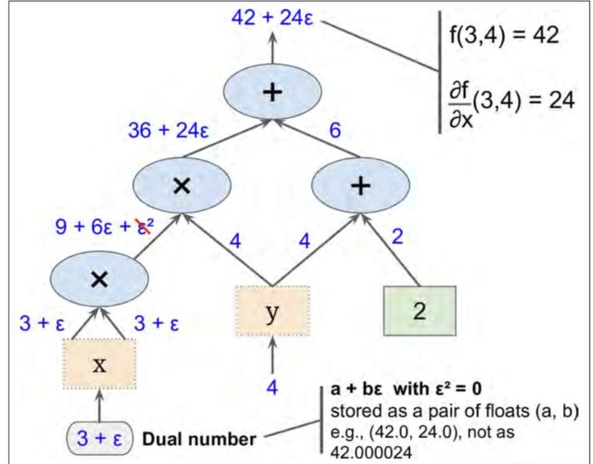

## Manual
## Numerical(Finite Difference)
$$
\frac{df}{dx} = \lim_{\epsilon \to 0} \frac{f(x+\epsilon) - f(x)}{\epsilon}
$$
* Issues:
  * $\epsilon$ is too small, rounding error (floating points precision)
  * $\epsilon$ is too large, truncation error (not good approximation)
  * if $f: \mathbb{R}^n \to \mathbb{R}$, then $O(n)$ evaluations of $f$ are required to compute the gradient, which is expensive.
## Symbolic

* Issues:
  * Expression swell (formulae become too large, e.g. derivative rules for multiplication, division, etc. will )

## Automatic Differentiation
> Symbolic differentiation creates chained expressions to get a symbolic representation of the derivative, but never passes numbers around.  

It utilizes the concept called **Dual Numbers**.
### Dual Numbers
$$
\begin{aligned}
a + b\epsilon
\end{aligned}
$$
where $a$ is the real part and $b$ is the dual part.  
> In practice, we store the dual number as a tuple of floating points $(a, b)$.  

$\epsilon$ is a special number such that $\epsilon^2 = 0$ and $\epsilon \neq 0$.
It satisfies the following properties:
$$
\begin{aligned}
(a + b\epsilon) + (c + d\epsilon) &= (a + c) + (b + d)\epsilon \\
(a + b\epsilon) \times (c + d\epsilon) &= ac + (ad + bc)\epsilon + bd\epsilon^2 \\
&= ac + (ad + bc)\epsilon
\end{aligned}
$$
Most importanty, it satisfies:
$$
h(a+b\epsilon) = h(a) + h'(a)b\epsilon
$$
which means we can calculate the value of $h$ and its derivative $h'$ at the same time.

### Forward Mode
Suppose $f(x,y) = x^2y + y + 2$
  

We can calculate $f(3,4)$ and $\frac{\partial f}{\partial x}(3,4)$ at the same time.