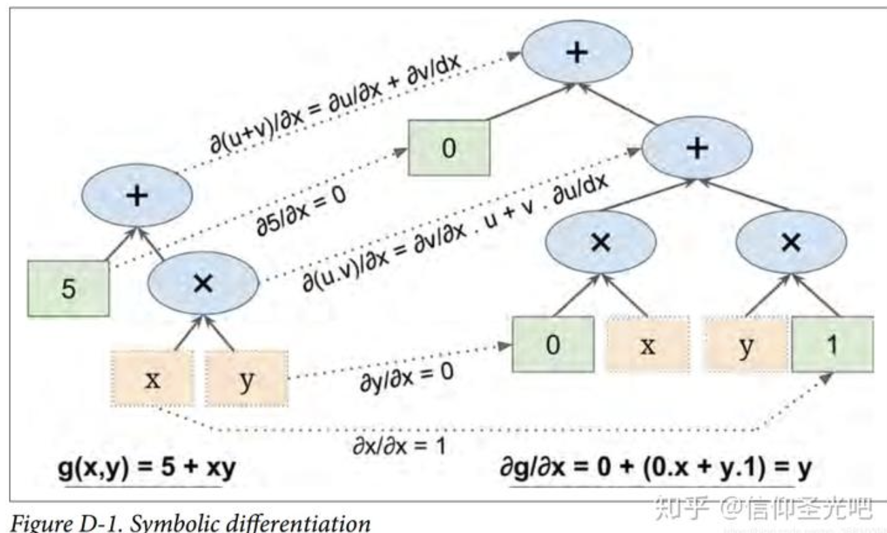
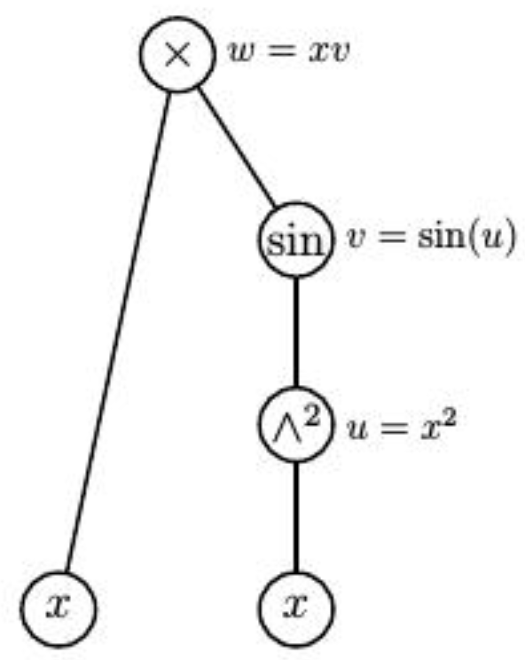
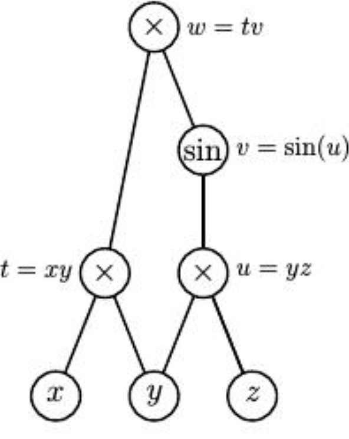
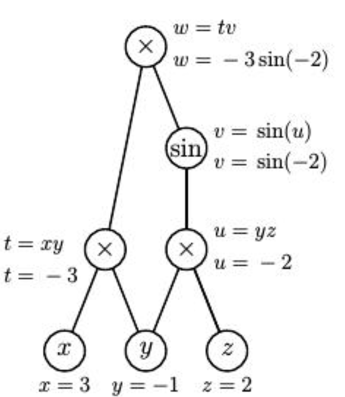

## Manual
## Numerical(Finite Difference)
$$
\frac{df}{dx} = \lim_{\epsilon \to 0} \frac{f(x+\epsilon) - f(x)}{\epsilon}
$$
* Issues:
  * $\epsilon$ is too small, rounding error (floating points precision)
  * $\epsilon$ is too large, truncation error (not good approximation)
  * if $f: \mathbb{R}^n \to \mathbb{R}$, then $O(n)$ evaluations of $f$ are required to compute the gradient, which is expensive.
## Symbolic

* Issues:
  * Expression swell (formulae become too large, e.g. derivative rules for multiplication, division, etc. will )

## Automatic Differentiation
> Symbolic differentiation creates chained expressions to get a symbolic representation of the derivative, but never passes numbers around.  

It utilizes the concept called **Dual Numbers**.
### Dual Numbers
$$
\begin{aligned}
a + b\epsilon
\end{aligned}
$$
where $a$ is the real part and $b$ is the dual part.  
> In practice, we store the dual number as a tuple of floating points $(a, b)$.  

$\epsilon$ is a special number such that $\epsilon^2 = 0$ and $\epsilon \neq 0$.
It satisfies the following properties:
$$
\begin{aligned}
(a + b\epsilon) + (c + d\epsilon) &= (a + c) + (b + d)\epsilon \\
(a + b\epsilon) \times (c + d\epsilon) &= ac + (ad + bc)\epsilon + bd\epsilon^2 \\
&= ac + (ad + bc)\epsilon
\end{aligned}
$$
Most importanty, it satisfies:
$$
f(a+b\epsilon) = f(a) + f'(a)b\epsilon
$$
which means we can calculate the value of $h$ and its derivative $h'$ at the same time.

### Forward Mode
Suppose $f(x) = xsin(x^2)$, we want to evaluate $f'(3)$.  
  
let $x = 3 + \epsilon$, 
$$
\begin{aligned}
u = x^2 &= (3 + \epsilon)^2 = 9 + 6\epsilon + \epsilon^2 = 9 + 6\epsilon \\
v = sin(u) &= sin(9 + 6\epsilon) = sin(9) + cos(9)6\epsilon \\
h = x sin(v) &= (3 + \epsilon) (sin(9) + cos(9)6\epsilon) \\&= 3sin(9)+(sin(9)+18cos(9))\epsilon
 \end{aligned}
$$

Therefore, we derived $f(3) = 3sin(9)$ and $f'(3) = sin(9) + 18cos(9)$.

---

Another example on $\mathbb{R}^3 \to \mathbb{R}$, 
$f(x,y,z) = xysin(xz)$, we want to find its gradient at $(3, -1, 2)$.   
  
We let 
$$
\begin{aligned}
x &= 3 + \epsilon[1, 0, 0] \\
y &= -1 + \epsilon[0, 1, 0] \\
z &= 2 + \epsilon[0, 0, 1]
\end{aligned}
$$
Then we can calculate $f(x,y,z)$ and its gradient at the same time.
$$
\begin{aligned}
t= xy &= (3 + \epsilon[1, 0, 0]) (-1 + \epsilon[0, 1, 0]) \\&= -3 + \epsilon[-1, 3, 0] \\
u = yz &= (-1 + \epsilon[0, 1, 0]) (2 + \epsilon[0, 0, 1]) \\&= -2 + \epsilon[0, 2, -1] \\
v = sin(u) &= sin(-2 + \epsilon[0, 2, -1]) \\&= sin(-2) + cos(-2)\epsilon[0, 2, -1] \\
w = tv &= (-3 + \epsilon[-1, 3, 0]) (sin(-2) + cos(-2)\epsilon[0, 2, -1]) \\&= -3sin(-2) + \epsilon[−sin(−2),3sin(−2)−6cos(−2),3cos(−2)]
 \\
\end{aligned}
$$
So we derived $f(3, -1, 2) = -3sin(-2)$ and $\nabla f(3, -1, 2) = [-sin(-2), 3sin(-2) - 6cos(-2), 3cos(-2)]$.

### Reverse Mode

Same example, we first forward pass to calculate all auxiliary variables.  
  
We now introduce what are called adjoint variables to record the partial derivatives of the top node with respect to the other nodes. For instance,
$$
\begin{aligned}
\bar{x} = \frac{\partial w}{\partial x} \\
\bar{u} = \frac{\partial w}{\partial u} \\
\end{aligned}
$$
Then we can calculate the adjoint variables in the reverse order.
$$
\begin{aligned}
\bar{v} = \frac{\partial w}{\partial v} &= t = -3 \\
\bar{t} = \frac{\partial w}{\partial t} &= v = sin(-2) \\
\bar{u} = \frac{\partial w}{\partial u} &= \bar{v} \frac{\partial v}{\partial u} = \bar{v} cos(u) = -3cos(-2) \\
\bar{x} = \frac{\partial w}{\partial x} &= \bar{t} \frac{\partial t}{\partial x} = \bar{t} y = -sin(-2) \\
\end{aligned}
$$
Here we find that $\frac{\partial w}{\partial x} = -sin(-2)$, which is the same as the result from forward mode.

> With some work, it's possible to show that the effort required to perform the computations in the reverse mode is always less than four times the effort required to evaluate the function. When the function has many variables, this represents a considerable savings over the forward mode.