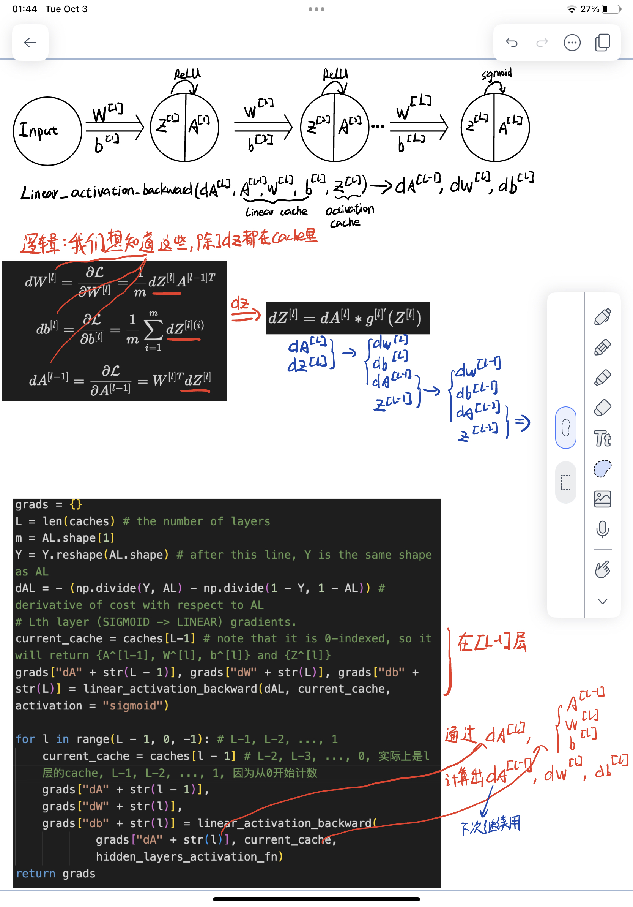
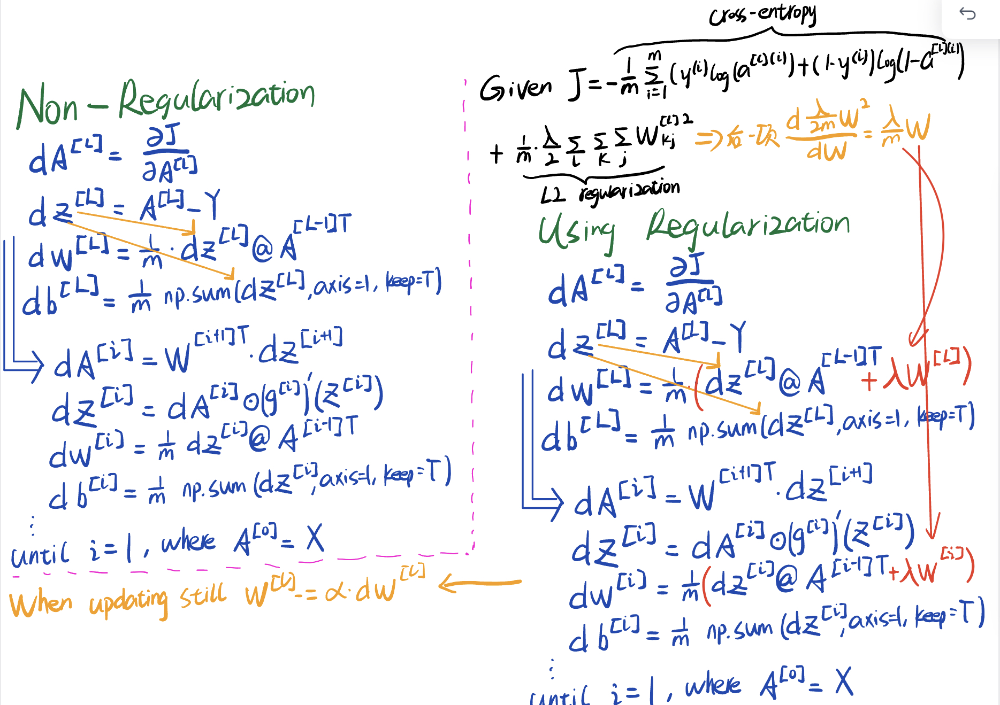

Another detailed illustration of back propogation - [sourece](https://zhuanlan.zhihu.com/p/71892752)  
The key points are how to find the recursive relation bewtween $\frac{\partial Cost}{\partial z^{[l]}}$ and $\frac{\partial Cost}{\partial z^{[l-1]}}$, or equivalently $\delta^{[l]}$ and $\delta^{[l-1]}$

It is good to revise this source from time to time in case I get confused in the future.

