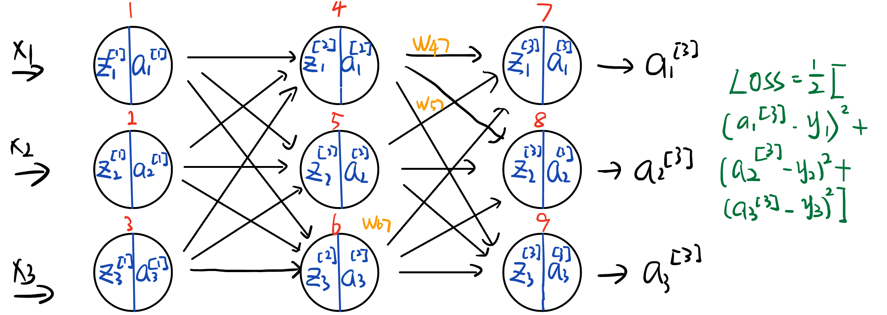

# Version 1
1. Notation
$$z^{(l)}=W^{(l)}a^{(l-1)}+b^{(l)}$$
$$a^{(l)}=\sigma(z^{(l)})$$
2. Cost Function
Suppose the cost function is MSE, i.e. 
$$C(W, b) = \frac{1}{2}||a^{(l)} - \hat{y}||^2$$
3. Gradient at output layer ($l$)
$$\begin{aligned}
&\begin{aligned}
\frac{\partial C(W, b)}{\partial w^{(l)}} & =\frac{\partial C(W, b)}{\partial a^{(l)}} \frac{\partial a^{(l)}}{\partial z^{(l)}} \frac{\partial z^{(l)}}{\partial w^{(l)}} \\
& =\left(a^{(l)}-y\right) \odot \sigma^{\prime}\left(z^{(l)}\right) a^{(l-1)}

\end{aligned}\\
&\begin{aligned}
\frac{\partial C(W, b)}{\partial b^{(l)}} & =\frac{\partial C(W, b)}{\partial a^{(l)}} \frac{\partial a^{(l)}}{\partial z^{(l)}} \frac{\partial z^{(l)}}{\partial b^{(l)}} \\
& =\left(a^{(l)}-y\right) \odot \sigma^{\prime}\left(z^{(l)}\right)
\end{aligned}
\end{aligned}$$
> The reason why we have $a^{(l)}-y$ is because the cost function is MSE. If the cost function is cross entropy, then we have $\frac{\partial C(W, b)}{\partial a^{(l)}} = \frac{a^{(l)}-y}{a^{(l)}(1-a^{(l)})}$  
  
> Dimension of each term:
> $$dim(\frac{\partial C(W, b)}{\partial a^{(l)}} )= dim(a^{(l)}): (n_y, m)$$
> $$dim(\frac{\partial a^{(l)}}{\partial z^{(l)}} )= dim(z^{(l)}): (n_y, m)$$
> $$dim(\frac{\partial z^{(l)}}{\partial w^{(l)}} )= dim(w^{(l)}): (n_y, n_{l-1})$$

4. Gradient at hidden layers  

Notice that 
$$
\delta^{(l)}=\frac{\partial C(W, b)}{\partial a^{(l)}} \frac{\partial a^{(l)}}{\partial z^{(l)}}=\left(a^{(l)}-y\right) \odot \sigma^{\prime}\left(z^{(l)}\right)
$$  
is a repeated term, so we can define it as $\delta^{(l)}$ for convenience.  

$$
\delta^{(l)}=\frac{\partial C(W, b)}{\partial z^{(l+1)}} \frac{\partial z^{(l+1)}}{\partial z^{(l)}}=\delta^{(l+1)} \frac{\partial z^{(l+1)}}{\partial z^{(l)}}
$$
Notice that $z^{(l+1)}$ and $z^{(l)}$ satisfies：
$$z^{(l+1)}=W^{(l+1)}a^{(l)}+b^{(l+1)}=W^{(l+1)}\sigma(z^{(l)})+b^{(l+1)}$$
so,
$$\frac{\partial z^{(l+1)}}{\partial z^{(l)}}=\left(W^{(l+1)}\right)^T \odot \sigma^{\prime}\left(z^{(l)}\right)$$
so the recursive relation is: 
$$
\delta^{(l)}=\left(W^{(l+1)}\right)^T \delta^{(l+1)} \odot \sigma^{\prime}\left(z^{(l)}\right)
$$
Then we can get the gradient at hidden layers:
$$
\begin{aligned}
& \frac{\partial C(W, b)}{\partial w^{(l)}}=\delta^{(l)} a^{(l-1)} \\
& \frac{\partial C(W, b)}{\partial b^{(l)}}=\delta^{(l)}
\end{aligned}
$$
credits to [source](https://zhuanlan.zhihu.com/p/71892752)  
The key points are how to find the recursive relation bewtween $\frac{\partial Cost}{\partial z^{[l]}}$ and $\frac{\partial Cost}{\partial z^{[l-1]}}$, or equivalently $\delta^{[l]}$ and $\delta^{[l-1]}$

Following is illustration with diagrams:

  

A video explanation with concrete example: [link](https://www.bilibili.com/video/BV1R64y187yt/?spm_id_from=333.337.search-card.all.click&vd_source=43fae35e0d515715cd36645ea2e6e547)

# Version 2
[visualizing backpropagation](https://www.bilibili.com/video/BV1zV4y1R7B4/?spm_id_from=333.337.search-card.all.click&vd_source=43fae35e0d515715cd36645ea2e6e547)  

* Key idea:  calculate $\frac{\partial C}{\partial z^{[l]}}$ 
* $\frac{\partial C}{\partial z^{[l]}}$ can represent the error of the layer $l$. Backpropagation is to propagate the **error** from the output layer to the input layer.
* If we have the error at layer $l$, we can update the weights and bias at connecting layer $l-1$ and $l$.

### At output layer
First thing, calculation error at output layer:
$$\frac{\partial C}{\partial z^{[L]}} = \frac{\partial C}{\partial a^{[L]}} \frac{\partial a^{[L]}}{\partial z_1^{[L]}}$$
In element wise form:
$$
\begin{align}
\frac{\partial L}{\partial z_1^{[3]}} &= 
\frac{\partial L}{\partial a_1^{[3]}} \frac{\partial a_1^{[3]}}{\partial z_1^{[3]}} \\&=
\frac{\partial \frac{1}{2}[(a_1^{[3]} - y_1)^2 + (a_2^{[3]} - y_2)^2 +(a_3^{[3]} - y_3)^2]}{\partial a_1^{[3]}} \frac{\partial \sigma(z_1^{[3]})}{\partial z_1^{[3]}} \\&=
\frac{\partial \frac{1}{2}[(a_1^{[3]} - y_1)^2 + (a_2^{[3]} - y_2)^2 +(a_3^{[3]} - y_3)^2]}{\partial a_1^{[3]}} \sigma(z_1^{[3]}) (1 - \sigma(z_1^{[3]})) \\&=
(a_1^{[3]} - y_1) \cdot a_1^{[3]} (1 - a_1^{[3]})
\end{align}
$$
Same for $z_2^{[3]}$ and $z_3^{[3]}$  
* Right now we have the loss at output layer $L$, so we can update the weights and bias from layer $L-1$ to $L$.  
 
Take $w_{47}$ and $b_7$ as an example:
$$
\begin{align}
\frac{\partial C}{\partial w_{47}} &= \frac{\partial L}{\partial a_1^{[3]}} \frac{\partial a_1^{[3]}}{\partial z_1^{[3]}} \frac{\partial z_1^{[3]}}{\partial w_{47}} \\&= (\text{loss at } z_1^{[3]})\frac{\partial (w_{47}a_1^{[2]} + w_{57}a_2^{[2]} + w_{67}a_3^{[2]} + b_7)}{\partial w_{47}} \\&= (\text{loss at } z_1^{[3]})a_1^{[2]}
\end{align}
$$
$$
\begin{align}
\frac{\partial C}{\partial b_7} &= \frac{\partial L}{\partial a_1^{[3]}} \frac{\partial a_1^{[3]}}{\partial z_1^{[3]}} \frac{\partial z_1^{[3]}}{\partial b_7} \\&= (\text{loss at } z_1^{[3]})\frac{\partial (w_{47}a_1^{[2]} + w_{57}a_2^{[2]} + w_{67}a_3^{[2]} + b_7)}{\partial b_7} \\&= (\text{loss at } z_1^{[3]})
\end{align}
$$
Now we can update $w_{47}$, $w_{57}$, $w_{67}$, $w_{48}$, $w_{58}$, $w_{68}$, $w_{49}$, $w_{59}$, $w_{69}$,$b_7$, $b_8$, $b_9$.

* We don't need the output layer anymore, so we can cover it. It will result in a similar structure. And we treat the hidden layer as the output layer. The problem now is how to calculate $\frac{\partial C}{\partial z^{[2]}}$.  

### At hidden layer
Let's say we want to calculate $\frac{\partial C}{\partial z_2^{[2]}}$. We need to first calculate $\frac{\partial C}{\partial a_2^{[2]}}$. 
* But $\frac{\partial C}{\partial a_2^{[2]}}$ turns out to be the weighted sum of loss of its children $loss ~at ~z_1^{[3]}$,$loss ~at ~z_2^{[3]}$ and $loss ~at ~z_3^{[3]}$, i.e. $\frac{\partial C}{\partial a_2^{[2]}} = w_{57} \frac{\partial C}{\partial z_1^{[3]}} + w_{58} \frac{\partial C}{\partial z_2^{[3]}} + w_{59} \frac{\partial C}{\partial z_3^{[3]}}$  

Then we can calculate $\frac{\partial C}{\partial z_2^{[2]}}$:
$$
\begin{align}
\frac{\partial C}{\partial z_2^{[2]}} &= \frac{\partial C}{\partial a_2^{[2]}} \frac{\partial a_2^{[2]}}{\partial z_2^{[2]}} \\&= \frac{\partial C}{\partial a_2^{[2]}} \frac{\partial \sigma(z_2^{[2]})}{\partial z_2^{[2]}} \\&= \frac{\partial C}{\partial a_2^{[2]}} \sigma(z_2^{[2]}) (1 - \sigma(z_2^{[2]})) \\&= \frac{\partial C}{\partial a_2^{[2]}} a_2^{[2]} (1 - a_2^{[2]})
\end{align}
$$
Then we can calculate the loss at hidden layer, which is the problem we have solved before.

## Combination of the two versions
Actually the $\delta^{[l]}$ in version 1 is the loss we discussed in version 2.  
It is easy to understand that the 
$$\frac{\partial C}{\partial w^{[l]}} = \delta^{[l]} a^{[l-1]}$$
$$\frac{\partial C}{\partial b^{[l]}} = \delta^{[l]}$$
The key point is to see how the error $\delta^{[l]}$ backpropagates (from $l$ to $l-1$), which can be stated in two steps:
- Error backpropagates from layer $l$ to layer $l-1$. 
  - for a particular node $j$ at layer $l-1$, $\frac{\partial C}{\partial a_j^{[l-1]}}$ is the weighted sum of loss of its children at layer $l$, i.e. $\frac{\partial C}{\partial a_j^{[l-1]}} = \sum_{i=1}^{n_l} w_{ij}^{[l]} \delta_i^{[l]}$
  > Error backpropagates from layer $l$ to layer $l-1$. But it doesn't pass through the activation function yet.
- Error passes through the activation function at layer $l-1$.
  - $\delta_j^{[l-1]} = \frac{\partial C}{\partial a_j^{[l-1]}} \frac{\partial a_j^{[l-1]}}{\partial z_j^{[l-1]}}$
  > Error passes through the activation function at layer $l-1$.

In matrix form:
$$
\delta^{[l]}=\left(W^{[l+1]}\right)^T \delta^{[l+1]} \odot g^{\prime[l]}\left(z^{[l]}\right)
$$
> Notice there is a transpose of $W^{[l+1]}$ in the formula. It is because the forward propagation is $z^{[l]}=W^{[l]}a^{[l-1]}+b^{[l]}$, to traverse back, we need to transpose $W^{[l+1]}$

> Two parts in this formula correspond to the two steps above. Error backpropagates from and error passes through the activation function.

## Summary
Only these are needed:

$$
\frac{\partial L}{\partial w^{[l]}}=\delta^{[l]} a^{[l-1]}
$$
$$
\frac{\partial L}{\partial b^{[l]}}=\delta^{[l]}
$$
$$
\delta^{[l]}=\left(W^{[l+1]}\right)^T \delta^{[l+1]} \odot g^{\prime[l]}\left(z^{[l]}\right)
$$
$$
w^{[l]}=w^{[l]}-\alpha \frac{\partial L}{\partial w^{[l]}}
$$
$$
b^{[l]}=b^{[l]}-\alpha \frac{\partial L}{\partial b^{[l]}}
$$
since at output layer $L$, $\delta^{[L+1]}$ is not defined, so we need to calculate $\frac{\partial L}{\partial a^{[L]}}$ instead
$$
\delta^{[L]}=\frac{\partial L}{\partial a^{[L]}} \odot g^{\prime[L]}\left(z^{[L]}\right)
$$
> All things above is based on the forward propagation is  $z^{[L]}=W^{[L]}a^{[L-1]}+b^{[L]}$ and $a^{[L]}=g^{[L]}(z^{[L]})$, which results in the transpose of $W^{[l+1]}$ in the formula.