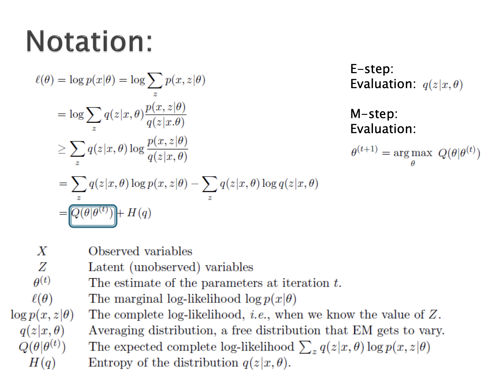
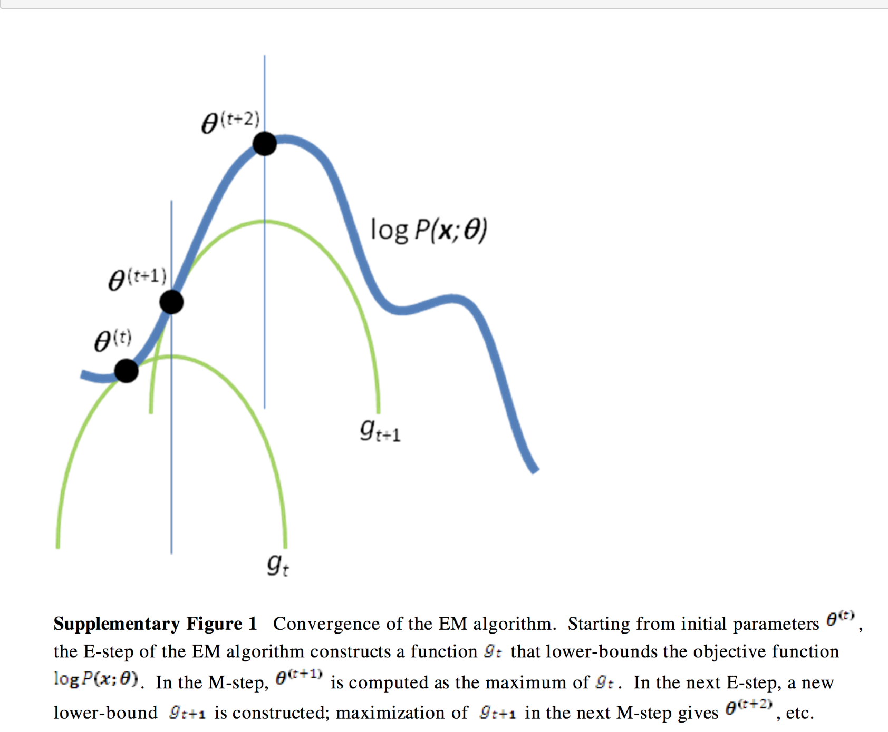

# TL;DR

# Amazing Visualization

# EM example 
Suppose we're tossing two coins, and results are as follows:
|   | Coin A  | Coin B  |
|---|---------|---------|
| 1 |   |5 H      5 T   |
| 2 |   9 H      1 T   |
| 3 |   8 H      2 T   |
| 4 |   |4 H      6 T   |
| 5 |   7 H      3 T   |
| Sum|   24H 6T   |  9H 11T   |  

We can calculate the probability of each coin being head as:
$$
\theta_A = \frac{24}{30} = 0.8
$$
$$
\theta_B = \frac{9}{20} = 0.45
$$
Suppose we no longer know which coin is used for each toss, as:
|   | Observation  |
|---|------------------|
| 1 |   5 H      5 T   |
| 2 |   9 H      1 T   |
| 3 |   8 H      2 T   |
| 4 |   4 H      6 T   |
| 5 |   7 H      3 T   |

then how can we estimate $\theta_A$ and $\theta_B$?
1. Randomly assign $\theta_A$ and $\theta_B$ to each toss, say $\theta_A = 0.6$ and $\theta_B = 0.5$.
2. Calculate the probability of each toss from which class. 

In the first round we have 5H 5T
If is from coin A, then the probability is
$$p_A = 0.6^5 \times 0.4^5$$
if it is from coin B, then the probability is
$$p_B = 0.5^5 \times 0.5^5$$

So the probability of this toss is from coin A and coin B is
$$\frac{p_A}{p_A + p_B} = \frac{0.6^5 \times 0.4^5}{0.6^5 \times 0.4^5 + 0.5^5 \times 0.5^5} = 0.45$$
$$\frac{p_B}{p_A + p_B} = \frac{0.5^5 \times 0.5^5}{0.6^5 \times 0.4^5 + 0.5^5 \times 0.5^5} = 0.55$$  
We can do it for each toss, then we have:
|   | Observation  | Probability of coin A  | Probability of coin B  |
|---|------------------|------------------|------------------|
| 1 |   5 H      5 T   | 0.45 | 0.55 |
| 2 |   9 H      1 T   | 0.80 | 0.20 |
| 3 |   8 H      2 T   | 0.73 | 0.27 |
| 4 |   4 H      6 T   | 0.35 | 0.65 |
| 5 |   7 H      3 T   | 0.65 | 0.35 |

Then we can figure out how much each coin has contributed:

|   | Observation  | coin A  | coin B  |
|---|------------------|------------------|------------------|
| 1 |   5 H      5 T   | 2.2 H, 2.2 T | 2.8 H, 2.8 T|
| 2 |   9 H      1 T   | 7.2 H, 0.8 T | 1.8 H, 0.2 T|
| 3 |   8 H      2 T   | 5.9 H, 1.5 T | 2.1 H, 0.5 T|
| 4 |   4 H      6 T   | 1.4 H, 2.1 T | 2.6 H, 3.9 T|
| 5 |   7 H      3 T   | 4.5 H, 1.9 T | 2.5 H, 1.1 T|

Then we can calculate the probability of each coin being head as:
$$
\theta_A = \frac{21.3}{21.3 + 8.6} = 0.71 \qquad
\theta_B = \frac{11.7}{11.7 + 8.4} = 0.58
$$

Then we can repeat the process until the $\theta_A$ and $\theta_B$ converge.

## Intuitive Explanation
Suppose we want collect the data about the distribution of heights in NUS. We successfully gather the height data from 100 boys and 100 girls, but someone removed all labels by accident, which means we don't know whether a data come from boys or girls.
Now we face two issues:
* Suppose we know the labels again, then we can use [MLE](https://en.wikipedia.org/wiki/Maximum_likelihood_estimation#) to estimate the distribution of boys and girls respectively.
* Suppose we know for example, boys' heights ~ $N(\mu_1 = 172, \sigma^2_1=5^2)$, girls' height ~$N(\mu_2 = 162, \sigma^2_2=5^2)$.Then when given a data, we know which class is more likely to be the source of this data. For example, 180 cm is more likely from boys.  

But the thing is we know neither, so it becomes a problem of "Which came first, the chicken or the egg?". Well the answer is we can use EM algorithm to solve this problem.

## Intuitive Algorithm
1. **Initialization:** We start by setting the initial distribution parameters for male and female heights. For instance, the height distribution for males is assumed to be $N(\mu_1 = 172, \sigma^2_1 = 5^2)$, and for females, it's $N(\mu_2 = 162, \sigma^2_2 = 5^2)$. These initial values may not be very accurate.

2. **Expectation (E-Step):** We calculate the likelihood of each individual belonging to the male or female group based on their height. For example, a person with a height of 180 is highly likely to belong to the male group.

3. **Maximization (M-Step):** After roughly assigning the 200 people to either the male or female group in the E-Step, we estimate the height distribution parameters for males and females separately using the Maximum Likelihood Estimation (MLE) method.

4. **Iteration:** We update the parameters of these two distributions. As a result, the probability of each student belonging to either males or females changes again, requiring us to adjust the E-Step once more.

5. **Convergence:** We repeat these E-Step and M-Step iterations iteratively until the parameters no longer change significantly, or until specific termination conditions are met.

> In this case, hidden variables are labels, namely boys and girls. And the observed variables are heights.

## Formal Proof
### Likelihood Function
> What is the probablity that I happen to choose $n$ samples?  

Every sample is drawn from $p(x|θ)$ independently, so the probability of choosing them altogether at once is:
$$ L(\theta) = \prod_{i=1}^n p(x^{(i)}|θ)$$
### Log Likelihood Function
By logging the $L(\theta)$, we can get the log likelihood function:
$$H(\theta) = \log L(\theta) = \sum_{i=1}^n \log p(x^{(i)}|θ)$$
> The reason why we choose log likelihood function is that it is easier to calculate and avoid the situation where the product of many small numbers is too small to be accurate in computer.
### Jensen Inequality
If $f(x)$ is a convex function, then
$$E[f(x)] \geq f(E[x])$$
specially, if $f(x)$ is strictly convex, then 
$E[f(x)] = f(E[x])$ if and only if  $p(x = E(x)) = 1$, i.e. random variable $x$ is a constant.
> If $f(x)$ is concave, flip the inequality sign.

### EM 
For $m$ independent data $x=(x^{(1)},x^{(2)},...,x^{(m)})$, and corrsponding hidden variables $z=(z^{(1)},z^{(2)},...z^{(m)})$. Then $(x,z)$ is full data.  

We want to find $\theta$ and $z$ s.t. it can maximize the likelihood function $L(\theta)$, i.e
$$
\theta, z=\arg \max _{\theta, z} L(\theta, z)$$
$$=\arg \max _{\theta, z} \sum_{i=1}^m \log P\left(x^{(i)} \mid \theta\right)
$$
$$=\arg \max _{\theta, z} \sum_{i=1}^m \log \sum_{z^{(i)}} P\left(x^{(i)}, z^{(i)} \mid \theta\right) \quad \text{(by Law of Total Probability)}
$$
We can see here that the summation is inside the log function. We want to extract it out:  
$$
\begin{aligned}
\sum_{i=1}^m \log \sum_{z^{(i)}} P\left(x^{(i)}, z^{(i)} \mid \theta\right) & =\sum_{i=1}^m \log \sum_{z^{(i)}} Q_i\left(z^{(i)}\right) \frac{P\left(x^{(i)}, z^{(i)} \mid \theta\right)}{Q_i\left(z^{(i)}\right)} \\
& \geq \sum_{i=1}^m \sum_{z^{(i)}} Q_i\left(z^{(i)}\right) \log \frac{P\left(x^{(i)}, z^{(i)} \mid \theta\right)}{Q_i\left(z^{(i)}\right)} \quad \text{(log(E[x]) >= E[log(x)] (because log(x) is concave))}
\end{aligned}
$$
where $Q_i(z^{(i)})$ is a distribution over $z^{(i)}$, it satisfies $\sum_{z^{(i)}} Q_i\left(z^{(i)}\right)=1$ and $1 \geq Q_i\left(z^{(i)}\right) \geq 0$.
> This is also called Expectation Step (E-Step), because $E\left(\log \frac{P\left(x^{(i)}, z^{(i)} \mid \theta\right)}{Q_i\left(z^{(i)}\right)}\right)=\sum_{z^{(i)}} Q_i\left(z^{(i)}\right) \log \frac{P\left(x^{(i)}, z^{(i)} \mid \theta\right)}{Q_i\left(z^{(i)}\right)}$

Suppose $\theta$ has been fixed, then $logL(\theta)$ is determined by two values, $Q_i(z^{(i)})$ and $P\left(x^{(i)}, z^{(i)} \mid \theta\right)$. We want to maximize the lower bound of $logL(\theta)$, so we need to make the inequality hold.

In order to hold the inequality, we need to let 
$$
\frac{P\left(x^{(i)}, z^{(i)} \mid \theta\right)}{Q_i\left(z^{(i)}\right)}=c
$$
$$\Leftrightarrow P\left(x^{(i)}, z^{(i)} \mid \theta\right)=cQ_i\left(z^{(i)}\right) \quad \text{(1)}$$
$$
\Leftrightarrow
\sum_z P\left(x^{(i)}, z^{(i)} \mid \theta\right)=c \sum_z Q_i\left(z^{(i)}\right) \quad \text{(sum over z)}
$$
$$
\Leftrightarrow
\sum_z P\left(x^{(i)}, z^{(i)} \mid \theta\right) = c
\quad \text{(2)}
$$
By $(1)$ and $(2)$,
$$
\begin{gathered}

Q_i\left(z^{(i)}\right)=\frac{P\left(x^{(i)}, z^{(i)} \mid \theta\right)}{c}=\frac{P\left(x^{(i)}, z^{(i)} \mid \theta\right)}{\sum_z P\left(x^{(i)}, z^{(i)} \mid \theta\right)}=\frac{P\left(x^{(i)}, z^{(i)} \mid \theta\right)}{P\left(x^{(i)} \mid \theta\right)}=P\left(z^{(i)} \mid x^{(i)}, \theta\right)
\end{gathered}
$$
since 
* Marginal Probability$: \space P\left(x^{(i)} \mid \theta\right)=\sum_z P\left(x^{(i)}, z^{(i)} \mid \theta\right)$
* Conditinonal Probability$: \space \frac{P\left(x^{(i)}, z^{(i)} \mid \theta\right)}{P\left(x^{(i)} \mid \theta\right)}=P\left(z^{(i)} \mid x^{(i)}, \theta\right)$  

> We can interpret $P\left(z^{(i)} \mid x^{(i)}, \theta\right)$ as the probability of $z^{(i)}$ given $x^{(i)}$ and $\theta$.

Hence we have successfully found the $Q_i(z^{(i)}) = P\left(z^{(i)} \mid x^{(i)}, \theta\right)$ that maximizes the lower bound of $logL(\theta)$.
What we are left to do is to maximize:  
$$
\begin{aligned}
\sum_{i=1}^m \sum_{z^{(i)}} Q_i\left(z^{(i)}\right) \log \frac{P\left(x^{(i)}, z^{(i)} \mid \theta\right)}{Q_i\left(z^{(i)}\right)} &=\sum_{i=1}^m \sum_{z^{(i)}} Q_i\left(z^{(i)}\right) \log P\left(x^{(i)}, z^{(i)} \mid \theta\right)-\sum_{i=1}^m \sum_{z^{(i)}} Q_i\left(z^{(i)}\right) \log Q_i\left(z^{(i)}\right) \\
&=\sum_{i=1}^m \sum_{z^{(i)}} Q_i\left(z^{(i)}\right) \log P\left(x^{(i)}, z^{(i)} \mid \theta\right)+H(Q_i)
\end{aligned}
$$
$$
\approx \sum_{i=1}^m \sum_{z^{(i)}} P\left(z^{(i)} \mid x^{(i)}, \theta\right) \log P\left(x^{(i)}, z^{(i)} \mid \theta\right) \quad \text{(by leaving out the constant)}
$$
where $H(Q_i)$ is the entropy of $Q_i(z^{(i)})$ and it is a constant.
## EM Algorithm
**Input:**
Observation data $x = (x^{(1)}, x^{(2)}, \ldots, x^{(m)})$,
joint distribution $p(x, z \, | \, \theta)$,
conditional distribution $p(z \, | \, x, \theta)$,
maximum iteration count $J$.

1. Randomly initialize the initial values of model parameters $\theta$ as $\theta^{(0)}$.

2. For each $j$ from 1 to $J$:  
    **E-step:**  
    Calculate the conditional probability expectations of the joint distribution:  
    $$
    Q_i\left(z^{(i)}\right)=P\left(z^{(i)} \mid x^{(i)}, \theta\right)
    $$
    > After substituting $\theta$, $Q_i\left(z^{(i)}\right)$ is a constant.

    **M-step:**  
    Maximize the likelihood function with respect to $\theta$:
    $$
    \theta=\arg \max _{\theta} \sum_{i=1}^m \sum_{z^{(i)}} Q_i\left(z^{(i)}\right) \log {P\left(x^{(i)}, z^{(i)} \mid \theta\right)}
    $$
3. Repeat step 2 until convergence.
> [Video of EM Algorithm](https://www.bilibili.com/video/BV19a411N72s/?spm_id_from=333.337.search-card.all.click&vd_source=43fae35e0d515715cd36645ea2e6e547)
## Why EM Converges?
$$
H(\theta^{(t+1)}) \geq \sum_{i=1}^m \sum_{z^{(i)}} Q_i\left(z^{(i)}\right) \log \frac{P\left(x^{(i)}, z^{(i)} \mid \theta^{(t+1)}\right)}{Q_i\left(z^{(i)}\right)} 
$$

$$
\geq \sum_{i=1}^m \sum_{z^{(i)}} Q_i\left(z^{(i)}\right) \log \frac{P\left(x^{(i)}, z^{(i)} \mid \theta^{(t)}\right)}{Q_i\left(z^{(i)}\right)}
\qquad \text{(by why we get $\theta^{(i + 1)}$)}
$$
$$
=H(\theta^{(t)})
$$
