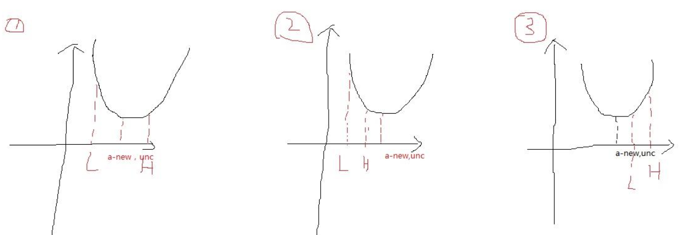
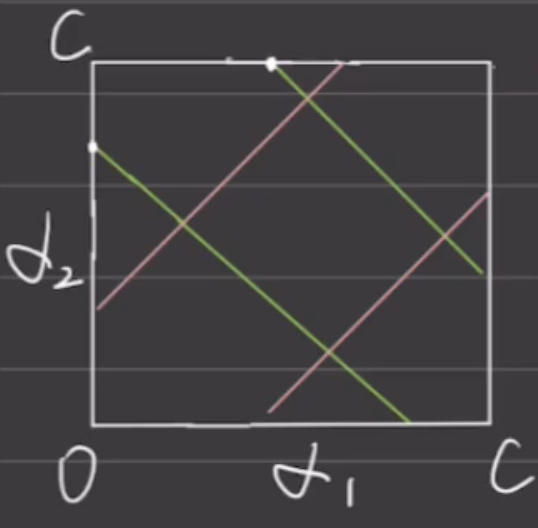
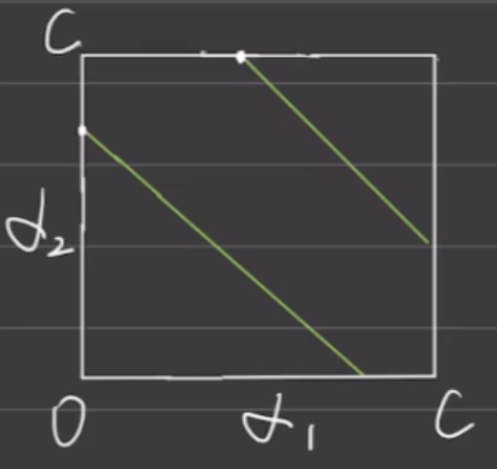

# Support Vector Machine
## Proof
### Problem Formulation
Suppose we have traning data $$T={(x_1,y_1),(x_2,y_2),...,(x_N,y_N)} $$
where $y_i\in \left\{ +1,-1 \right\} , i=1,2,...N$

We need to find a hyperplane which can classify data perfectly, i.e.,
$$ f(x) = \begin{cases} \omega^Tx_i + \gamma > 0 & \text{if } y_i = 1 \\ \omega^Tx_i + \gamma < 0 & \text{if } y_i = -1 \end{cases} $$
By setting the distance between hyperplane and support vector to be $d$, then 
$$ f(x) = \begin{cases} \frac{\omega^Tx_i + \gamma}{||w||} \geq d & \text{if } y_i = 1 \\ \frac{\omega^Tx_i + \gamma}{||w||} \leq d & \text{if } y_i = -1 \end{cases} $$
Divide $d$ on both sides, and 
$$ f(x) = \begin{cases} \omega_d^Tx_i + \gamma_d \geq 1 & \text{if } y_i = 1 \\ \omega_d^Tx_i + \gamma_d \leq -1 & \text{if } y_i = -1 \end{cases} $$
where,
$$\omega_{d}=\frac{\omega}{||\omega||d},\ \ \gamma_{d}=\frac{\gamma}{||\omega||d}$$
Since they still represent lines, we can simplify them as,
$$ f(x) = \begin{cases} \omega^Tx_i + \gamma \geq  1 & \text{if } y_i = 1 \\ \omega^Tx_i + \gamma \leq -1 & \text{if } y_i = -1 \end{cases} $$
$$\Leftrightarrow y_{i}(\omega^{T}x_{i}+\gamma)\geq1\ ,for \space \forall x_{i}$$
Distance $d =$ distance between support vectors and hyperplane,
$$d = \frac{\omega^{T}x_{i}+\gamma}{||w||} = \frac{1}{||w||} $$
since points on support vectors satisfy $\omega^{T}x_{i}+\gamma = 1$

$$max \space d \\
\Leftrightarrow min \space\frac{1}{2}||w||^2\\
s.t.  \space y_{i}(\omega^{T}x_{i}+\gamma)\geq1\ ,\forall x_{i}$$

### Optimization Problem
Rewrite it as a KKT problem
$$
min \space\frac{1}{2}||w||^2\\
s.t.  \space h_i(x) = 1- y_{i}(\omega^{T}x_{i}+b)\leq0\ ,i = 1, 2,...,N$$
Constructing the Lagrangian Function
$$
{\mathcal{L}}(w,b,\alpha)={\frac{1}{2}}\|w\|^{2}+\sum_{i=1}^{n}\alpha_{i}h_i(x)\\
={\frac{1}{2}}\|w\|^{2}-\sum_{i=1}^{n}\alpha_{i}\left(y_{i}(w^{\mathrm{T}}x_{i}+b)-1\right)$$
Orignial question can be converted to
$$\operatorname*{min}_{w,b} \frac{1}{2}||w||^2=\operatorname*{min}_{w,b}\operatorname*{max}_{\alpha_i\geq 0}{\mathcal{L}}(w,b,\alpha)
$$
## Duality Conversion
We want to show the above function satisfies two properties
* Convexity 
* [Slater's Condition](https://en.wikipedia.org/wiki/Slater%27s_condition#Formulation)
> In English, Slater's means that there exist a feasible point which let all inequality constrain cannot hold equality, i.e. $h_i(x) <0$

If so we can use Strong Langrangian Duality. 
* Convexity: it holds true for $\frac{1}{2}||w||^2$ and $h_i(x)$
* Slater's: it holds true since all inequality constrain are affine

Strong duality holds. We can now solve this instead,
$$\operatorname*{max}_{\alpha_i\geq 0}\operatorname*{min}_{w, b}{\mathcal{L}}(w,b,\alpha)$$
We first fix the value of all $\alpha_i$, since we want to minimize $\mathcal{L}$, we should take partial derivatives w.r.t $w$ and $b$, 

$${\frac{\partial{\mathcal{L}}}{\partial w}}=0\Rightarrow w=\sum_{i=1}^{n}\alpha_{i}y_{i}x_{i}$$
$${\frac{\partial{\mathcal{L}}}{\partial b}}=0\Rightarrow\sum_{i=1}^{n}\alpha_{i}y_{i}=0$$
By plugging them back in to $\mathcal{L}$, we have
$$\begin{align*}
min \space \mathcal{L}(w,b,\alpha) &= \frac{1}{2}\|w\|^2 - \sum_{i=1}^{n}\alpha_{i}\left[y_{i}(w^T x_i + b) - 1\right] \\
&= \frac{1}{2}w^T w - w^T \sum_{i=1}^{n}\alpha_{i}y_{i}x_{i} - b\sum_{i=1}^{n}\alpha_{i}y_{i} + \sum_{i=1}^{n}\alpha_{i} \\
&={\frac{1}{2}}w^{\mathrm{{T}}}\sum_{i=1}^{n}\alpha_{i}y_{i}x_{i}-w^{\mathrm{{T}}}\sum_{i=1}^{n}\alpha_{i}y_{i}x_{i}-b\cdot0+\sum_{i=1}^{n}\alpha_{i} \\
&=\sum_{i=1}^{n}\alpha_{i}-{\frac{1}{2}}\left(\sum_{i=1}^{n}\alpha_{i}y_{i}x_{i}\right)^{\mathrm{T}}\sum_{i=1}^{n}\alpha_{i}y_{i}x_{i} \\
&={\sum_{i=1}^{n}}\alpha_{i}-{\frac{1}{2}}\sum_{i,j=1}^{n}\alpha_{i}\alpha_{j}y_{i}y_{j}x_{i}^{\mathrm{{T}}}x_{j}
\end{align*}
$$
This is $min$ part  inside of $max \space min$, so the $max$ is 
$$\operatorname*{max}_{\alpha}\sum_{i=1}^{n}\alpha_{i}-\frac12\sum_{i,j=1}^{n}\alpha_{i}\alpha_{j}y_{i}y_{j}x_{i}^{\mathrm{T}}x_{j} \\
s.t. \alpha_i \geq 0, i = 1, 2, ..., n\\
\sum_{i=1}^{n}\alpha_iy_i=0$$

## Algorithm (HardMargin)
1. Solve
$$
\operatorname*{max}_{\alpha} \sum_{i=1}^{N} \alpha_i-\frac{1}{2} \sum_{i=1}^{N} \sum_{j=1}^{N} \alpha_i \alpha_j y_i y_j (x_i \cdot x_j) 
$$
subject to
$$\sum_{i=1}^{N} \alpha_i y_i = 0 \\\alpha_{i}\geqslant 0$$
to get optimal solution $\alpha^{*}=(\alpha_{1}^{*},\alpha_{2}^{*},\cdot\cdot\cdot,\alpha_{N}^{*})^{\mathrm{T}}$
3. 
	$\omega^{*}=\sum_{i-1}^{N}\alpha_{i}^{*}y_{i}x_{i}$, and choose any $j$ s.t. $\alpha_j > 0$ to get $b^{*}=y_{j}-\sum_{i=1}^{N}y_{i}\alpha_{i}^{*}(x_{i}\ast x_{j})$	
4. Hyperplane is $w^{T}x+b^{*}=0$
## SoftMargin
For the majority of cases, there are some points fall in between two support vectors inevitably, i.e. Not all points can satisfy 
$$y_{i}(w^T x_i + b) \geq 1$$
To tackle this issue, we introduce another variable for the sake of slackness. 
$$y_{i}(w^T x_{i}+b)+ \xi_{i} \geq 1$$
where $\xi_i \geq 0$ 

So the updated question is,
$$\operatorname*{min}_{w,b,\xi}~~{\frac{1}{2}}\|w\|^{2}+C\sum_{i=1}^{N}\xi_{i} \\
s.t.  \space 1 - y_{i}(w^T x_{i}+b)  - \xi_{i} \leq 0 ~~ \text{(a)}\\
 -\xi_{i} \leq 0 ~~ \text{(b)}$$

Lagrangian Function
$${\mathcal{L}}(w,b,\alpha, \mu, \xi) = {\frac{1}{2}}\|w\|^{2}  +C\sum_{i=1}^{N}\xi_{i} +\sum_{i=1}^{N}\alpha_{i}(1 - y_{i}(w^T x_{i}+b)  - \xi_{i}) + \sum_{i=1}^{N}\mu_i(-\xi_i)$$
Want to find
$$\operatorname*{min}_{w,b,\xi} \operatorname*{max}_{\alpha, \mu} \mathcal{L}$$
which is equaivalent with,
$$\operatorname*{max}_{\alpha, \mu} \operatorname*{min}_{w,b,\xi}\mathcal{L}$$

By taking derivative w.r.t $w$, $b$ and $\xi$, we have 
$$\begin{array}{c}{{w=\sum_{i=1}^{N}\alpha_{i}y_{i}x_{i}}}\\ 
\sum_{i=1}^{N}\alpha_iy_i =0\\
{{C-\alpha_{i}-\mu_{i}=0}}\end{array}$$

By plugging in, the dual problem now is

$$
\operatorname*{max}_{\alpha} \sum_{i=1}^{N} \alpha_i-\frac{1}{2} \sum_{i=1}^{N} \sum_{j=1}^{N} \alpha_i \alpha_j y_i y_j (x_i \cdot x_j) 
$$
subject to

$$
\sum_{i=1}^{N} \alpha_i y_i = 0 \\
C - \alpha_i - \mu_i = 0 \\
\alpha_i \geq 0, \quad \text{for } i = 1,2,\ldots,N \\
\mu_i \geq 0, \quad \text{for } i = 1,2,\ldots,N \\
$$
constrain can be simplified as
$$\sum_{i=1}^{N} \alpha_i y_i = 0 \\0\leqslant\alpha_{i}\leqslant C$$

## Algorithm (SoftMargin)
1. Select punishment coeffient $c$
2. Solve
$$
\operatorname*{max}_{\alpha} \sum_{i=1}^{N} \alpha_i-\frac{1}{2} \sum_{i=1}^{N} \sum_{j=1}^{N} \alpha_i \alpha_j y_i y_j (x_i \cdot x_j) 
$$
subject to
$$\sum_{i=1}^{N} \alpha_i y_i = 0 \\0\leqslant\alpha_{i}\leqslant C$$
to get optimal solution $\alpha^{*}=(\alpha_{1}^{*},\alpha_{2}^{*},\cdot\cdot\cdot,\alpha_{N}^{*})^{\mathrm{T}}$
3. 
	$\omega^{*}=\sum_{i-1}^{N}\alpha_{i}^{*}y_{i}x_{i}$, and choose any $j$ s.t. $0 < \alpha_j < C$ to get $b^{*}=y_{j}-\sum_{i=1}^{N}y_{i}\alpha_{i}^{*}(x_{i}\ast x_{j})$	
4. Hyperplane is $w^{T}x+b^{*}=0$

## Another Perspective: HingeLoss
First, we define HingeLoss Function as
$$L(y(w\ast x+b))=[1-y(w\ast x+b)]_{+}$$
where
$$[z]_+ = \begin{cases}
    z, & \text{if } z > 0 \\
    0, & \text{otherwise}
\end{cases}
$$
So we want to minimize the cost function (with regularization)
$$\operatorname*{min}_{w, b} \sum_{i=1}^{N}\left[1-y_{i}(w*x_{i}+b)\right]_{+}+\lambda\vert\vert w\vert\vert^{2} ~~~\text{(1)}$$

Now we want to show this is equivalent with 
$$\operatorname*{min}_{w,b,\xi}~~{\frac{1}{2}}\|w\|^{2}+C\sum_{i=1}^{N}\xi_{i} ~~~ \text{(2)}$$

Proof:
Let
$$[1-y_{i}(w^T x_{i}+b)]_{+}=\xi_{i} \geq 0 ~~~\text{(trivial)}$$
and it satisfies
$$y_{i}(w^T x_{i}+b) \geq 1-\xi_{i} ~~~ \text{(divide into cases)}$$

Hence, if we take $\lambda=\frac{1}{2C}$, $(1)$ and $(2)$ are the same because they have same objective function and same constrain.

## SMO (Sequential Minimal Optimization)
$$
\operatorname*{min}_{\alpha} \frac{1}{2} \sum_{i=1}^{N} \sum_{j=1}^{N} \alpha_i \alpha_j y_i y_j (x_i \cdot x_j)  -\sum_{i=1}^{N} \alpha_i
$$
subject to
$$\sum_{i=1}^{N} \alpha_i y_i = 0 \\0\leqslant\alpha_{i}\leqslant C$$
We want to get optimal solution $\alpha^{*}=(\alpha_{1}^{*},\alpha_{2}^{*},\cdot\cdot\cdot,\alpha_{N}^{*})^{\mathrm{T}}$
We choose to treat $\alpha_1$ and $\alpha_2$ like variable while others are constants ($\alpha_i, i=3,...,N$).
Let 
$$
L(\alpha_1, \alpha_2) = \frac{1}{2}[\alpha_1 y_1 \alpha_1 y_1 x_1^T \cdot x_1 + 2 \alpha_1 y_1 \alpha_2 y_2 x_1^T \cdot x_2 + 2 \sum_{j=3}^{N} \alpha_1 y_1 \alpha_j y_j x_1^T \cdot x_j + \alpha_2 y_2 \alpha_2 y_2 x_2^T \cdot x_2 + 2 \sum_{j=3}^{N} \alpha_2 y_2 \alpha_j y_j x_2^T \cdot x_j + \sum_{i=3}^{N} \sum_{j=3}^{N} \alpha_i y_i \alpha_j y_j x_i^T \cdot x_j] - [\alpha_1 + \alpha_2 + \sum_{j=3}^{N} \alpha_j]
$$
Let $x_{i}^{T}\cdot x_{j}=K_{ij}$, then
$$
L(\alpha_1, \alpha_2) = \frac{1}{2}[\alpha_1 y_1 \alpha_1 y_1 K_{11} + 2 \alpha_1 y_1 \alpha_2 y_2 K_{12} + 2 \sum_{j=3}^{N}{\alpha_1 y_1 \alpha_j y_j K_{1j}} + \alpha_2 y_2 \alpha_2 y_2 K_{22} + 2 \sum_{j=3}^{N}{\alpha_2 y_2 \alpha_j y_j K_{2j} + \sum_{i=3}^{N}{\sum_{j=3}^{N}{\alpha_i y_i \alpha_j y_j K_{ij}}}] - [\alpha_1 + \alpha_2 + \sum_{j=3}^{N}{\alpha_j}]}
$$
Since $\sum_{i=3}^{N} \sum_{j=3}^{N} \alpha_i y_i \alpha_j y_j K_{ij}~~$and$~~\sum_{j=3}^{N}{\alpha_{j}}$ are constants, we can discard them without affecting the results of differentiation. We have
$$
L(\alpha_1, \alpha_2) = \frac{1}{2}[\alpha_1^2 K_{11} + 2 \alpha_1 y_1 \alpha_2 y_2 K_{12} + 2 \sum_{j=3}^{N} \alpha_1 y_1 \alpha_j y_j K_{1j} + \alpha_2^2 K_{22} + 2 \sum_{j=3}^{N} \alpha_2 y_2 \alpha_j y_j K_{2j}] - [\alpha_1 + \alpha_2]
$$

Let $\sum_{i=3}^{N} \alpha_i y_i = -C$, then $\alpha_1 y_1 + \alpha_2 y_2 - C = 0$
Substituting $\alpha_1 = y_1(C - \alpha_2 y_2)$:

$$L(\alpha_2) = \frac{1}{2}[(C-\alpha_2y_2)^2K_{11} + 2(C -\alpha_2y_2 )\alpha_2y_2K_{12} + 2\sum_{j=3}^{N}(C -\alpha_2y_2 )\alpha_jy_jK_{1j} + \alpha_2^2K_{22} +2\sum_{j=3}^{N}\alpha_2y_2\alpha_jy_jK_{2j} ] - [y_1(C- \alpha_2y_2) + \alpha_2]$$

By letting $\frac{\sigma L}{\sigma \alpha_{2}}= 0$, we have
$$\begin{align*}
\alpha_2(K_{11} + K_{22} - 2K_{12}) &= 1 - y_1 y_2 + C y_2 K_{11} - Cy_2 K_{12} + \sum_{i=3}^{N} y_2 \alpha_i y_i K_{1i} - \sum_{i=3}^{N} y_2 \alpha_j y_j K_{2j}  \quad ~~~~~ (1 = y_2^2 )\\
&= y_2 [y_2 - y_1 + C K_{11} - C K_{12} + \sum_{i=3}^{N} \alpha_i y_i K_{1i} - \sum_{i=3}^{N} \alpha_i y_i K_{2i}] \quad (\text{Equation 1})
\end{align*}
$$

Given that $w = \sum_{i=1}^{N}{\alpha_{i}y_{i}x_{i}}$ and $f(x) = w^{T}x + b$, it follows that $f(x) = \sum_{i=1}^{N}{\alpha_{i}y_{i}x_{i}^{T}}x + b$.
So, $f(x_1) - \alpha_1 y_1 K_{11} - \alpha_2 y_2 K_{12} - b = \sum_{i=3}^{N}{\alpha_i y_i K_{1i}}$ (Equation 2)
$f(x_2) - \alpha_1 y_1 K_{12} - \alpha_2 y_2 K_{22} - b = \sum_{i=3}^{N}{\alpha_i y_i K_{2i}}$ (Equation 3)
By substituting $Equation ~2$ and $Equation ~3$ into $Equation ~1$, and $\alpha_{1}^{old}y_{1}+\alpha_{2}^{old}y_{2}=C$, we have
$$\alpha_{2}^{new,unc}(K_{11}+K_{22}-2K_{12}) = y_{2}[(f(x_{1})-y_{1}) - (f(x_{2})-y_{2}) + \alpha_{2}^{old}y_{2}(K_{11}+K_{22}-2K_{12})]$$

Let $E_{1} = f(x_{1}) - y_{1}$ and $E_{2} = f(x_{2}) - y_{2}$, and $\eta = K_{11} + K_{22} - 2K_{12}$, so 
$$\alpha_{2}^{new,unc} = \alpha_{2}^{old} + \frac{y_{2}(E_{1} - E_{2})}{\eta}$$
$$\alpha_1^{new, unc} = y_1(C - \alpha_2^{new, unc}y_2)$$

The reason why we have a special notation $\alpha_{2}^{new,unc}$ is that we are just letting partial derivative to be $0$ without considering whether $\alpha_2$ can meet the contrain $\alpha_1 y_1 + \alpha_2 y_2 - C = 0$ or not.
> ERRETA: I shouldn't use C in $\alpha_1 y_1 + \alpha_2 y_2 - C = 0$ because it has been used in the contrain where $0\leqslant\alpha_{i}\leqslant C$.  

Let $L$ and $H$ be the lower bound and upper bound of $\alpha_2$ respectively , i.e. $L \leq \alpha_2 \leq H$.

Based on graph above, we have
$$
\alpha_{2}^{new} =
\begin{cases}
\alpha_{2}^{new,unc} & \text{if } L \leq \alpha_{2}^{new,unc} \leq H \\
H & \text{if } \alpha_{2}^{new,unc} > H \\
L & \text{if } \alpha_{2}^{new,unc} < L
\end{cases}
$$

Our question lies at how to find $L$ and $H$.
We have $\alpha_1y_1 + \alpha_2y_2 = \xi$, and $0 \leq \alpha_1 , \alpha_2 \leq C$, so
* Case 1: $y_1 \neq y_2$ (one +1 and one -1), i.e. $\alpha_1 - \alpha_2 = y_1\xi$
  * $L = max(0, \alpha_2^{old} - \alpha_1^{old})$
  * $H = min(C, C + \alpha_2^{old} - \alpha_1^{old})$
  
      

* Case 2: $y_1 = y_2$ (both +1 or both -1), i.e. $\alpha_1 + \alpha_2 = y_1\xi$
  * $L = max(0, \alpha_2^{old} + \alpha_1^{old} - C)$
  * $H = min(C, \alpha_2^{old} + \alpha_1^{old})$

       

To update $\alpha_1$, we have
$$
\alpha_1^{new} = y_1\xi - y_1y_2\alpha_2^{(new)} =y_1(\alpha_1^{(old)}y_1 + \alpha_2^{(old)}y_2) - y_1y_2\alpha_2^{(new)}=  \alpha_1^{old} + y_1y_2(\alpha_2^{old} - \alpha_2^{new})
$$
> Multiply by $y_1y_2$ is a trick to avoid considering different cases.
### How to choose $\alpha_1$ and $\alpha_2$ in SMO
Let's get back to our constrains:
* $1 - y_{i}(w^T x_{i}+b)  - \xi_{i} \leq 0$ (1)
* $-\xi_{i} \leq 0$ (2)
* $0 \leq \alpha_i \leq C$ (3)
* $\alpha_i + \mu_i = C$ (4)
* $\alpha_i(1 - y_{i}(w^T x_{i}+b)  - \xi_{i}) = 0$ (5)
* $\mu_i\xi_i = 0$ (6)
---
* Case 1: $\alpha_i = 0$

  From (4) we know $\mu_i = C$, so $\xi_i = 0$ from (6). Then, from (1) $y_{i}(\omega\cdot x_{i}+b)\geq1 - \xi_i$ $\Rightarrow y_{i}g(x_{i})\geq1$
* Case 2: $0 < \alpha_i < C$

  From (4) we know $\mu_i \neq 0$ and $\alpha_i \neq 0$, so $\xi_i = 0$ from (6). Then, from (1) $y_{i}(\omega\cdot x_{i}+b)=1 - \xi_i$ $\Rightarrow y_{i}g(x_{i})=1$

* Case 3: $\alpha_i = C$
  
    From (5) we know $y_{i}(w^T x_{i}+b)=1 - \xi_i$, and $\xi_i \geq 0$ from (2). Then, $y_{i}(\omega\cdot x_{i}+b) =1 - \xi_i$ $\Rightarrow y_{i}g(x_{i})\leq1$

In summary, 
$$
\alpha_i =
\begin{cases}
y_ig_i(x) \geq 1 & \text{if } \alpha_i = 0 \\
y_ig_i(x) = 1 & \text{if } 0 < \alpha_i < C ~~~ \text{(lie on support vector)}\\
y_ig_i(x) \leq 1 & \text{if } \alpha_i = C
\end{cases}
$$
where $g_i(x_i) = w^T x_i + b$.

So for $\alpha_1$, we want to choose the one that violates KKT condition the most. First we scan through data point where $0 < \alpha_i < C$. If we can't find any, then we will look at all data points.

For $\alpha_2$, we want to choose the one that can make $|E_1 - E_2|$ the largest. 

---
### How to update $b$
* When $0 < \alpha_1^{new} < C$, we have

$$y_{i}g(x_{i})=1$$
i.e.
$$\sum_{i=1}^{N}{\alpha_{i}y_{i}K_{i1}}+b=y_{1}
$$
Since 
$$E_{1}=g(x_{1})-y_{1}=\sum_{i=3}^{N}{\alpha_{i}y_{i}K_{1i}}+\alpha_{1}^{old}y_{1}K_{11}+\alpha_{2}^{old}y_{2}K_{21}+b^{old}-y_{1}$$
By plugging in, we have
$$b_1^{new} = -E_1 - y_1K_{11}(\alpha_1^{new} - \alpha_1^{old}) - y_2K_{21}(\alpha_2^{new} - \alpha_2^{old}) + b^{old}$$
Similarly, when $0 < \alpha_2^{new} < C$, we have
$$b_2^{new} = -E_2 - y_1K_{12}(\alpha_1^{new} - \alpha_1^{old}) - y_2K_{22}(\alpha_2^{new} - \alpha_2^{old}) + b^{old}$$

In summary, 
$$
b^{new} = 
\begin{cases}
b_1^{new} = b_2^{new} & \text{if } 0 < \alpha_1^{new}, \alpha_2^{new} < C \\
\\

\frac{b_1^{new} + b_2^{new}}{2} & \text{if otherwise}\\
\end{cases}
$$