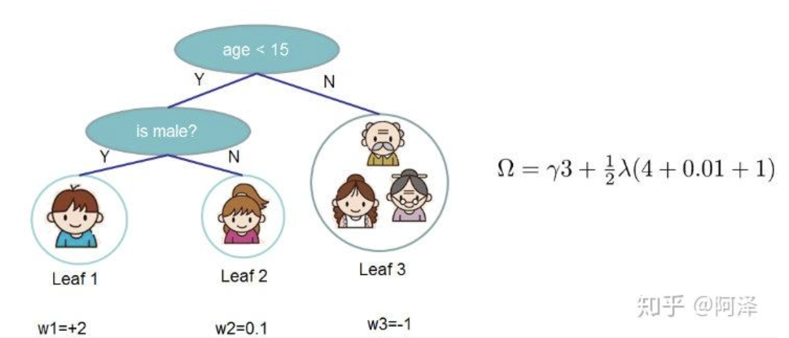
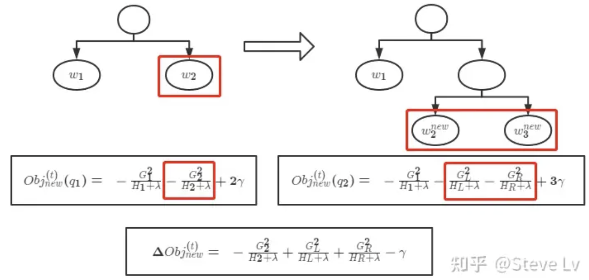
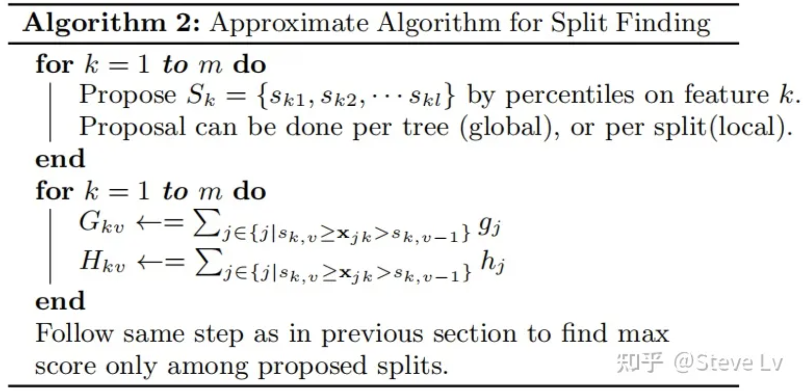

# XGBoost
XGBoost is a decision-tree-based ensemble Machine Learning algorithm that uses a gradient boosting framework. It stands for eXtreme Gradient Boosting.

## Loss Function Formulation
We know that XGBoost is a sum of $k$ basic models:
$$\hat{y}_i = \sum_{t=1}^kf_{t}(x_{i})$$  
where $f_{k}$ is the $k_{th}$ model and $\hat{y}_{i}$ is the prediction of $i_{th}$ sample.
The loss function is a summation over all datas:
$$L =\sum_{i=1}^nl(\hat{y}_i , y_{i})$$  
$n$ is the size of data.
By introducing regularization, we have
$$L =\sum_{i=1}^nl(\hat{y}_i , y_{i}) + \sum_{i=1}^k\Omega(f_{i})$$  

Since XGBoost uses a strategy where each weak learner is built upon the previous one, i.e.,
$$\hat{y}_i ^{t} = \hat{y}_i ^{t - 1} + f_{t}(x_{i})$$

So the Loss Function at step $t$ can be updated as:
$$L^{(t)} =\sum_{i=1}^nl(\hat{y}_i ^{t - 1} + f_{t}(x_{i}), y_{i}) + \sum_{i=1}^t\Omega(f_{i})$$  

By Taylor's Theorem:
$$f(x + \Delta x) \approx f(x ) + f^{'}(x) \Delta x+ \frac{1}{2}f^{''}(x)\Delta x^{2}$$
By treating $\hat{y}_i ^{t - 1}$ as $x$, $f_{t}(x_{i})$ as $\Delta x$, we have:
$$
L^{(t)} = \sum_{i=1}^{n} [l(y_i, \hat{y}^{t-1}) + g_i f_t(x_i) + \frac{1}{2} h_i f_t^2(x_i)] + \sum_{i=1}^{t} \Omega(f_i)
$$
Note that $g_{i}$ and $h_{i}$ are first and second derivative w.r.t to **$\hat{y}_i ^{t - 1}$** respectively.  
Take MSE as an example:
$$
\sum_{i=1}^{n} (y_i - (y_i^{t-1} + f_t(x_i))^2)
$$
Then, 
$$
g_i = \frac{\partial (\hat{y}^{t-1} - y_i)^2}{\partial y^{t-1}} = 2(\hat{y}^{t-1} - y_i)
$$

$$
h_i = \frac{\partial^2(\hat{y}^{t-1})}{\partial\hat{y}^{t-1}} = 2
$$

Since at step $t$  we already know the value of $\hat{y}^{t-1}$, so $l(y_i, \hat{y}^{t-1})$ is a contant, which doesn't have an impact on our loss function.  

$$
L^{(t)} \approx \sum_{i=1}^{n} [g_if_t(x_i) + \frac{1}{2} h_i f_t^2(x_i)] + \sum_{i=1}^{t} \Omega(f_i)
$$

we can define $f_t(x) = w_{q(x)}$, where $x$ is a sample data, $q(x)$ indicates which leaf this data falls into, and $w_{q(x)}$ represents the value of that leaf.  

The complexity of the decision tree can be decided from two aspects, 1. total number of leaves $T$; 2. weight of leaves. And both of them shouldn't be too large.  Hence, we derive the regularization term as:
$$
\Omega(f_t) = \gamma T + \frac{1}{2} \lambda \sum_{i=1}^{T} w_j^2
$$

Let  $I_j = \{ i \,|\, q(x_i) = j \}$ be the $j_{th}$ be a set of indices where each index of sample data falls in this leave. (叶子节点所有instances的下标), then:
$$ L^{(t)} \approx \sum_{i=1}^{n} \left[g_if_t(x_i) + \frac{1}{2} h_i f_t^2(x_i)\right] + \Omega(f_t) \\ = \sum_{i=1}^{n} \left[g_i w_{q(x_i)} + \frac{1}{2} h_i w^2_{(x_i)}\right] + \gamma T + \frac{1}{2} \lambda \sum_{j=1}^{T} w_j^2 \\ = 
\sum_{j=1}^{T}\left[ (\sum_{i\in I_j}^{}g_i)w_j + \frac{1}{2} (\sum_{i\in I_j}^{} h_i + \lambda) w_j^2 \right]+ \gamma T $$
since $f_t(x_i) = w_{q(x_i)}$, what the last equation essentially does is  convert $x_1+x_2+x_3+x_4+x_5+...$ to $(x_1+x_2)+(x_3+x_4+x_5)+...$, representing the iteration happening on leaves.  

In order to simplify, let $G_j = \sum_{i \in I_j} g_i$ and $H_j = \sum_{i \in I_j}^{} h_i$ , then:

$$L(t) = \sum_{j=1}^T [G_j w_j + \frac{1}{2} (H_j + \lambda) w_j^2 ] + \gamma T $$

To minimize $G_jw_j+\frac{1}{2}( H_j+\lambda) \cdot w_j^2$ and find  $w_j$, it is equivalent of $$w_j = argmin \space G_j w_j+\frac{1}{2}( H_j+\lambda) \cdot w_j^2$$
Since it's a quadratic funtion, we can derive $$w_j = -\frac{G_j}{ H_j+\lambda}$$
By pluggin back, we have,
$$L(t) =  -\frac{1}{2}\sum_{j=1}^T\frac{G_j^2}{ H_j+\lambda}+\gamma T $$ 
 
It is easier when looking at real data. We can think of $G_j$ as the sum of the first derivative of the loss function of the data points that fall into the $j_{th}$ leaf. And $H_j$ is the sum of the second derivative of the loss function of all the data points that fall into the $j_{th}$ leaf.

## Partitioning (How to find the best split)
Let's first take a step back and think about what we have achieved so far. We only get one thing by far, which is the loss function:
$$L(t) =  -\frac{1}{2}\sum_{j=1}^T\frac{G_j^2}{ H_j+\lambda}+\gamma T $$

But how can we build a tree which can minimize this loss function? One feasible way is to try all possible splits and find the best one, i.e. exhaustion. But this is not efficient. So we need to find a way to find the best split in a more efficient way.

### Greedy Algorithm
Before splitting, the loss function is:
$$L_{before} = -\frac{1}{2} \left[ \frac{(G_L + G_R)^2}{H_L + H_R + \lambda} \right] + \gamma$$

After splitting:
$$L_{after} = -\frac{1}{2} \left[ \frac{G_L^2}{H_L + \lambda} + \frac{G_R^2}{H_R + \lambda} \right] + 2\gamma$$

The gain can be expressed as:
$$Gain = \frac{1}{2} \left[ \frac{G_L^2}{H_L + \lambda} + \frac{G_R^2}{H_R + \lambda} - \frac{(G_L + G_R)^2}{H_L + H_R + \lambda} \right]- \gamma $$

Above is an intuitive elaboration of the gain. (It is not exactly the same but the idea is similar)
This calls out the algorithm:
  
In English, in each iteration, choose the split that can let loss function decrease the most.

### Approximate Algorithm

- First for loop：Find a partition of sorted data set based on different percentile.
- Second for loop: Compute the loss for each bucket and find the best split after comparison.
This is an example of 1/3 percentile split.

  
