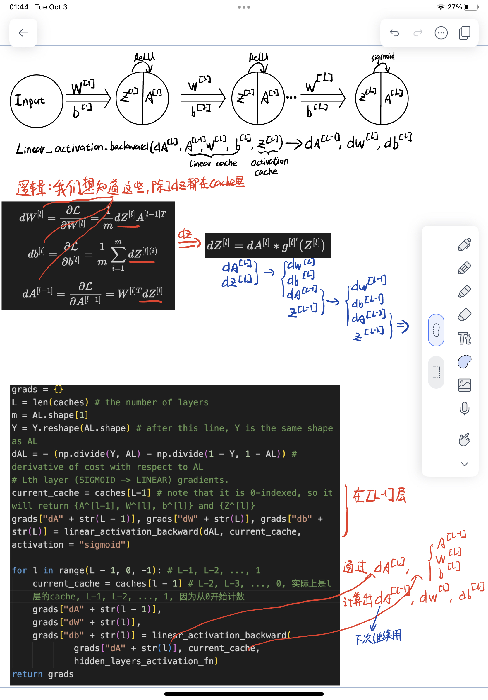

# TL;DR:
1. read relavtive [source](https://towardsdatascience.com/coding-neural-network-forward-propagation-and-backpropagtion-ccf8cf369f76)
2. read this 

# IMPORTANT: BackProp Math
**Suppose we have $dZ^{[l]} = \frac{\partial \mathcal{L} }{\partial Z^{[l]}}$, we want to calculate $(dW^{[l]}, db^{[l]} dA^{[l-1]})$**  

<center>

</center>
  
**Here is what we will do:**

$$  
dW^{[l]} = \frac{\partial \mathcal{L} }{\partial W^{[l]}} = \frac{1}{m} dZ^{[l]} A^{[l-1] T} 
$$  
$$  
db^{[l]} = \frac{\partial \mathcal{L} }{\partial b^{[l]}} = \frac{1}{m} \sum_{i = 1}^{m} dZ^{[l](i)}
$$  
$$  
dA^{[l-1]} = \frac{\partial \mathcal{L} }{\partial A^{[l-1]}} = W^{[l] T} dZ^{[l]} 
$$  

Code can be found below (linear_backward function)  


In order to derive $dZ^{[l]}$, we need to calculate $dZ^{[l]} = dA^{[l]} * g^{[l]'}(Z^{[l]})$  

Code can be found below (linear_activation_backward function)

# IMPORTANT: Parameters Initialization
> Input data stack <u>horizontally</u> or vertically. Each column is a example. No need to transpose $W$  

|           | Shape of W | Shape of b | Activation | Shape of  Activation |  
| --------- | ---------- | ---------- | ---------- | -------------------- |  
| Layer 1   | $(n^{[1]},num\:of\:input\:parameters)$ | $(n^{[1]},1)$ | $Z^{[1]} = W^{[1]}  X + b^{[1]}$ | $(n^{[1]},num\:of\:samples)$ |  
| Layer 2   | $(n^{[2]}, n^{[1]})$ | $(n^{[2]},1)$ | $Z^{[2]} = W^{[2]} A^{[1]} + b^{[2]}$ | $(n^{[2]}, num\:of\:samples)$ |  
| $\vdots$| $\vdots$ | $\vdots$ | $\vdots$ | $\vdots$ |  
| Layer L-1 | $(n^{[L-1]}, n^{[L-2]})$ | $(n^{[L-1]}, 1)$ | $Z^{[L-1]} =  W^{[L-1]} A^{[L-2]} + b^{[L-1]}$ | $(n^{[L-1]}, num\:of\:samples)$ |  
| Layer L   | $(n^{[L]}, n^{[L-1]})$ | $(n^{[L]}, 1)$ | $Z^{[L]} =  W^{[L]} A^{[L-1]} + b^{[L]}$ | $(n^{[L]}, num\:of\:samples)$ | 


# IMPORTANT: Linear forward caches $A^{[l-1]}, W^{[l]} \:and\: b^{[l]} (which \:are\: used\: in\: the\: above\: picture)$. Activation functions cache $A^{[l-1]}, W^{[l]} \:and\: b^{[l]}$. 
## Main Logic
```python
def initialize_parameters_deep(layer_dims):
    """
    Arguments:
    layer_dims -- python array (list) containing the dimensions of each layer in our network
    
    Returns:
    parameters -- python dictionary containing your parameters "W1", "b1", ...,:
                    Wl -- weight matrix of shape (layer_dims[l], layer_dims[l-1])
                    bl -- bias vector of shape (layer_dims[l], 1)
    """
    parameters = {}
    L = len(layer_dims)            # number of layers in the network
    for l in range(1, L): # L excluded
        parameters['W' + str(l)] = np.random.randn(layer_dims[l],layer_dims[l-1])*0.01
        parameters['b' + str(l)] = np.zeros((layer_dims[l],1))        
    return parameters
```
> WL and bL are initialized later.


```python
def linear_forward(A, W, b):
    Z = np.dot(W, A) + b
    cache = (A, W, b)
    return Z, cache
```
> Just the implementaion for $Z^{[l]} = W^{[l]}A^{[l-1]} +b^{[l]}$  
> This linear combination would cache $A^{[l-1]}, W^{[l]} \:and\: b^{[l]}$ for later use in backpropagation.  

```python
def linear_activation_forward(A_prev, W, b, activation):
    if activation == "sigmoid":
        Z, linear_cache = linear_forward(A_prev,W,b)
        A, activation_cache = sigmoid(Z)
    elif activation == "relu":
        Z, linear_cache = linear_forward(A_prev,W,b)
        A, activation_cache = relu(Z)
    
    cache = (linear_cache, activation_cache)
    return A, cache
```
> Activation function would return $A^{[l]}$ and $Z^{[l]}$  

> This whole function would return $A^{[l]}$ and cache $A^{[l-1]}, W^{[l]}, b^{[l]}$ and $Z^{[l]}$ for later use in backpropagation.  


```python
def L_model_forward(X, parameters):
    """
    Arguments:
    parameters -- output of initialize_parameters_deep() 
    Returns:
    AL -- last post-activation value
    caches -- list of caches containing:
    """
    caches = []
    A = X
    L = len(parameters) // 2 # number of layers in the neural network
    for l in range(1, L):
        A_prev = A 
        A, cache = linear_activation_forward(A_prev,parameters['W' + str(l)],parameters['b' + str(l)],activation = "relu")
        caches.append(cache)
    # This is to deal with last layer since our initlization only considers the first L-1 layers
    AL, cache = linear_activation_forward(A,parameters['W' + str(L)],parameters['b' + str(L)],activation = "sigmoid")
    caches.append(cache)
    return AL, caches
```

```python
def linear_backward(dZ, cache):
    A_prev, W, b = cache
    m = A_prev.shape[1]
    dW = 1 / m * np.dot(dZ ,A_prev.T)
    db = 1 / m * np.sum(dZ,axis = 1 ,keepdims=True)
    dA_prev = np.dot(W.T,dZ) 
    return dA_prev, dW, db
```
```python
# GRADED FUNCTION: linear_activation_backward

def linear_activation_backward(dA, cache, activation):
    """
    Implement the backward propagation for the LINEAR->ACTIVATION layer.
    
    Arguments:
    dA -- post-activation gradient for current layer l 
    cache -- tuple of values (linear_cache, activation_cache) we store for computing backward propagation efficiently
    activation -- the activation to be used in this layer, stored as a text string: "sigmoid" or "relu"
    
    Returns:
    dA_prev -- Gradient of the cost with respect to the activation (of the previous layer l-1), same shape as A_prev
    dW -- Gradient of the cost with respect to W (current layer l), same shape as W
    db -- Gradient of the cost with respect to b (current layer l), same shape as b
    """
    # cache has two elements: linear_cache and activation_cache, which has {A^[l-1], W^[l], b^[l]} and {Z^[l]} respectively
    linear_cache, activation_cache = cache
    
    if activation == "relu":
        dZ = relu_backward(dA, activation_cache)
        dA_prev, dW, db = linear_backward(dZ, linear_cache)
        
    elif activation == "sigmoid":
        dZ = sigmoid_backward(dA, activation_cache)
        dA_prev, dW, db = linear_backward(dZ, linear_cache)
    return dA_prev, dW, db
```

```python
def L_model_backward(AL, Y, caches):
    """
    Arguments:
    AL -- probability vector, output of the forward propagation (L_model_forward())
    Y -- true "label" vector (containing 0 if non-cat, 1 if cat)
    caches -- list of caches containing:
                every cache of linear_activation_forward() with "relu" (it's caches[l], for l in range(L-1) i.e l = 0...L-2)
                the cache of linear_activation_forward() with "sigmoid" (it's caches[L-1])
    Returns:
    grads -- A dictionary with the gradients
             grads["dA" + str(l)] = ...
             grads["dW" + str(l)] = ...
             grads["db" + str(l)] = ...
    """
    # Each cache in list has two elements: linear_cache and activation_cache, which has {A^[l-1], W^[l], b^[l]} and {Z^[l]} respectively
    grads = {}
    L = len(caches) # the number of layers
    m = AL.shape[1]
    Y = Y.reshape(AL.shape) # after this line, Y is the same shape as AL
    dAL = - (np.divide(Y, AL) - np.divide(1 - Y, 1 - AL)) # derivative of cost with respect to AL   
    # Lth layer (SIGMOID -> LINEAR) gradients. 
    current_cache = caches[L-1] # note that it is 0-indexed, so it will return {A^[l-1], W^[l], b^[l]} and {Z^[l]}
    grads["dA" + str(L - 1)], grads["dW" + str(L)], grads["db" + str(L)] = linear_activation_backward(dAL, current_cache, activation = "sigmoid")
      
    for l in range(L - 1, 0, -1): # L-1, L-2, ..., 1
        current_cache = caches[l - 1] # L-2, L-3, ..., 0, 实际上是l层的cache, L-1, L-2, ..., 1, 因为从0开始计数
        grads["dA" + str(l - 1)], 
        grads["dW" + str(l)], 
        grads["db" + str(l)] = linear_activation_backward(
                grads["dA" + str(l)], current_cache,
                hidden_layers_activation_fn)
    return grads
```

```python
def update_parameters(parameters, grads, learning_rate):
    L = len(parameters) // 2 # number of layers in the neural network
    for l in range(L):
        parameters["W" + str(l+1)] =  parameters["W" + str(l+1)] - learning_rate * grads["dW" + str(l + 1)]
        parameters["b" + str(l+1)] = parameters["b" + str(l+1)] - learning_rate * grads["db" + str(l + 1)]     
    return parameters
```