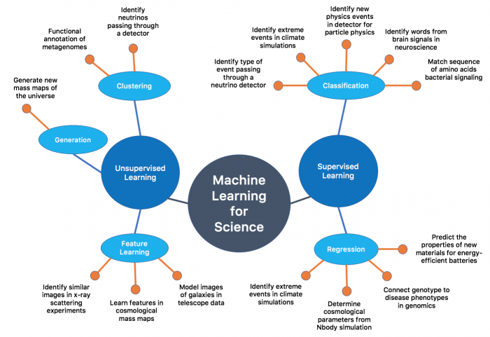

# Machine Learning Daily Blog

## Overview  
- Basic Concepts ([notes](https://github.com/WangCheng0116/ML/blob/main/Concepts/note.md))
- [Table of Contents](#table-of-contents)
- [Decision Tree](#decision-tree)
  - [ID3 (Iterative Dichotomiser)](#id3-iterative-dichotomiser)
  - [C4.5](#c45)
  - [CART](#cart)
    - [Gini Index](#gini-index)
    - [Dealing with continuous values](#dealing-with-continuous-values)
  - [Pre-Pruning](#pre-pruning)
  - [Post-Pruning](#post-pruning)
    - [Reduced Error Pruning (REP)](#reduced-error-pruning-rep)
    - [Pessimistic Error Pruning (PEP)](#pessimistic-error-pruning-pep)
    - [Minimum Error Pruning (MEP)](#minimum-error-pruning-mep)
    - [Cost-Complexity Pruning (CCP)](#cost-complexity-pruning-ccp)
- [Bayes Classifier](#bayes-classifier)
  - [Bayes Theorem](#bayes-theorem)
  - [Naive Bayes Theorem](#naive-bayes-theorem)
  - [Bayes Classifier](#bayes-classifier-1)
  - [Native Bayes Classifier](#native-bayes-classifier)
- [Linear Regression with one variable](#linear-regression-with-one-variable)
  - [Gradient Descent](#gradient-descent)
  - [Apply Gradient Descent into linear regression model](#apply-gradient-descent-into-linear-regression-model)
- [Matrix Review](#matrix-review)
- [Linear Regression with multiple variables](#linear-regression-with-multiple-variables)
  - [New notations](#new-notations)
  - [Gradient Descent for Multiple Variables](#gradient-descent-for-multiple-variables)
  - [Python Implementation](#python-implementation)
  - [Feature Scaling](#feature-scaling)
  - [Learning Rate](#learning-rate)
- [Features and Polynomial Regression](#features-and-polynomial-regression)
- [Normal Equation](#normal-equation)
- [Comparison](#comparison)
  - [What if X^T X is not invertible?](#what-if-xt-x-is-not-invertible)
- [Logistic Regression](#logistic-regression)
  - [Classification Problems](#classification-problems)
  - [Decision Boundary](#decision-boundary)
  - [Cost Function](#cost-function)
  - [Vectorization of Logistic Regression](#vectorization-of-logistic-regression)
  - [Multiclass Classification](#multiclass-classification)
- [Regularization](#regularization)
  - [Underfit and Overfit](#underfit-and-overfit)
  - [Motivation to have regularization](#motivation-to-have-regularization)
  - [Gradient Descent and Normal Equation Using Regularization in Linear Regression](#gradient-descent-and-normal-equation-using-regularization-in-linear-regression)
  - [Gradient Descent Using Regularization in Logistic Regression](#gradient-descent-using-regularization-in-logistic-regression)
  - [Gradient Descent Using Regularization in Neural Networks](#gradient-descent-using-regularization-in-neural-networks)
  - [Dropout](#dropout)
    - [Implementation](#implementation)
  - [Other Methods of Regularization](#other-methods-of-regularization)
- [Neural Networks](#neural-networks)
  - [Activation functions](#activation-functions)
  - [Multiclass Classification](#multiclass-classification-1)
  - [Cost Function](#cost-function-1)
  - [Backpropagation Algorithm](#backpropagation-algorithm)
  - [Randomize Initialization](#randomize-initialization)
- [Deep Neural Network](#deep-neural-network)
  - [Working Flow Chart](#working-flow-chart)
- [Setting Up ML Application](#setting-up-ml-application)
  - [Data Split: Training / Validation / Test Sets](#data-split-training--validation--test-sets)
  - [Vanishing and Exploding Gradients](#vanishing-and-exploding-gradients)
  - [Gradient Checking (Grad Check)](#gradient-checking-grad-check)
- [Optimization Algorithms](#optimization-algorithms)
  - [Mini-Batch Gradient Descent](#mini-batch-gradient-descent)
    - [Batch Gradient Descent:](#batch-gradient-descent)
    - [Stochastic Gradient Descent:](#stochastic-gradient-descent)
  - [Exponentially Weighted Averages](#exponentially-weighted-averages)
  - [Bias Correction in Exponentially Weighted Averages](#bias-correction-in-exponentially-weighted-averages)
  - [Gradient Descent with Momentum](#gradient-descent-with-momentum)
  - [RMSprop(Root Mean Square Propagation)](#rmsproproot-mean-square-propagation)
  - [Adam Optimization Algorithm(Adaptive Moment Estimation)](#adam-optimization-algorithmadaptive-moment-estimation)
  - [Learning Rate Decay](#learning-rate-decay)
  - [Local Optima](#local-optima)
- [Hyperparameter Tuning Batch Normalization and Programming Frameworks](#hyperparameter-tuning-batch-normalization-and-programming-frameworks)
  - [Tuning Process](#tuning-process)
  - [Using an Appropriate Scale to Pick Hyperparameters](#using-an-appropriate-scale-to-pick-hyperparameters)
  - [Hyperparameters Tuning in Practice: Pandas vs. Caviar](#hyperparameters-tuning-in-practice-pandas-vs-caviar)
  - [Normalizing Activations in a Network](#normalizing-activations-in-a-network)
  - [Batch Normalization (BN)](#batch-normalization-bn)
  - [Fitting Batch Norm into a Neural Network](#fitting-batch-norm-into-a-neural-network)
  - [Batch Normalization and Its Usage](#batch-normalization-and-its-usage)
  - [Why Does Batch Norm Work?](#why-does-batch-norm-work)
  - [Benefits of Batch Normalization](#benefits-of-batch-normalization)
  - [Batch Norm at Test Time](#batch-norm-at-test-time)
  - [Softmax Regression](#softmax-regression)
- [Introduction to ML Strategy I](#introduction-to-ml-strategy-i)
  - [Orthogonalization in Machine Learning](#orthogonalization-in-machine-learning)
  - [Training / Validation / Test Set Split](#training--validation--test-set-split)
  - [Distribution of Validation and Test Sets](#distribution-of-validation-and-test-sets)
  - [Partitioning Data](#partitioning-data)
  - [Comparing to Human Performance](#comparing-to-human-performance)
  - [Summary](#summary)
- [Introduction to ML Strategy II](#introduction-to-ml-strategy-ii)
- [Convolutional Neural Networks](#convolutional-neural-networks)
  - [Padding in Convolution](#padding-in-convolution)
  - [Strided Convolution](#strided-convolution)
  - [Convolution in High Dimensions](#convolution-in-high-dimensions)
  - [Single-Layer Convolutional Network](#single-layer-convolutional-network)
    - [Summary of Notation](#summary-of-notation)
  - [Simple Convolutional Network Example](#simple-convolutional-network-example)
  - [Pooling Layer](#pooling-layer)
  - [Fully Connected Layer](#fully-connected-layer)
  - [Example of a Convolutional Neural Network (CNN)](#example-of-a-convolutional-neural-network-cnn)
  - [Why Convolutions?](#why-convolutions)
- [Convolutional Neural Networks (CNN) Architectures](#convolutional-neural-networks-cnn-architectures)
  - [LeNet-5](#lenet-5)
  - [AlexNet](#alexnet)
  - [VGG](#vgg)
  - [ResNet (Residual Network)](#resnet-residual-network)
    - [Reasons Why Residual Networks Work](#reasons-why-residual-networks-work)
- [Object Detection](#object-detection)
  - [Object Localization](#object-localization)
  - [Object Detection](#object-detection-1)
  - [Convolutional Implementation of Sliding Windows (Do partition all at once, no need to feed in sliding windows sequentially)](#convolutional-implementation-of-sliding-windows-do-partition-all-at-once-no-need-to-feed-in-sliding-windows-sequentially)
  - [Bounding Box Predictions](#bounding-box-predictions)
  - [Intersection Over Union (IoU)](#intersection-over-union-iou)
  - [Non-Maximum Suppression](#non-maximum-suppression)
  - [R-CNN](#r-cnn)
- [Face Recognition and Neural Style Transfer](#face-recognition-and-neural-style-transfer)
  - [Difference Between Face Verification and Face Recognition](#difference-between-face-verification-and-face-recognition)
  - [One-Shot Learning](#one-shot-learning)
  - [Siamese Network](#siamese-network)
  - [Triplet Loss](#triplet-loss)
  - [As Binary Classification](#as-binary-classification)
  - [Neural Style Transfer](#neural-style-transfer)
  - [What Deep Convolutional Networks Learn](#what-deep-convolutional-networks-learn)
  - [Cost Function For Neural Style Transfer](#cost-function-for-neural-style-transfer)
    - [Content Cost Function](#content-cost-function)
    - [Style Cost Function](#style-cost-function)
- [Sequence Models](#sequence-models)
  - [Notations](#notations)
  - [Recurrent Neural Network (RNN) Model](#recurrent-neural-network-rnn-model)
    - [Forward Propagation](#forward-propagation)
    - [Backpropagation Through Time (BPTT)](#backpropagation-through-time-bptt)
  - [Different Types of RNNs](#different-types-of-rnns)
  - [Language Model](#language-model)
  - [Sampling](#sampling)
  - [The Gradient Vanishing Problem in RNNs](#the-gradient-vanishing-problem-in-rnns)
- [Expectation Maximization (EM) Algorithm](#expectation-maximization-em-algorithm)
  - [Intuitive Explanation](#intuitive-explanation)
  - [Intuitive Algorithm](#intuitive-algorithm)
  - [Formal Proof](#formal-proof)
    - [Likelihood Function](#likelihood-function)
    - [Log Likelihood Function](#log-likelihood-function)
    - [Jensen Inequality](#jensen-inequality)
    - [EM](#em)
  - [EM Algorithm](#em-algorithm)
  - [Why EM Converges?](#why-em-converges)
- [Gaussian Mixture Model (GMM)](#gaussian-mixture-model-gmm)
  - [Notation](#notation)
  - [Algorithm](#algorithm)
  - [Intuitive Example](#intuitive-example)
  - [Implementation](#implementation-1)
  - [Math Proof](#math-proof)
- [Clustering](#clustering)
  - [Measuring Similarity](#measuring-similarity)
    - [Minkowski Distance:](#minkowski-distance)
    - [Mahalanobis Distance:](#mahalanobis-distance)
    - [Correlation Coefficient:](#correlation-coefficient)
    - [Cosine Similarity:](#cosine-similarity)
- [K Means Clustering](#k-means-clustering)
  - [Algorithm](#algorithm-1)
  - [How to choose k?](#how-to-choose-k)
  - [Improvement](#improvement)
  - [Smarter Initialization - K Means++](#smarter-initialization---k-means)
  - [Why K-Means is a variant of EM?](#why-k-means-is-a-variant-of-em)
- [K Nearest Neighbors (KNN) Algorithm](#k-nearest-neighbors-knn-algorithm)
  - [Algorithm I - Linear Scan](#algorithm-i---linear-scan)
  - [Algorithm II - KD Tree](#algorithm-ii---kd-tree)
    - [Build KD Tree](#build-kd-tree)
    - [Search KD Tree to find k nearest neighbors](#search-kd-tree-to-find-k-nearest-neighbors)
- [Support Vector Machine (SVM)](#support-vector-machine-svm)
- [Ensemble Learning](#ensemble-learning)
  - [Bagging](#bagging)
    - [Random Forest](#random-forest)
  - [Boosting](#boosting)
    - [AdaBoost (Adaptive Boosting)](#adaboost-adaptive-boosting)
      - [Algorithm](#algorithm-2)
      - [Example](#example)
      - [Why alpha is like that?](#why-alpha-is-like-that)
      - [Why we can update w\_m is like that?](#why-we-can-update-w_m-is-like-that)
    - [Boosting Decision Tree](#boosting-decision-tree)
      - [Herustic Example](#herustic-example)
    - [Gradient Boosting Decision Tree](#gradient-boosting-decision-tree)
      - [Why Gradient?](#why-gradient)
      - [Algorithm](#algorithm-3)
    - [XGBoost](#xgboost)
      - [Loss Function Formulation](#loss-function-formulation)
      - [Partitioning (How to find the best split)](#partitioning-how-to-find-the-best-split)
        - [Greedy Algorithm](#greedy-algorithm)
        - [Approximate Algorithm](#approximate-algorithm)

- Challenges
  - [Matrix Differentiation](https://github.com/WangCheng0116/ML/blob/main/Challenges/Matrix%20Differentiation.md)
  - [Backpropagation](https://github.com/WangCheng0116/ML/blob/main/Challenges/Back%20Propogation.md)
  - [SVM Math Proof](https://github.com/WangCheng0116/ML/blob/main/Challenges/SVM%20Math%20Proof.md)
  - [XGBoost Math Proof](https://github.com/WangCheng0116/ML/blob/main/Challenges/XGBoost.md)
  
- Code (code implementation for model)
  - [CNN](https://github.com/WangCheng0116/ML/tree/main/Code%20Implementation/CNN)
  - [KNN-Iris](https://github.com/WangCheng0116/ML/tree/main/Code%20Implementation/KNN-Iris)
  - [Optimization Method - Mini-batches, Momentum and Adam](https://github.com/WangCheng0116/ML/tree/main/Code%20Implementation/Optimization%20Method%20-%20Mini-batches%2C%20Momentum%20and%20Adam)
  - [CNN - Fruit Recognition](https://github.com/WangCheng0116/ML/tree/main/Code%20Implementation/CNN%20-%20Fruit%20Recognition)
  - [Linear Regression](https://github.com/WangCheng0116/ML/tree/main/Code%20Implementation/Linear%20Regression)
  - [Random Forest](https://github.com/WangCheng0116/ML/tree/main/Code%20Implementation/Random%20Forest)
  - [Decision Tree](https://github.com/WangCheng0116/ML/tree/main/Code%20Implementation/Decision%20Tree)
  - [Logistic Regression](https://github.com/WangCheng0116/ML/tree/main/Code%20Implementation/Logistic%20Regression)
  - [Regularization - L2 and dropout](https://github.com/WangCheng0116/ML/tree/main/Code%20Implementation/Regularization%20-%20L2%20and%20dropout)
  - [Deep Neural Network](https://github.com/WangCheng0116/ML/tree/main/Code%20Implementation/Deep%20Neural%20Network)
  - [Neural Network - Binary Classification on 2D plane](https://github.com/WangCheng0116/ML/tree/main/Code%20Implementation/Neural%20Network%20-%20Binary%20Classification%20on%202D%20plane)
  - [ResNets](https://github.com/WangCheng0116/ML/tree/main/Code%20Implementation/ResNets)
  - [GradientChecking](https://github.com/WangCheng0116/ML/tree/main/Code%20Implementation/GradientChecking)
  - [Neural Network - Digit Recognition](https://github.com/WangCheng0116/ML/tree/main/Code%20Implementation/Neural%20Network%20-%20Digit%20Recognition)
  - [Choose Good Initialization](https://github.com/WangCheng0116/ML/tree/main/Code%20Implementation/choose%20good%20Initialization)
  - [SVM on Binary Classification](https://github.com/WangCheng0116/ML/blob/main/Code%20Implementation/SVM%20Binary%20Classification/SVM_Binary_Classification.ipynb) 
- Resources
  - [Machine Learning Cheatsheet](https://ml-cheatsheet.readthedocs.io/en/latest/index.html) 
  - [Neural Network Playground](https://playground.tensorflow.org/)
  - [CNN Explainer](https://poloclub.github.io/cnn-explainer/)
  - [LaTex Cheatsheet](https://wch.github.io/latexsheet/latexsheet.pdf)
  - [GAN Lab](https://poloclub.github.io/ganlab/)
  
  

## Calendar 

### September 2023  
|   Sunday   |   Monday   |   Tuesday   |   Wednesday   |   Thursday   |   Friday   |   Saturday   |
|:---------:|:---------:|:---------:|:-----------:|:---------:|:-------:|:---------:|
|           | [ ] 1     | [ ] 2     | [ ] 3       | [ ] 4     | [ ] 5   | [ ] 6     |
| [ ] 7     | [ ] 8     | [ ] 9     | [ ] 10      | [ ] 11    | [ ] 12  | [ ] 13    |
| [ ] 14    | [ ] 15    | [ ] 16    | [ ] 17      | [ ] 18    | [ ] 19  | [ ] 20    |
| [ ] 21    | [ ] 22    | [ ] 23    | [ ] 24      | [ ] 25    | [ ] 26  | [ ] 27    |
| [✅ 28](##28-Sept) | [✅ 29](##29-Sept) | [✅ 30](##30-Sept) |           |         |           |

### October 2023  
|   Sunday   |   Monday   |   Tuesday   |   Wednesday   |   Thursday   |   Friday   |   Saturday   |
|:---------:|:---------:|:---------:|:-----------:|:---------:|:-------:|:---------:|
|           | ✅ [1](##1-Oct)     |  ✅ [2](##2-Oct)     |  ✅ [3](##3-Oct)       | ✅ [4](##4-Oct)     | [Midterm] 5   |  ✅[6](##6-Oct)     |
|  ✅[7](##7-Oct)      | [Midterm] 8     | [Midterm] 9     | ✅[10](##10-Oct)       | ✅[11](##11-Oct)    | ✅[12](##12-Oct)  | ✅[13](##13-Oct)    |
| ✅[14](##14-Oct)   | [Chill] 15    | ✅[16](##16-Oct)    | ✅[17](##17-Oct)      | [ ] 18    | [ ] 19  | [ ] 20    |
| [ ] 21    | [ ] 22    | [ ] 23    | [ ] 24      | [ ] 25    | [ ] 26  | [ ] 27    |
| [ ] 28    | [ ] 29    | [ ] 30    | [ ] 31      |           |         |           |

## 28 Sept  
Today is officially the first day of my journey in Machine Learning. During the conversation with Prof Soh, he recommended I first learn the concept of random forest and gradient boosted, but I feel like I might start from the whole picture of ML and then dive into those two topics meticulously. The material that I opted for is from Andrew Ng, a pretty well-known course. And today I managed to finish the following chapters. I took special notice of math formulas, so I wrote all the steps in a rigorous mathematical manner. 

* Linear Regression with one variable
* Matrix Review
* Linear Regression with multiple variables
* Features and Polynomial Regression
* Logistic Regression

[Notes can be found here](https://github.com/WangCheng0116/ML/blob/main/AndrewNgMLCourse/note.md)

## 29 Sept
I GOT DRIVEN CRAZY BY BP PROOF!!!  
I have watched at least five different videos and none of them explain this thoroughly, in the end, I have no choice but to use plain math. What torture it is(I hate all those subscripts and superscripts in NN. HATE THEM!).

Today what I have learned:
* Regularization
* Neural Networks
* Deep Neural Networks

[Notes can be found here](https://github.com/WangCheng0116/ML/blob/main/AndrewNgMLCourse/note.md)

## 30 Sept
Today I did something different, something real!   
This is my first neural network for recognizing digits. Details can be found [here](https://github.com/WangCheng0116/ML/tree/main/Projects/Digit%20Recognition), I also include my takeaway there.  

Other topics that I have learned:  
- Mini-Batch Gradient Descent

- Exponentially Weighted Averages

- Bias Correction in Exponentially Weighted Averages

- Gradient Descent with Momentum

- RMSprop

- Adam Optimization Algorithm

- Learning Rate Decay

- Local Optima Issues

## 1 Oct
Today is the last day of recess week. From tomorrow on I think I will shift my focus to midterms again. Anyway, this is what I have learned, and it was the first time to have been exposed to CNN, the thing only existed in legend before. But it turned out to be quite easy to understand due to its high resemblance with NN.
- Orthogonalization in Machine Learning
- Training / Validation / Test Set Split
- Distribution of Validation and Test Sets
- Partitioning Data
- Comparing to Human Performance
- Convolutional Neural Networks
- Padding in Convolution
- Strided Convolution
- Convolution in High Dimensions
- Single-Layer Convolutional Network
- Simple Convolutional Network Example
- Pooling Layer
- Fully Connected Layer
- Example of a Convolutional Neural Network (CNN)
- Why Convolutions?

## 2 Oct
Conception wise:
- Padding in Convolution
- Strided Convolution
- Convolution in High Dimensions
- Single-Layer Convolutional Network
- Pooling Layer
- Fully Connected Layer (FC)
- Example of a CNN
- Why Convolutions?
- CNN Architectures
- Reasons Why Residual Networks Work

Projects wise:
[NN Binary Classification](https://github.com/WangCheng0116/ML/tree/main/Projects/Neural%20Network%20-%20Binary%20Classification%20on%202D%20plane)

## 3 Oct
The online tutorial became more and more theoretical, so I decided to include more code implementation in my learning process.  
Still, conceptwise:
- Object Detection
  - Bounding Boxes
  - Target Labels
  - Loss Functions
  - Sliding Windows Detection Algorithm
  - Convolutional Implementation of Sliding Windows
  - YOLO Algorithm
  - Intersection Over Union (IoU)
  - Non-Maximum Suppression (NMS)
  - R-CNN
  - Anchor Boxes
  
Projects wise:  
[Logistic Regression](https://github.com/WangCheng0116/ML/tree/main/Projects/Logistic%20Regression)
[Multiple Methods for initialization](https://github.com/WangCheng0116/ML/tree/main/Projects/choose%20good%20Initialization)  

## 4 Oct
Conceptwise:
- Difference Between Face Verification and Face Recognition
- One-Shot Learning
- Siamese Network
- Triplet Loss
- As Binary Classification
- Neural Style Transfer
- What Deep Convolutional Networks Learn
- Cost Function For Neural Style Transfer
- Content Cost Function
- Style Cost Function

Projects wise:
[DNN](https://github.com/WangCheng0116/ML/tree/main/Projects/Deep%20Neural%20Network)
[Gradient Checking](https://github.com/WangCheng0116/ML/tree/main/Projects/GradientChecking)

## 5 Oct
Midterm Time  

## 6 Oct
Project:  
[Regularization-L2 and dropout](https://github.com/WangCheng0116/ML/tree/main/Projects/Regularization%20-%20L2%20and%20dropout)

## 7 Oct
Project:
[Optimization Method: Mini-batches, Momentum and Adam](https://github.com/WangCheng0116/ML/tree/main/Projects/Optimization%20Method%20-%20Mini-batches%2C%20Momentum%20and%20Adam)

## 10 Oct  
Finally, the midterm week has ended. It's time to get back on track.  
I did a project on Kaggle about [fruit recognition](https://github.com/WangCheng0116/ML/tree/main/Code%20Implementation/CNN%20-%20Fruit%20Recognition)  
In terms of new topics, I opted for a relatively easier one -- KNN, my own implementation from scratch and application on Iris dataset can be found [here](https://github.com/WangCheng0116/ML/tree/main/Code%20Implementation/KNN-Iris)

## 11 Oct
Plan for going through new concepts has been put aside because I saw the syllabus that I will focus on NLP, which I think is not that relevant to my current job. So..., see you later NLP.  

Instead, I will focus more on using ML framework, more specifically, Pytorch. Notes can be found [here](https://github.com/WangCheng0116/ML/blob/main/pytorch/note.md)  
Projects done:  
* [CNN-Multi-classification](https://github.com/WangCheng0116/ML/blob/main/pytorch/code/PyTorch_NN_MultiClassification.ipynb)
* [Fashion MNIST](https://github.com/WangCheng0116/ML/blob/main/pytorch/code/Pytorch_FashionMnist.ipynb)

## 12 Oct
Things have started getting busier and busier recently, mainly because of CS2103T and stuff :( As a result, today I learned two relatively chill topics, which are tensorboard and transform. I didn't have time to actually implement them, but I will mark this down and try to use them in the future. Note can be found [here](https://github.com/WangCheng0116/ML/blob/main/pytorch/note.md)

## 13 Oct
Today I tried digging into a gradient-boosted method, which is stated to be quite important by Prof. Again, this topic is very mathy and for future actual code usage, I will try to look for suitable frameworks and train this model. This topic deserves to be included in the [challenge](https://github.com/WangCheng0116/ML/blob/main/Challenges/XGBoost.md) folder.
## 14 Oct
This is a hard day. Currently, I need to confess that SVM is by far the most math-heavy topic I have ever learned. On a side note, it is very interesting to see how my math courses are intertwined with SVM, because I happen to be learning non-linear optimization (MA3236). I will put SVM in [challenge](https://github.com/WangCheng0116/ML/blob/main/Challenges/SVM%20Math%20Proof.md) folder. A very simple implementation of SVM can be found [here](https://github.com/WangCheng0116/ML/blob/main/Code%20Implementation/SVM%20Binary%20Classification/SVM_Binary_Classification.ipynb) (using scikit)

## 16 Oct
Today's topic is a quite unique one, since we are going back to revise the concept of decision tree. Things turned out to be so surprising -- 2109S only covers a very tiny small portion of that and omit a lot of math induction. Learned a lot :)

## 17 Oct
Today's topic is about ensembling method, which is a very popular method in ML. And also, the method called gradient boosting has been emphasized by prof. Indeed it is a very powerful method, but it is also very mathy. Refer to [here](https://github.com/WangCheng0116/ML/blob/main/Concepts/note.md#ensemble-learning) for more details. 
