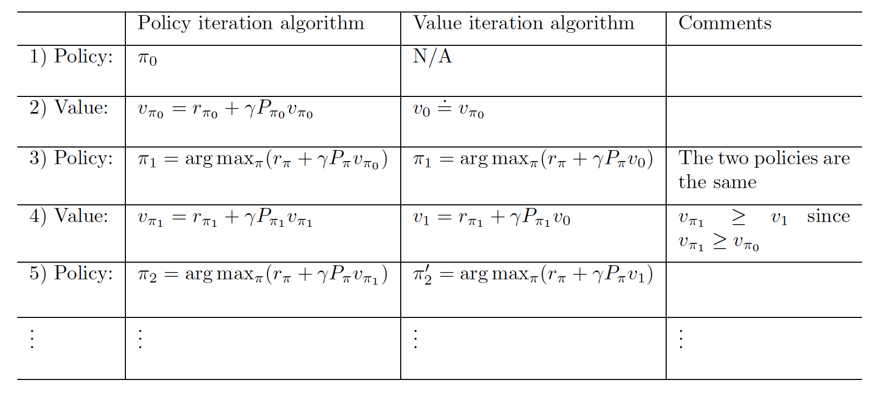
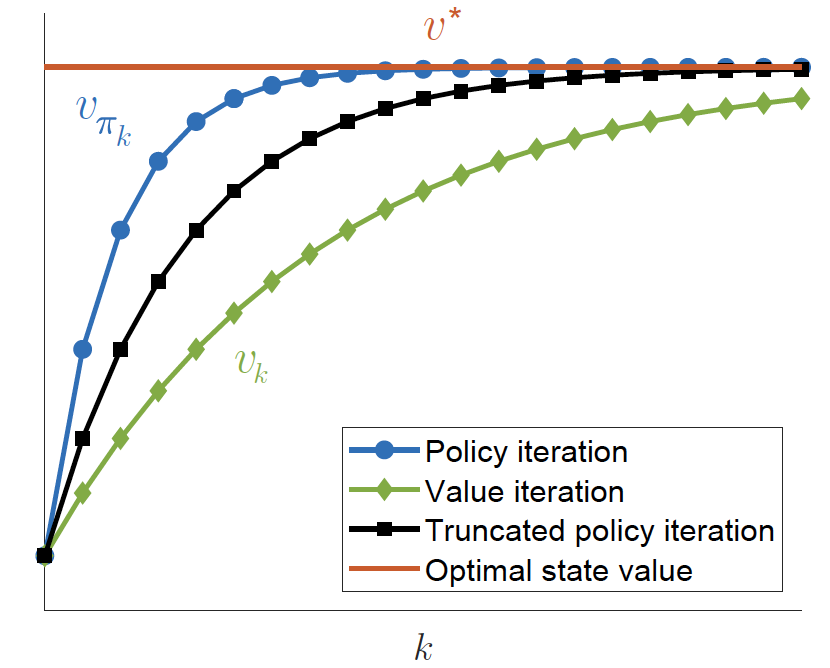

- [Basic Concepts](#basic-concepts)
- [Bellman Equation](#bellman-equation)
  - [Motivating Example](#motivating-example)
  - [State Value](#state-value)
  - [Bellman Equation](#bellman-equation-1)
  - [Bellman Equation in Matrix Form](#bellman-equation-in-matrix-form)
  - [Solving Bellman Equation (Closed Form and Iterative Method)](#solving-bellman-equation-closed-form-and-iterative-method)
  - [Action Value](#action-value)
  - [Summary](#summary)
- [Optimal State Value and Bellman Optimality Equation (BOE)](#optimal-state-value-and-bellman-optimality-equation-boe)
  - [Optimal Policy](#optimal-policy)
  - [Bellman Optimality Equation (BOE)](#bellman-optimality-equation-boe)
  - [Contraction Mapping Theorem](#contraction-mapping-theorem)
    - [Definition](#definition)
    - [Theorem](#theorem)
    - [Proof](#proof)
  - [BOE is a Contraction Mapping](#boe-is-a-contraction-mapping)
  - [Solution of BOE](#solution-of-boe)
  - [$\\gamma$ in BOE](#gamma-in-boe)
  - [Value Iteration Algorithm](#value-iteration-algorithm)
    - [Example](#example)
  - [Policy Iteration Algorithm](#policy-iteration-algorithm)
    - [Example](#example-1)
- [\\end{bmatrix}](#endbmatrix)
- [\\end{bmatrix}](#endbmatrix-1)
  - [Truncated Policy Iteration](#truncated-policy-iteration)
    - [Algorithm](#algorithm)
  - [Summary](#summary-1)
# Basic Concepts
* State: $s_t$ describes the agent's status with respect to the environment.
* State Space: $S$ is the set of all possible states.
* Action: $a_t$ is the action taken by the agent at time $t$.
* Action Space: $A$ is the set of all possible actions.
* State Transition: A process where the agent moves from one state to another.
* State Transition Probability: $p(s'|s,a)$ is the probability of transitioning from state $s$ to state $s'$ under action $a$.
* Policy: tells what action to take at a state. $\pi(a|s)$, which means the probability of taking action $a$ at state $s$.
* Reward: 
* Reward Probability: $p(r|s,a)$ is the probability of getting reward $r$ at state $s$ under action $a$.
* Trajectory: is state-action-reward sequence. 
* Return: summation of all rewards in a trajectory. 
* Discount Factor: $\gamma \in (0,1)$ is the discount factor. It is used to discount the future reward.

# Bellman Equation
## Motivating Example
  

Suppose $v_i$ is the return value of a trajectory starting at state $s_i$, then we have (consider discount factor $\gamma$):
$$
\begin{align}
v_1 &= r_1 + \gamma r_2 + \gamma^2 r_3 + ... \\
v_2 &= r_2 + \gamma r_3 + \gamma^2 r_4 + ... \\
v_3 &= r_3 + \gamma r_4 + \gamma^2 r_1 + ... \\
v_4 &= r_4 + \gamma r_1 + \gamma^2 r_2 + ... \\
\end{align}
$$
which is equivalent to:
$$
\begin{align}
v_1 &= r_1 + \gamma v_2 \\
v_2 &= r_2 + \gamma v_3 \\
v_3 &= r_3 + \gamma v_4 \\
v_4 &= r_4 + \gamma v_1 \\
\end{align}
$$
In matrix form:
$$
\begin{bmatrix}
v_1 \\
v_2 \\
v_3 \\
v_4 \\
\end{bmatrix}

=
\begin{bmatrix}
    r_1 \\
    r_2 \\
    r_3 \\
    r_4 \\
\end{bmatrix}
+ 
\gamma
\begin{bmatrix}
    0 & 1 & 0 & 0 \\
    0 & 0 & 1 & 0 \\
    0 & 0 & 0 & 1 \\
    1& 0 & 0 & 0 \\
\end{bmatrix}
\begin{bmatrix}
v_1 \\
v_2 \\
v_3 \\
v_4 \\
\end{bmatrix}
$$
Then 
$$v\,=\,(I\,-\,\gamma P)^{-1}r$$
## State Value 
Consider the following single step 
$$\textstyle S_{t}\ {\overset{A_{t}}{\longrightarrow}}\ S_{t+1},R_{t+1}$$
where $S_t$ is the state at time $t$, $A_t$ is the action taken at time $t$, $S_{t+1}$ is the state at time $t+1$, and $R_{t+1}$ is the reward at time $t+1$.
> $S_t$, $S_{t+1}$, $A_{t}$ and $R_{t+1}$ are random variables.

* Policy: $S_t \rightarrow A_{t}$, $\pi(A_t = a|S_t = s)$
* Reward: $S_t, A_t \rightarrow R_{t+1}$, $p(R_{t+1} = r|S_t = s, A_t = a)$
* State Transition: $S_t, A_t \rightarrow S_{t+1}$, $p(S_{t+1} = s'|S_t = s, A_t = a)$

Then we can have multi-step trajectory:
$$S_{t}\stackrel{A t}{\longrightarrow}S_{t+1},\,R_{t+1}\stackrel{A_{t+1}}{\longrightarrow}S_{t+2},\,{{{R_{t+2}}}}\stackrel{A_{t+2}}{\longrightarrow}S_{t+3},\,R_{t+3}\cdot\cdot\cdot\cdot.$$

The return of this trajectory is:
$$G_{t}= R_{t+1}+\gamma R_{t+2}+\gamma^{2} R_{t+3}+\cdot\cdot\cdot\cdot=\sum_{k=0}^{\infty}\gamma^{k} R_{t+k+1}$$

So the **state value** function is defined as the expected return starting from state $s$:
$$v_{\pi}(s)=\mathbb{E}[G_{t}|S_{t}=s]$$
> The difference between state value and return is that state value is an expected sum of multiple trajectories, while return is the sum of a single trajectory.

## Bellman Equation 
Back to the example above, we have:

multi-step trajectory:
$$S_{t}\stackrel{A t}{\longrightarrow}S_{t+1},\,R_{t+1}\stackrel{A_{t+1}}{\longrightarrow}S_{t+2},\,{{{R_{t+2}}}}\stackrel{A_{t+2}}{\longrightarrow}S_{t+3},\,R_{t+3}\cdot\cdot\cdot\cdot.$$

The return of this trajectory is:

$$G_{t}= R_{t+1}+\gamma R_{t+2}+\gamma^{2} R_{t+3}+\cdot\cdot\cdot=\sum_{k=0}^{\infty}\gamma^{k} R_{t+k+1} \\
\Leftrightarrow G_{t}=R_{t+1}+\gamma G_{t+1}$$

So
$$
\begin{align}
v_{\pi}(s) &= \mathbb{E}[G_{t}|S_{t}=s] \\
&= \mathbb{E}[R_{t+1}+\gamma G_{t+1}|S_{t}=s] \\
&= \mathbb{E}[R_{t+1}|S_{t}=s]+\gamma \mathbb{E}[G_{t+1}|S_{t}=s]
\end{align}
$$
The first term is
$$
\begin{align}
\mathbb{E}[R_{t+1}|S_{t}=s] 

    &= \sum_{a\in\mathcal{A}}\pi(a|s)\mathbb{E}[R_{t+1}|S_{t}=s,A_{t}=a] ~~~~~~~~(Total ~Probability) 
    \\
    &= \sum_{a\in\mathcal{A}}\pi(a|s)\sum_{r\in\mathcal{R}}r p(r|s,a) ~~~~~~~~(Total ~Expectation)
\end{align}
$$
> This term is the called expectation of **immediate reward**.

The second term is
$$
\begin{align}
\mathbb{E}[G_{t+1}|S_{t}=s] 

  &= \sum_{s^{\prime}\in{\cal S}}\mathbb{R}[G_{t+1}|S_{t}=s,S_{t+1}= s^{\prime}]p(s^{\prime}|s) ~~(Total ~Probability)
    \\
    &= \sum_{s^{\prime}\in{\cal S}}\mathbb{E}[G_{t+1}|S_{t+1}=s^{\prime}]p(s^{\prime}|s) ~~ (Markov ~ Property  -Memoryless)
    \\
    &= \sum_{s^{\prime}\in{\cal S}}v_{\pi}(s^{\prime})p(s^{\prime}|s)
    \\
    &=\sum_{s^{\prime}\in{\mathcal{S}}}v_{\pi}(s^{\prime})\sum_{a\in A}p(s^{\prime}|s,a)\pi(a|s)
    ~~ (Total ~ Probability)
    \\
    &= \sum_{a\in\mathcal{A}}\pi(a|s)\sum_{s^{\prime}\in{\mathcal{S}}}v_{\pi}(s^{\prime})p(s^{\prime}|s,a)
\end{align}
$$
> This term is the called expectation of **future reward**.

So Bellman Equation is:
$$
\begin{align}
v_{\pi}(s) &= \mathbb{E}[R_{t+1}|S_{t}=s]+\gamma \mathbb{E}[G_{t+1}|S_{t}=s] \\
&= \sum_{a\in\mathcal{A}}\pi(a|s)\sum_{r\in\mathcal{R}}r p(r|s,a) + \gamma \sum_{a\in\mathcal{A}}\pi(a|s)\sum_{s^{\prime}\in{\mathcal{S}}}v_{\pi}(s^{\prime})p(s^{\prime}|s,a) \\
&= \sum_{a\in\mathcal{A}}\pi(a|s)\left[\sum_{r\in\mathcal{R}}r p(r|s,a) + \gamma \sum_{s^{\prime}\in{\mathcal{S}}}v_{\pi}(s^{\prime})p(s^{\prime}|s,a)\right] \\
\end{align}
$$
> It is important to note that how Bellman equation can connect the state value of current state $v_{\pi}(s)$ with the state value of all next possible state $v_{\pi}(s^{\prime})$.

- In English
  - Outer Sigma: From all possible actions, choose action $a$
    - First Inner Sigma: From all possible rewards, choose reward $r$ and calculate the probability of getting that. (Essentially is expected reward)
    - Second Inner Sigma: From all possible next states, choose state $s^{\prime}$ and calculate the probability of getting there. Multiply with the state value of that state $s'$. (Essentially is expected future reward)

## Bellman Equation in Matrix Form
Previously, we know 
$$
\begin{align}
v_{\pi}(s)
&= \sum_{a\in\mathcal{A}}\pi(a|s)\sum_{r\in\mathcal{R}}r p(r|s,a) + \gamma\sum_{s^{\prime}\in{\mathcal{S}}}v_{\pi}(s^{\prime})\sum_{a\in A}p(s^{\prime}|s,a)\pi(a|s)
\end{align}
$$

which can be simplified as:
$$v_{\pi}(s)=r_{\pi}(s)+\gamma\sum_{s^{\prime}\in S}p_{\pi}(s^{\prime}|s)v_{\pi}(s^{\prime})$$
where
$$
r_{\pi}(s)=\sum_{a\in A}\pi(a|s)\sum_{r\in R}p(r|s,a)r \\
p_{\pi}(s^{\prime}|s)=\sum_{a\in A}\pi(a|s)p(s^{\prime}|s,a)$$
> $r_{\pi}(s)$ is the expected immediate reward of state $s$ under policy $\pi$.
> $p_{\pi}(s^{\prime}|s)$ is the probability of transitioning from state $s$ to state $s'$ under policy $\pi$.

Suppose state has $n$ states, then we can have:
$$
\begin{align}
v_{\pi}(s_i) = r_{\pi}(s_i)+\gamma\sum_{j=1}^{n}p_{\pi}(s_j|s_i)v_{\pi}(s_j)
\end{align}
$$
In matrix form:

$$
\begin{align}
v_{\pi} &= r_{\pi}+\gamma P_{\pi}v_{\pi} \\
\end{align}
$$
where 
$$
\begin{align}
v_{\pi} &= \begin{bmatrix}
v_{\pi}(s_1) \\
v_{\pi}(s_2) \\
\vdots \\
v_{\pi}(s_n) \\
\end{bmatrix}
\\
r_{\pi} &= \begin{bmatrix}
r_{\pi}(s_1) \\
r_{\pi}(s_2) \\
\vdots \\
r_{\pi}(s_n) \\
\end{bmatrix}
\\
P_{\pi} &= \begin{bmatrix}
p_{\pi}(s_1|s_1) & p_{\pi}(s_2|s_1) & \cdots & p_{\pi}(s_n|s_1) \\
p_{\pi}(s_1|s_2) & p_{\pi}(s_2|s_2) & \cdots & p_{\pi}(s_n|s_2) \\
\vdots & \vdots & \ddots & \vdots \\
p_{\pi}(s_1|s_n) & p_{\pi}(s_2|s_n) & \cdots & p_{\pi}(s_n|s_n) \\
\end{bmatrix}
\end{align}
$$
> $P_{\pi}$ is called row stochastic matrix, which means the sum of each row is 1.

> $(i, j)$-entry of $P_{\pi}$ is the probability of transitioning from state $s_i$ to state $s_j$ under policy $\pi$.

Let's look at an example:

$$
\begin{align}
\begin{bmatrix}
   v_{\pi}(s_1) \\
    v_{\pi}(s_2) \\
    v_{\pi}(s_3) \\
    v_{\pi}(s_4) \\ 
\end{bmatrix}
&=
\begin{bmatrix}
0.5 * 0 + 0.5 * (-1) \\
1 \\
1 \\
1 \\
\end{bmatrix}+
\gamma
\begin{bmatrix}
0 & 0.5 & 0.5 & 0 \\
0 & 0 & 0 & 1 \\
0 & 0 & 0 & 1 \\
0 & 0 & 0 & 1 \\
\end{bmatrix}
\begin{bmatrix}
v_{\pi}(s_1) \\
v_{\pi}(s_2) \\
v_{\pi}(s_3) \\
v_{\pi}(s_4) \\
\end{bmatrix}
\end{align}
$$
> (1,3)-entry of $P_{\pi}$ is 0.5, which means the probability of transitioning from state $s_1$ to state $s_3$ under policy $\pi$ is 0.5.

## Solving Bellman Equation (Closed Form and Iterative Method)
* **Closed Form**

We know
$$v_{\pi} = r_{\pi}+\gamma P_{\pi}v_{\pi}$$
So
$$v_{\pi} = (I - \gamma P_{\pi})^{-1}r_{\pi}$$
> This method is not efficient (inversion is $O(n^3)$).

---
**Why $I - \gamma P_{\pi}$ is invertible?**  

If $(I - \gamma P_{\pi}) x = 0$, then $Ax = \frac{1}{\gamma} x$.
Now suppose that $x \neq 0$, then $\frac{1}{\gamma}$ is an eigenvalue of $P_{\pi}$.
Since $P_{\pi}$ is a row stochastic matrix, $\frac{1}{\gamma} \leq 1$, a contradiction.
Thus $x = 0$.
Hence $I - \gamma P_{\pi}$ is invertible.  

---
**Why eigenvalue of a stochastic matrix $A$ is less than 1?**

Let $\lambda$ be an eigenvalue of the stochastic matrix $A$, and let $v$ be a corresponding eigenvector. That is, we have $Av = \lambda v$.  
Comparing the $i$-th row of both sides, we obtain:

$$
a_{i1}v_1 + a_{i2}v_2 + \ldots + a_{in}v_n = \lambda v_i \quad (*)
$$

for $i=1, \ldots, n$. 

Let $|v_k| = \max\{|v_1|, |v_2|, \ldots, |v_n|\}$; namely, $v_k$ is the entry of $v$ that has the maximal absolute value. 

Note that $|v_k| > 0$ since otherwise we would have $v = 0$, which contradicts the fact that an eigenvector is a nonzero vector. Then, from (*) with $i=k$, we have:

$$
|\lambda| \cdot |v_k| = |a_{k1}v_1 + a_{k2}v_2 + \ldots + a_{kn}v_n| \leq a_{k1}|v_1| + a_{k2}|v_2| + \ldots + a_{kn}|v_n| \leq a_{k1}|v_k| + a_{k2}|v_k| + \ldots + a_{kn}|v_k| = (a_{k1} + a_{k2} + \ldots + a_{kn}) |v_k| = |v_k|.
$$

This follows from the triangle inequality and the fact that $a_{ij} \geq 0$.

* **Iterative Method**
$$v_{k+1}=r_{\pi}+\gamma P_{\pi}v_{k},\quad k=0,1,2,\cdot\cdot\cdot$$
when $k$ is large enough, $v_k$ will converge to $v_{\pi}$.
> $v_0$ can be any vector.

---
Proof:
Define the error as:
$$e_{k}=v_{k}-v_{\pi}$$
Then we want to show that $e_k$ converges to 0 as $k$ goes to infinity.
$$
\begin{align}
e_{k+1} &= v_{k+1}-v_{\pi} \\
&= r_{\pi}+\gamma P_{\pi}v_{k}-v_{\pi} \\
&= r_{\pi}+\gamma P_{\pi}v_{k}-r_{\pi}-\gamma P_{\pi}v_{\pi} \\
&= \gamma P_{\pi}(v_{k}-v_{\pi}) \\
&= \gamma P_{\pi}e_{k}
\end{align}
$$
So
$$e_{k+1} = \gamma P_{\pi}e_{k} = \gamma P_{\pi}(\gamma P_{\pi}e_{k-1}) = \gamma^2 P_{\pi}^2 e_{k-1} = \cdots = \gamma^{k+1} P_{\pi}^{k+1} e_{0}$$
Every entry of $P_{\pi}$ is trivially between 0 and 1, so $P_{\pi}^{k+1}$ is also between 0 and 1. Plus, $\gamma \in (0,1)$, so $\gamma^{k+1} P_{\pi}^{k+1}$ converges to 0 as $k$ goes to infinity. So $e_{k+1}$ converges to 0 as $k$ goes to infinity.

## Action Value
Let's first compare state value and action value:
* State Value: $v_{\pi}(s)$ is the expected return starting from state $s$ exeuting policy $\pi$ forever.
* Action Value: $q_{\pi}(s,a) = \mathbb{E}[G_{t}|S_{t}=s,A_{t}=a]$ is the expected return starting from state $s$ and taking action $a$.
The relationship between state value and action value is:
$$v_{\pi}(s) = \sum_{a\in\mathcal{A}}\pi(a|s)q_{\pi}(s,a)
\quad {(a)}
$$
> In english: state value is the weighted sum of action value, where the weight is the probability of taking that action.
We notice that 
$$
v_{\pi}(s) = \sum_{a\in\mathcal{A}}\pi(a|s)\left[\sum_{r\in\mathcal{R}}r p(r|s,a) + \gamma \sum_{s^{\prime}\in{\mathcal{S}}}v_{\pi}(s^{\prime})p(s^{\prime}|s,a)\right]
\quad {(b)}
$$
By comparing (a) and (b), we can see 
$$
\begin{align}
q_{\pi}(s,a) &= \sum_{r\in\mathcal{R}}r p(r|s,a) + \gamma \sum_{s^{\prime}\in{\mathcal{S}}}v_{\pi}(s^{\prime})p(s^{\prime}|s,a) \\

\end{align}
$$
> In english: We first fix an action $a$, then we sum over all possible next states $s^{\prime}$, and for each $s^{\prime}$, we multiply the state value of $s^{\prime}$ with the probability of transitioning from $s$ to $s^{\prime}$ under action $a$. And last, we add it with expected immediate reward.  
---
Example:  

  

$$
\begin{align}
q_{\pi}(s_1, a_2) &= -1 + \gamma v_{\pi}(s_2) \\
q_{\pi}(s_1, a_3) &= 0 + \gamma v_{\pi}(s_3) \\
\end{align}
$$
> Note that we don't need to multiply $0.5$ since action has been fixed.

## Summary
**Key Concepts and Results:**

* State Value:
The state value, denoted as $v_\pi(s)$, is defined as the expected return $E[G_t | S_t = s]$.

* Action Value:
The action value, denoted as $q_\pi(s, a)$, is defined as the expected return $E[G_t | S_t = s, A_t = a]$.

* Bellman Equation (Elementwise Form):
The Bellman equation in its elementwise form is:
$$
v_\pi(s) = \sum_a \pi(a|s) \left(\sum_r p(r|s, a)r + \gamma \sum_{s'} p(s'|s, a)v_\pi(s')\right)
$$

* Bellman Equation (Matrix-Vector Form):
The Bellman equation in its matrix-vector form is:
$$
v_\pi = r_\pi + \gamma P_\pi v_\pi
$$
* Solving the Bellman Equation:
Using a closed-form solution or an iterative solution.

# Optimal State Value and Bellman Optimality Equation (BOE)

## Optimal Policy
* Optimal Policy: $\pi^*$ is an optimal policy if and only if $v_{\pi^*}(s) \geq v_{\pi}(s)$ for all $s \in S$.

## Bellman Optimality Equation (BOE)
Bellman Optimality Equation (BOE) is:
* Elementwise Form:
$$
\begin{align}
v(s) &=\max_{\pi(s)\in\Pi(s)}\sum_{a\in A}\pi(a|s)\left(\sum_{r\in\mathcal{R}}p(r|s,a)r+\gamma\sum_{s^{\prime}\in S}p(s^{\prime}|s,a)v(s^{\prime})\right)\\
&= \max_{\pi(s)\in\Pi(s)}\sum_{a\in A}\pi(a|s)q(s,a)

\end{align}
$$
* Matrix-Vector Form:
$$\displaystyle v=\max_{\pi\in\Pi}(r_{\pi}+\gamma P_{\pi}v)
$$
> In English: We want to find a policy $\pi$ that maximizes the state value of every state $s \in S$.

Our goal is to solve this, which is dependent on the knowledge of **Contraction Mapping Theorem**.

## Contraction Mapping Theorem

### Definition
Function $f$ is said to be a contraction mapping if there exists a constant $0 < \gamma < 1$ such that
$$\|f(x_{1})-f(x_{2})\|\leq\gamma\|x_{1}-x_{2}\|$$

### Theorem
Let $f$ be a contraction mapping on a complete metric space $(X,d)$. Then 
* $f$ has a **unique** fixed point $x^*$, i.e., $f(x^*) = x^*$.
* For any $x_0 \in X$, the sequence $\{x_k\}$ defined by $x_k = f(x_{k-1})$ converges to $x^*$.

### Proof
> Cauchy Sequence: A sequence $\{x_k\}$ is said to be a Cauchy sequence if for any $\epsilon > 0$, there exists $N \in \mathbb{N}$ such that for all $m, n \geq N$, we have $\|x_m - x_n\| < \epsilon$. It means that after some point, two elements in the sequence will be sufficiently close to each other. Cauchy sequcence will always converge.

We want to show that $\{x_k = f(x_{k-1})\}$ is a Cauchy sequence.
$$
\begin{align}
\|x_{k+1}-x_{k}\| &= \|f(x_{k})-f(x_{k-1})\| \\
&\leq\gamma\|x_{k}-x_{k-1}\| \\
&\leq\gamma^{2}\|x_{k-1}-x_{k-2}\| \\
&\leq\cdots \\
&\leq\gamma^{k}\|x_{1}-x_{0}\|
\end{align}
$$
But this is not enough, since Cauchy Sequence requires that it should be for any $x_m$ and $x_n$, not just two adjacent points. 
$$
\begin{align}
\|x_{m}-x_{n}\| &= \|x_m - x_{m-1} + x_{m-1} - x_{m-2} + \cdots + x_{n+1} - x_n\| \\
&\leq \|x_m - x_{m-1}\| + \|x_{m-1} - x_{m-2}\| + \cdots + \|x_{n+1} - x_n\| \\
&\leq \gamma^{m-1}\|x_1 - x_0\| + \gamma^{m-2}\|x_1 - x_0\| + \cdots + \gamma^{n}\|x_1 - x_0\| \\
&= \gamma^{n}\|x_1 - x_0\| \left(\frac{1 - \gamma^{m-n}}{1 - \gamma}\right) \\
&\leq \gamma^{n}\|x_1 - x_0\| \left(\frac{1}{1 - \gamma}\right) \\
&= \frac{\gamma^{n}}{1 - \gamma}\|x_1 - x_0\|\\
&\rightarrow 0 \quad \text{as} \quad n \rightarrow \infty
\end{align}
$$
We are done about the convergence of $\{x_k\}$, but we still need to show that $x^* = \operatorname*{lim}_{k\to\infty}x_{k}$ is the fixed point of $f$.
$$
\begin{align}
\|f(x_k) - x_k\| &= \| x_{k+1} - x_{k}\|
\\
&\leq \gamma^{k}\|x_1 - x_0\|
\end{align}
$$
Let $k \rightarrow \infty$, then $\|f(x_k) - x_k\| \rightarrow 0$, which means $f(x_k) \rightarrow x_k$. Since $f$ is continuous, we have $f(x_k) \rightarrow f(x^*)$. So $f(x^*) = x^*$.  

Lastly, we need to show that $x^*$ is unique. Suppose $x^*$ and $y^*$ are both fixed points of $f$, then
$$
\begin{align}
\|x^* - y^*\| &= \|f(x^*) - f(y^*)\| \\
&\leq \gamma \|x^* - y^*\|
\end{align}
$$
Since $\gamma < 1$, we have $\|x^* - y^*\| = 0$, which means $x^* = y^*$.

## BOE is a Contraction Mapping
Omitted here.

## Solution of BOE
Since we know BOE is a contraction mapping, we can use the iterative method to solve it.  
Suppose we have a solution $v^*$ of BOE, then we have:
$$v_{k+1}=\max_{\pi\in\Pi}(r_{\pi}+\gamma P_{\pi}v_{k}),\quad k=0,1,2,\cdot\cdot\cdot$$

> It is of the form $v_{k+1} = f(v_k)$, where $f$ is a contraction mapping. So
when $k$ is large enough, $v_k$ will converge to $v^*$.  

Let $\pi_k$ be the policy that achieves the maximum in the above equation, then $\pi_k$ will converge to the optimal policy $\pi^*$.  
And $v^*$ is the optimal state value under optimal policy $\pi^*$.
> $v^*$ is unqiue while it may correspond to multiple optimal policies $\pi^*$.
> 
## $\gamma$ in BOE
  * $\gamma$ is the discount factor, which means how much we care about the future reward. If $\gamma$ is small, then we care less about the future reward, so we will take the action that gives the largest immediate reward. If $\gamma$ is large, then we care more about the future reward, so we will take the action that gives the largest future reward.
  > When $\gamma = 0$, we only care about the immediate reward. 
  * If we $\gamma \leftarrow a\gamma + b$ ($a>0$), then the optimal policy will not change. Because we only care about the relative value.
  > optimal state value will change, $v_{new}^* = av_{old}^* + \frac{b}{1-\gamma}1$, where $1$ is a column vector of all 1s.

## Value Iteration Algorithm
- Input: $R(s, a) = rp(r|s,a)$, $p(s'|s,a)$, $\gamma \in (0, 1)$
- Initialize: $v_0(s) = 0$ for all $s \in S$ (or randomly)
- while $\|v_{t+1} - v_t\| > \epsilon$
  - For $s \in S$
    - For $a \in A$
      - $q(s, a) = R(s, a) + \gamma \sum_{s' \in S} p(s'|s, a) v(s')$
    - $V_{t+1}(s) = \max_{a \in A} q(s, a)$
    - $\pi_{t+1}(a|s) = (a =\arg\max_{a \in A} q(s, a)~ ? ~1 ~: ~0)$
  - $t = t + 1$
- For $s \in S$
  - $\pi^*(s) = \arg\max_{a \in A} (R(s, a) + \gamma \sum_{s' \in S} p(s'|s, a) v(s'))$
- Output: $\pi^*$ 

> In English: First we take out a state $s$, then we examine all possible actions this state can take. For each action, we take out the action which gives the maximum action value (**greedy**). State value will be updated as the largest action value.
> To get the optimal policy, we just need to extract out which state takes which action.
### Example

      

* entering target -> $r = 1$
* try to go out boundary -> $r = -1$

Suppose $\gamma = 0.9$, 
| $q\text{-value}$ | $a_l$ | $a_0$ | $a_r$ |
| --- | --- | --- | --- |
| $s_1$ | $-1 + 0.9v_0(s_1)$ | $0 + 0.9v_0(s_1)$ | $1 + 0.9v_0(s_2)$ |
| $s_2$ | $0 + 0.9v_0(s_1)$ | $1 + 0.9v_0(s_2)$ | $0 + 0.9v_0(s_3)$ |
| $s_3$ | $1 + 0.9v_0(s_2)$ | $0 + 0.9v_0(s_3)$ | $-1 + 0.9v_0(s_3)$|

Initialize $v(s_1)=v(s_2)=v(s_3)=0$, then q-value table is:
| $q\text{-value}$ | $a_l$ | $a_0$ | $a_r$ |
| --- | --- | --- | --- |
| $s_1$ | $-1$ | $0$ | $1$ |
| $s_2$ | $0$ | $1$ | $0$ |
| $s_3$ | $1$ | $0$ | $-1$|

Let's start the algorithm:  
1. $s_1$
    - $a_l$: $q(s_1, a_l) = -1 + 0.9 \times 0 = -1$
    - $a_0$: $q(s_1, a_0) = 0 + 0.9 \times 0 = 0$
    - $a_r$: $q(s_1, a_r) = 1 + 0.9 \times 0 = 1$
    - $v_1(s_1) = \max_{a \in A} q(s_1, a) = 1$
2. $s_2$
    - $a_l$: $q(s_2, a_l) = 0 + 0.9 \times 1 = 0$
    - $a_0$: $q(s_2, a_0) = 1 + 0.9 \times 0 = 1$
    - $a_r$: $q(s_2, a_r) = 0 + 0.9 \times 0 = 0$
    - $v_1(s_2) = \max_{a \in A} q(s_2, a) = 1$
3. $s_3$
    - $a_l$: $q(s_3, a_l) = 1 + 0.9 \times 1 = 1$
    - $a_0$: $q(s_3, a_0) = 0 + 0.9 \times 0 = 0$
    - $a_r$: $q(s_3, a_r) = -1 + 0.9 \times 0 = -1$
    - $v_1(s_3) = \max_{a \in A} q(s_3, a) = 1$

We update the $q-value$ table:
| $q\text{-value}$ | $a_l$ | $a_0$ | $a_r$ |
| --- | --- | --- | --- |
| $s_1$ | $-1 + 0.9v_1(s_1)$ | $0 + 0.9v_1(s_1)$ | $1 + 0.9v_1(s_2)$ |
| $s_2$ | $0 + 0.9v_1(s_1)$ | $1 + 0.9v_1(s_2)$ | $0 + 0.9v_1(s_3)$ |
| $s_3$ | $1 + 0.9v_1(s_2)$ | $0 + 0.9v_1(s_3)$ | $-1 + 0.9v_1(s_3)$|  

Plug in the value we get:
| $q\text{-value}$ | $a_l$ | $a_0$ | $a_r$ |
| --- | --- | --- | --- |
| $s_1$ | $-1 + 0.9 \times 1$ | $0 + 0.9 \times 1$ | $1 + 0.9 \times 1$ |
| $s_2$ | $0 + 0.9 \times 1$ | $1 + 0.9 \times 1$ | $0 + 0.9 \times 1$ |
| $s_3$ | $1 + 0.9 \times 1$ | $0 + 0.9 \times 1$ | $-1 + 0.9 \times 1$|

We can repeat the above process until the $q-value$ table converges.

## Policy Iteration Algorithm
- Input: $R(s, a) = rp(r|s,a)$, $p(s'|s,a)$, $\gamma \in (0, 1)$
- Initialize: $\pi$ randomly
- while $v_{\pi}$ not converges
  - [Solve Bellman Equation](#solving-bellman-equation-closed-form-and-iterative-method) defined by policy $\pi$:
    -  $v_{\pi} = (I - \gamma P_{\pi})^{-1}r_{\pi}$ (or iterative method)
    -  > $(i, j)$-entry of $P_{\pi}$ is the probability of transitioning from state $s_i$ to state $s_j$ under policy $\pi$.
  - Update policy $\pi$:
    - For $s \in S$
      - $\pi(s) = \arg\max_{a \in A} (R(s, a) + \gamma \sum_{s' \in S} p(s'|s, a) v_{\pi}(s'))$
   
- Output: $\pi^*$ 

### Example

    

$(a)$ is the initial policy, and $(b)$ is the optimal policy.
Suppose $\gamma = 0.9$, $r_{boundary} = -1$, $r_{target} = 1$, $r_{other} = 0$.
Then let's follow the policy iteration algorithm:
$$
\begin{bmatrix}
   v_{\pi_0}(s_1) \\
    v_{\pi_0}(s_2) \\
\end{bmatrix}
= 
\begin{bmatrix}
   -1 \\
    0 \\
\end{bmatrix}+
\gamma
\begin{bmatrix}
   1 & 0 \\
    1 & 0 \\
\end{bmatrix}
\begin{bmatrix}
   v_{\pi_0}(s_1) \\
    v_{\pi_0}(s_2) \\
\end{bmatrix}
$$  
We solve that direcly
$$
\begin{bmatrix}
   v_{\pi_0}(s_1) \\
    v_{\pi_0}(s_2) \\
\end{bmatrix}
=
\begin{bmatrix}
   -10 \\
    -9 \\
\end{bmatrix}
$$
> Optionally, we can use iterative method to solve it.   

q-value table:
| $q_{\pi_k}(s, a)$ | $a_l$ (move left) | $a_0$ (stand still) | $a_r$ (move right) |
| --- | --- | --- | --- |
| $s_1$ | $-1 + 0.9 \times v_{\pi_k}(s_1)$ | $0 + 0.9 \times v_{\pi_k}(s_1)$ | $1 + 0.9 \times v_{\pi_k}(s_2)$ |
| $s_2$ | $0 + 0.9 \times v_{\pi_k}(s_1)$ | $1 + 0.9 \times v_{\pi_k}(s_2)$ | $-1 + 0.9 \times v_{\pi_k}(s_2)$ |  

Plug in the value we get:
| $q_{\pi_k}(s, a)$ | $a_l$ (move left) | $a_0$ (stand still) | $a_r$ (move right) |
| --- | --- | --- | --- |
| $s_1$ | $-1 + 0.9 \times (-10) = -10$ | $0 + 0.9 \times (-10) = -9$ | $1 + 0.9 \times (-9) = -7.1$ |
| $s_2$ | $0 + 0.9 \times (-10) = -9$ | $1 + 0.9 \times (-9) = -7.1$ | $-1 + 0.9 \times (-9) = -9.1$ | 

Policy can be updated as:
$$\pi_1(a_r|s_1) = 1, \quad \pi_1(a_0|s_2) = 1$$

> In this case, we achieve the optimal policy after one iteration. But in general, we need to iterate until the policy converges.

## Truncated Policy Iteration

If we let the initial value be $v_{\pi_0}$ (since we can initialize it randomly), then we can have a nice comparison between policy iteration and truncated policy iteration.
* $(1)$, $(2)$ and $(3)$ are exactly the same.
* At $(4)$, in **policy iteration**, we solve the Bellman equation by infinite many iterations; while in **value iteration**, it is a one-step iteration.

Let's take a closer look at $(4)$ in **policy iteration**:

Since in order to solve Bellman equation, we can randomly initialize $v_{\pi1}^{(0)}$, we choose it to be $v_0$ ( $(2)$ in value iteration).  
Then after one iteration, we get $v_1$ at (4) in Value Iteration, but there are still infinite many iterations to get $v_{\pi_1}$.  
Can we pause the iteration midway? Then we have **truncated policy iteration**:
### Algorithm
- Input: $p(r|s,a)$, $p(s'|s,a)$, $\gamma \in (0, 1)$
- while $v_k$ not converges:
  - **Policy Evaluation**:
    - Initialization: $v_k^{(0)} = v_{k-1}$
    - while ($j < j_{truncate}$)
      - For every state $s \in S$
        - $v_{k_{\cdot}}^{(j+1)}(s)=\sum_{a}\pi_{k}(a|s)\left[\sum_{r}p(r|s,a)r+\gamma\sum_{s^{\prime}}p(s^{\prime}|s,a)v_{k}^{(j)}(s^{\prime})\right]$
      - (or $v_{k_{\cdot}}^{(j+1)}=r_{\pi_{k}}+\gamma P_{\pi_{k}}v_{k_{\cdot}}^{(j)}$ in matrix-vector form)
    - Let $v_k = v_k^{(j_{truncate})}$ (last iteration)
  - **Policy Improvement**:
    - For every state $s \in S$
      - $q_{\pi_k}(s, a) = \sum_{r}p(r|s,a)r+\gamma\sum_{s^{\prime}}p(s^{\prime}|s,a)v_{k}(s^{\prime})$ 
      - $\pi_{k+1}(a|s) = (a =\arg\max_{a \in A} q(s, a)~ ? ~1 ~: ~0)$ 
      - > Select the action that gives the largest action value.

> So we can conclude that **truncated policy iteration** is a generalization of **value iteration** and **policy iteration**. When $j_{truncate} = 0$, it is **value iteration**; when $j_{truncate} = \infty$, it is **policy iteration**.

  

$j_{truncate}$ plays an important role in **truncated policy iteration**. 
  

## Summary

  
**Value Update** looks similar to **Policy Evaluation**, but one is just a one-step iteration, while the other requires to sovle the Bellman equation. 

The first half is about math proof, and the second half is about algorithm. For simplicity, we can just look at
- [Value Iteration Algorithm](#value-iteration-algorithm)
    - [Example](#example)
- [Policy Iteration Algorithm](#policy-iteration-algorithm)
    - [Example](#example-1)