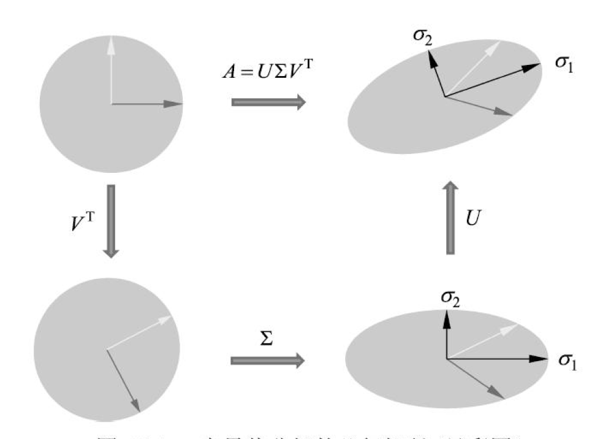
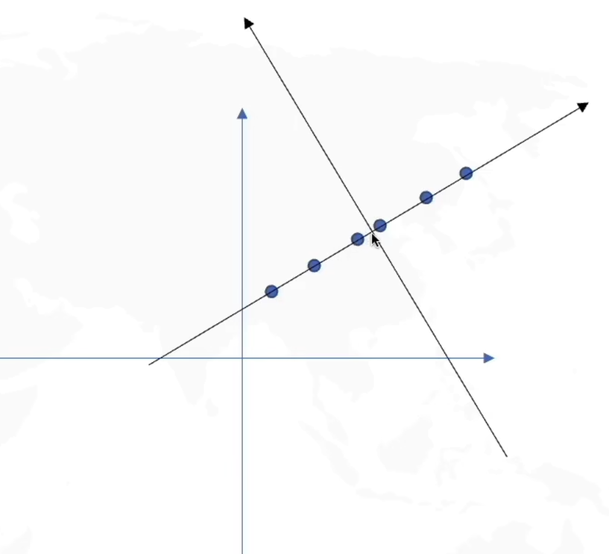
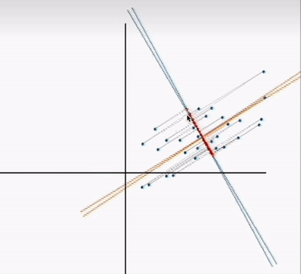
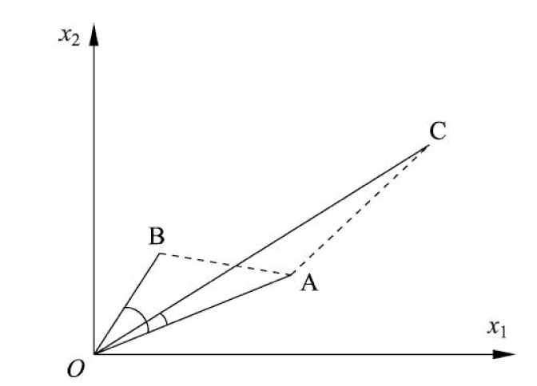

- [Singular Value Decomposition (SVD)](#singular-value-decomposition-svd)
  - [Definition](#definition)
  - [Proof of Existence](#proof-of-existence)
  - [Geometric Interpretation](#geometric-interpretation)
  - [Animated Interpretation](#animated-interpretation)
  - [Properties](#properties)
  - [How to calculate SVD](#how-to-calculate-svd)
  - [Summary](#summary)
- [Principal Component Analysis (PCA)](#principal-component-analysis-pca)
  - [Introduction](#introduction)
  - [Covariance](#covariance)
  - [Covariance Matrix](#covariance-matrix)
  - [Problem Formulation](#problem-formulation)
  - [Mathematical Proof](#mathematical-proof)
  - [Summary and Algorithm](#summary-and-algorithm)
  - [Example](#example)
  - [Code Implementation](#code-implementation)
  - [How to choose a reasonable $k$?](#how-to-choose-a-reasonable-k)
- [Clustering](#clustering)
  - [Measuring Similarity](#measuring-similarity)
    - [Minkowski Distance:](#minkowski-distance)
    - [Mahalanobis Distance:](#mahalanobis-distance)
    - [Correlation Coefficient:](#correlation-coefficient)
    - [Cosine Similarity:](#cosine-similarity)
- [K Means Clustering](#k-means-clustering)
  - [Algorithm](#algorithm)
  - [How to choose k?](#how-to-choose-k)
  - [Improvement](#improvement)
  - [Smarter Initialization - K Means++](#smarter-initialization---k-means)
  - [Why K-Means is a variant of EM?](#why-k-means-is-a-variant-of-em)
- [Expectation Maximization (EM) Algorithm](#expectation-maximization-em-algorithm)
  - [Intuitive Explanation](#intuitive-explanation)
  - [Intuitive Algorithm](#intuitive-algorithm)
  - [Formal Proof](#formal-proof)
    - [Likelihood Function](#likelihood-function)
    - [Log Likelihood Function](#log-likelihood-function)
    - [Jensen Inequality](#jensen-inequality)
    - [EM](#em)
  - [EM Algorithm](#em-algorithm)
  - [Why EM Converges?](#why-em-converges)
- [Gaussian Mixture Model (GMM)](#gaussian-mixture-model-gmm)
  - [Notation](#notation)
  - [Algorithm](#algorithm-1)
  - [Intuitive Example](#intuitive-example)
  - [Implementation](#implementation)
  - [Math Proof](#math-proof)
    - [Definition](#definition-1)
    - [Log Likelihood Function](#log-likelihood-function-1)
    - [E-Step](#e-step)
    - [M-Step](#m-step)

# Singular Value Decomposition (SVD)

## Definition
Suppose $A\in\mathbf{R}^{m\times n}$, we decompose $A$ into three matrices:
$$A = U\Sigma V^T$$
where $U\in\mathbf{R}^{m\times m}$, $V\in\mathbf{R}^{n\times n}$ are orthogonal matrices, and $\Sigma\in\mathbf{R}^{m\times n}$ is a diagonal matrix with non-negative real numbers on the diagonal, and diagonal entries are arranged in descending order.
In math notation:
$$U^TU = I, V^TV = I$$
$$\Sigma = diag(\sigma_1, \sigma_2, \ldots, \sigma_p)$$
$$p = min(m, n)$$

$\sigma_i$ is called **singular value**, column vectors of $U$ are called **left singular vectors**, and column vectors of $V$ are called **right singular vectors**.

## Proof of Existence
1. Construct $V$ and $\Sigma$

$A^TA$ is a real symmetric matrix, which means it is guaranteed to be diagonalizable.  
Let $\lambda$ be a eigenvalue of $A^TA$, then
$$A^TAx = \lambda x$$
Consider
$$||Ax||^2 = x^TA^TAx = \lambda x^Tx = \lambda ||x||^2$$
which means $\lambda = \frac{||Ax||^2}{||x||^2} \geq 0$.  

Suppose $rank(A) = r$ is $r$, so $rank(A^TA) = r$. Then there are $r$ eigenvalues of $A^TA$, which are $\lambda_1, \lambda_2, \ldots, \lambda_r$. Let 

$$\lambda_{1} \geq \lambda_{2}\geq ...\geq \lambda_r > 0,\quad\lambda_{r+1}=\lambda_{r+2}=...=\lambda_{n}=0$$
Correspondingly, make $\sigma_i = \sqrt{\lambda_i}$, then we have
$$\sigma_1 \geq \sigma_2 \geq \ldots \geq \sigma_r > 0, \quad \sigma_{r+1} = \sigma_{r+2} = \ldots = \sigma_n = 0$$
Let $v_1, v_2, ..., v_r$ be the eigenvector whose eigenvalue is positive, $v_{r+1}, v_{r+2}, ..., v_n$ be the eigenvector whose eigenvalue is 0.
Then 
$$V_1 = [v_1, v_2, \ldots, v_r] \in \mathbf{R}^{n\times r}$$
$$V_2 = [v_{r+1}, v_{r+2}, \ldots, v_n] \in \mathbf{R}^{n\times (n-r)}$$
$$\Sigma_1 = diag(\sigma_1, \sigma_2, \ldots, \sigma_r) \in \mathbf{R}^{r\times r}$$
Our $V$ and $\Sigma$ are constructed as follows:
$$V = [V_1, V_2]$$
$$\Sigma = \begin{bmatrix} \Sigma_1 & 0 \\ 0 & 0 \end{bmatrix}$$
2. Construct $U$  
  
Let
$$u_{j}=\frac{1}{\sigma_{j}}A v_{j},\quad j=1,2,\cdot\cdot\,,r$$
$$U_{1}=[u_{1}\quad u_{2}\quad\ldots\quad u_{r}]$$
Then 
$$
AV_1 = [Av_1, Av_2, \ldots, Av_r] = [\sigma_1u_1, \sigma_2u_2, \ldots, \sigma_ru_r] = U_1\Sigma_1 ~ (\ast)
$$
We want to show $U_1$ is orthogonal, it is true because:
$$
U_1^TU_1 = \begin{bmatrix} u_1^T \\ u_2^T \\ \vdots \\ u_r^T \end{bmatrix} \begin{bmatrix} u_1 & u_2 & \ldots & u_r \end{bmatrix} = \begin{bmatrix} u_1^Tu_1 & u_1^Tu_2 & \ldots & u_1^Tu_r \\ u_2^Tu_1 & u_2^Tu_2 & \ldots & u_2^Tu_r \\ \vdots & \vdots & \ddots & \vdots \\ u_r^Tu_1 & u_r^Tu_2 & \ldots & u_r^Tu_r \end{bmatrix}
$$
Consider $u_i^Tu_j~(i \neq j)$:
$$
u_i^Tu_j = \frac{1}{\sigma_i\sigma_j}v_i^T[A^TAv_j] = \frac{1}{\sigma_i\sigma_j}v_i^T\lambda_jv_j = \frac{\lambda_j}{\sigma_i\sigma_j}v_i^Tv_j = \frac{\sigma_j}{\sigma_i}v_i^Tv_j = 0 ~~ (v_i \perp v_j)
$$
Now let $\left\{u_{r+1},u_{r+2},\cdot\cdot\cdot,u_{m}\right\}$ be a set of orthonormal vectors that are orthogonal to $\left\{u_{1},u_{2},\cdot\cdot\cdot,u_{r}\right\}$, i.e. they are a set of orthonormal basis of the null space of $A^T$. Then we have:
$$
U_2 = [u_{r+1},u_{r+2},\cdot\cdot\cdot,u_{m}]
$$
$$
U = [U_1, U_2]
$$

3. Verify $A = U\Sigma V^T$

$$
U\Sigma V^T = [U_1, U_2] \begin{bmatrix} \Sigma_1 & 0 \\ 0 & 0 \end{bmatrix} [V_1, V_2]^T = U_1\Sigma_1V_1^T = AV_1V_1^T = A \\
from ~ AV_1 = U_1\Sigma_1 ~(\ast)
$$
For the proof of $V_1V_1^T = I$
$$
I = VV^T = [V_1, V_2] \begin{bmatrix} V_1^T \\ V_2^T \end{bmatrix} = V_1V_1^T + V_2V_2^T
$$
$$
\Rightarrow A = AI = AVV^T = AV_1V_1^T + AV_2V_2^T = AV_1V_1^T
$$
$$
\Rightarrow V_1V_1^T = I
$$
Then why $AV_2V_2^T=0$?
Based on our construction, we know
$$A^{\mathrm{T}}A v_{j}=0,\quad j=r+1,\cdot\cdot\ ,n$$
So column vectors of $V_2$ form $N(A^TA)$, and $N(A^TA) = N(A)$, which means $AV_2=0$.


Then why $N(A^TA) = N(A)$?  
 
Let $\mathbf{x} \in \mathcal{N}(\mathbf{A})$, where $\mathcal{N}(\mathbf{A})$ is the null space of $\mathbf{A}$.

So,
$\mathbf{A}\mathbf{x} =0\Rightarrow \mathbf{A}^T\mathbf{A}\mathbf{x} =0\Rightarrow \mathbf{x} \in \mathcal{N}(\mathbf{A}^T\mathbf{A})$

Hence $\mathcal{N}(\mathbf{A}) \subseteq \mathcal{N}(\mathbf{A}^T\mathbf{A})$.

Again, let $\mathbf{x} \in \mathcal{N}(\mathbf{A}^T\mathbf{A})$.
So,
$\mathbf{A}^T\mathbf{A}\mathbf{x} =0\Rightarrow \mathbf{x}^T\mathbf{A}^T\mathbf{A}\mathbf{x} =0\Rightarrow (\mathbf{A}\mathbf{x})^T(\mathbf{A}\mathbf{x}) =0\Rightarrow \mathbf{A}\mathbf{x} =0\Rightarrow \mathbf{x} \in \mathcal{N}(\mathbf{A})$

Hence $\mathcal{N}(\mathbf{A}^T\mathbf{A}) \subseteq \mathcal{N}(\mathbf{A})$.

## Geometric Interpretation
$U\Sigma V^T$ is rotation, stretching, and another rotation respectively.


## Animated Interpretation


## Properties
* $$A^{\mathrm{T}}A=(U\Sigma V^{\mathrm{T}})^{\mathrm{T}}(U\Sigma V^{\mathrm{T}})=V(\Sigma^{\mathrm{T}}\Sigma)V^{\mathrm{T}}$$
which means column vectors of $V$ are eigenvectors of $A^TA$.
* $$A A^{\mathrm{T}}=(U\Sigma V^{\mathrm{T}})(U\Sigma V^{\mathrm{T}})^{\mathrm{T}}=U(\Sigma\Sigma^{\mathrm{T}})U^{\mathrm{T}}$$
which means column vectors of $U$ are eigenvectors of $AA^T$.
* $$A=U\Sigma V^T$$
$$\Leftrightarrow A^T V = U\Sigma$$
$$\Leftrightarrow \begin{array}{c}{{A^{\mathrm{T}}u_{j}=\sigma_{j}v_{j},\quad j=1,2,\cdots,n}}\\ {{\ }}\\ {{A^{\mathrm{T}}u_{j}=0,\quad j=n+1,n+2,\cdots,m}}\end{array}$$
* Singular values are unqiue, while $U$ and $V$ are not.
* $$rank(A) = rank(\Sigma)$$

## How to calculate SVD
Steps can refer to previous discussion. Here we will present a concrete example.
$$A=\left[{\begin{array}{r r}{1}&{1}\\ {2}&{2}\\ {0}&{0}\end{array}}\right]$$
find SVD of $A$.
$$A^{\mathrm{T}}A={\left[\begin{array}{l l l}{1}&{2}&{0}\\ {1}&{2}&{0}\end{array}\right]}{\left[\begin{array}{l l}{1}&{1}\\ {2}&{2}\\ {0}&{0}\end{array}\right]}={\left[\begin{array}{l l}{5}&{5}\\ {5}&{5}\end{array}\right]}$$
Eigenvalues of $A^TA$ are $\lambda_1 = 10, \lambda_2 = 0$.
By solving $(A^TA - \lambda I)x = 0$, we have
$$v_1 = \frac{1}{\sqrt{2}}\left[{\begin{array}{r}{1}\\ {1}\end{array}}\right],\quad v_2 = \frac{1}{\sqrt{2}}\left[{\begin{array}{r}{-1}\\ {1}\end{array}}\right]$$
$$\sigma_1 = \sqrt{\lambda_1} = \sqrt{10},\quad \sigma_2 = \sqrt{\lambda_2} = 0$$
So
$$V=\left[\begin{array}{c c}{{\frac{1}{\sqrt{2}}}}&{{\frac{1}{\sqrt{2}}}}\\ {{\frac{1}{\sqrt{2}}}}&{{-\frac{1}{\sqrt{2}}}}\end{array}\right]$$
$$\Sigma=\left[\begin{array}{c c}{{\sqrt{10}}}&{{0}}\\ {{0}}&{{0}}\\ {{0}}&{{0}}\end{array}\right]$$
After this, we can calculate $U$ by solving $Av_i = \sigma_iu_i$.

$$u_{1}=\frac{1}{\sigma_{1}}A v_{1}=\frac{1}{\sqrt{10}}\left[\begin{array}{c c}{{1}}&{{1}}\\ {{2}}&{{2}}\\ {{0}}&{{0}}\end{array}\right]\left[\begin{array}{c}{{\frac{1}{\sqrt{2}}}}\\ {{\frac{1}{\sqrt{2}}}}\end{array}\right]=\left[\begin{array}{c}{{\frac{1}{\sqrt{5}}}}\\ {{\frac{2}{\sqrt{5}}}}\\ {{0}}\end{array}\right]$$
$u_2$ and $u_3$ are orthogonal basis of $N(A^T)$,so
$$A^{\mathrm{T}}x=\left[\begin{array}{c c c}{{1}}&{{2}}&{{0}}\\ {{1}}&{{2}}&{{0}}\\ {{1}}&{{2}}&{{0}}\end{array}\right]\left[\begin{array}{c}{{x_{1}}}\\ {{x_{2}}}\\ {{x_{3}}}\end{array}\right]=\left[\begin{array}{c}{{0}}\\ {{0}}\end{array}\right]$$
i.e.
$$\begin{array}{c}{{x_{1}+2x_{2}+0x_{3}=0}}\\ {{x_{1}=-2x_{2}+0x_{3}}}\end{array}$$
By letting $(x_2, x_3)$ = $(1, 0)$ and $(0, 1)$, we have
$$u_2 = \left[\begin{array}{c}{{-\frac{2}{\sqrt{5}}}}\\ {{\frac{1}{\sqrt{5}}}}\\ {{0}}\end{array}\right],\quad u_3 = \left[\begin{array}{c}{{0}}\\ {{0}}\\ {{1}}\end{array}\right]$$
So 
$$U=\left[\begin{array}{c c c}{{\frac{1}{\sqrt{5}}}}&{{-\frac{2}{\sqrt{5}}}}&{{0}}\\ {{\frac{2}{\sqrt{5}}}}&{{\frac{1}{\sqrt{5}}}}&{{0}}\\ {{0}}&{{0}}&{{1}}\end{array}\right]$$
Lastly, 
$$A=U\Sigma V^T=\left[\begin{array}{c c c}{{\frac{1}{\sqrt{5}}}}&{{-\frac{2}{\sqrt{5}}}}&{{0}}\\ {{\frac{2}{\sqrt{5}}}}&{{\frac{1}{\sqrt{5}}}}&{{0}}\\ {{0}}&{{0}}&{{1}}\end{array}\right]\left[\begin{array}{c c}{{\sqrt{10}}}&{{0}}\\ {{0}}&{{0}}\\ {{0}}&{{0}}\end{array}\right]\left[\begin{array}{c c}{{\frac{1}{\sqrt{2}}}}&{{\frac{1}{\sqrt{2}}}}\\ {{\frac{1}{\sqrt{2}}}}&{{-\frac{1}{\sqrt{2}}}}\end{array}\right]$$

## Summary
SVD is a method to reduce the dimensionality and achieve data compression.

# Principal Component Analysis (PCA)
## Introduction
We want to rotate and shift the coordinate system to reduce the dimensionality of the data.

In this case instead of using $(x_1, x_2)$, we can use $(x_1', 0)$ to represent the data.  
Then we want to find such a coordinate system that can maximize the variance of the data.


## Covariance 
$$C o v(a,b)={\frac{1}{m-1}}\sum_{i=1}^{m}{\bigl(}a_{i}-\mu_{a}{\bigr)}(b_{i}-\mu_{b})$$
Since $\mu_a$ and $\mu_b$ are $0$ after shifting the coordinate system, we have
$$Cov(a,b)={\frac{1}{m-1}}\sum_{i=1}^{m}a_{i}b_{i}$$
> In pratice, $m$ and $m-1$ are both fine.

## Covariance Matrix
$$X = \begin{bmatrix}
  a_1 & a_2 & \cdots & a_m \\
  b_1 & b_2 & \cdots & b_m
\end{bmatrix}$$
then
$$
\frac{1}{m}XX^T = \left(\begin{array}{c c}{{\frac{1}{m}\sum_{i=1}^{m}a_{i}^{2}}}&{{\frac{1}{m}\sum_{i=1}^{m}a_{i}b_{i}}}\\ {{\frac{1}{m}\sum_{i=1}^{m}a_{i}b_{i}}}&{{\frac{1}{m}\sum_{i=1}^{m}b_{i}^{2}}}\end{array}\right)
= \left(\begin{array}{l l}{{C o v(a,a)}}&{{C o v(a,b)}}\\ {{C o v(b,a)}}&{{C o v(b,b)}}\end{array}\right)$$
It can be generalized to $m$ pieces of $n$ dimension data:
$(i, j)$ entry of the covariance matrix is $Cov(a_i, a_j)$.

## Problem Formulation

Suppose $P$ is a basis of the new coordinate system, then let $Y = PX$, 
$$D = \frac{1}{m}YY^T = \frac{1}{m}(PX)(PX)^T = 
\frac{1}{m}PXX^TP^T = P\frac{1}{m}XX^TP^T = PCP^T$$
where $D$ is the covariance matrix of $Y$ and $C$ is the covariance matrix of $X$.  

The new optimization objective is to find a matrix $P$ such that $D = PCP^T$ is a diagonal matrix, and the diagonal elements are arranged in descending order. In this case, the first $k$ rows of $P$ represent the bases we want to find. Using the first $k$ rows of $P$ to form a matrix and multiplying it by $X$ will reduce the dimension of $X$ from $N$ dimensions to $k$ dimensions while satisfying the optimization conditions.

We notice that $C$ is a symmetric matrix, so it is guaranteed to be diagonalizable. So we have  
$$C = E\Lambda E^T$$
$$\Leftrightarrow \Lambda = E^T CE$$
where $E$ is an orthogonal matrix and $\Lambda$ is a diagonal matrix with diagonal elements arranged in descending order.  

Then $E^T$ is what we want for $P$.

## Mathematical Proof
$x_i$ under basis $w$'s coordinate is $w^Tx_i$, then
$$Var(w^Tx_i) = \frac{1}{m}\sum_{i=1}^{m}(w^Tx_i)^2 = w^T(\frac{1}{m}\sum_{i=1}^{m}x_ix_i^T)w $$ 
We notice that $\frac{1}{m}\sum_{i=1}^{m}x_ix_i^T$ is the covariance matrix of $X$, denoted as $C$, so we have 
$$Var(w^tx_i) = w^TCw$$
 The problem is converted to maximizing $w^TCw$ under the constraint that $||w|| = 1$.
 By Lagrange Multiplier, we have
  $$\mathcal{L}(w, \lambda) = w^TCw + \lambda(1 - w^Tw )$$
  $$\frac{\partial \mathcal{L}}{\partial w} = 2Cw - 2\lambda w = 0$$
  $$\Rightarrow Cw = \lambda w$$
So $Var(w^Tx_i)$ is maximized when $w$ is the eigenvector of $C$ corresponding to the largest eigenvalue, and its largest value is the largest eigenvalue of $w^TCw = w^T\lambda w = \lambda$.

## Summary and Algorithm
Suppose we have m data points in n-dimensional space. To perform dimensionality reduction, follow these steps:

1. Create a matrix $X$ by arranging the original data in columns, resulting in an n-row by m-column matrix.
2. Apply zero-mean normalization to each row of $X$ by subtracting the mean of that row.
3. Compute the covariance matrix $C$ as $C = \frac{1}{m}X  X^T$.
4. Find the eigenvalues and their corresponding eigenvectors of the covariance matrix.
5. Arrange the eigenvectors in descending order according to their eigenvalues, forming a matrix $P$ (Each eigenvector is a row in $P$). Select the top $k$ rows of $P$ to create a new matrix $P'$.
6. Perform dimensionality reduction: $Y = P'X$. The result, $Y$, is the data reduced to k dimensions.

## Example
$$
X = \begin{bmatrix}
-1 & -1 & 0 & 2 & 0 \\
-2 & 0 & 0 & 1 & 1 \\
\end{bmatrix}
$$
1. It has been normalized, so we can skip this step.
2. 
$$Cov(X) = \begin{bmatrix}
\frac{6}{5} & \frac{4}{5} \\
\frac{4}{5} & \frac{6}{5} \\
\end{bmatrix}
$$


3.
$$\lambda_1 = 2 ~ \lambda_2 = \frac{2}{5}$$
and the corresponding eigenvectors are

$$v_1 = \begin{bmatrix}
\frac{1}{\sqrt{2}} \\
\frac{1}{\sqrt{2}} \\
\end{bmatrix}, v_2 = \begin{bmatrix}
-\frac{1}{\sqrt{2}} \\
\frac{1}{\sqrt{2}} \\
\end{bmatrix}$$

4.
$$P = \begin{bmatrix}
\frac{1}{\sqrt{2}} & \frac{1}{\sqrt{2}} \\
-\frac{1}{\sqrt{2}} & \frac{1}{\sqrt{2}} \\
\end{bmatrix}$$
5. Suppose $k=1$
$$
Y = \begin{bmatrix}
\frac{1}{\sqrt{2}} & \frac{1}{\sqrt{2}} 

\end{bmatrix} \begin{bmatrix}
-1 & -1 & 0 & 2 & 0 \\
-2 & 0 & 0 & 1 & 1 \\
\end{bmatrix} = \begin{bmatrix}
-\frac{3}{\sqrt{2}} & -\frac{1}{\sqrt{2}} & 0 & \frac{1}{\sqrt{2}} & -\frac{1}{\sqrt{2}} \\
\end{bmatrix}
$$

## Code Implementation
```python
import numpy as np
def pca(X,k):#k is the components you want
  #mean of each feature
  n_samples, n_features = X.shape
  mean=np.array([np.mean(X[:,i]) for i in range(n_features)])
  #normalization
  norm_X=X-mean
  #covariance matrix
  scatter_matrix=np.dot(np.transpose(norm_X),norm_X)
  #Calculate the eigenvectors and eigenvalues
  eig_val, eig_vec = np.linalg.eig(scatter_matrix)
  eig_pairs = [(np.abs(eig_val[i]), eig_vec[:,i]) for i in range(n_features)]
  # sort eig_vec based on eig_val from highest to lowest
  eig_pairs.sort(reverse=True)
  # select the top k eig_vec
  feature=np.array([ele[1] for ele in eig_pairs[:k]])
  #get new data
  data=norm_X.dot(np.transpose(feature))
  return data
```

## How to choose a reasonable $k$?
* Average squared projection error
$$\frac{1}{m}\sum_{i=1}^{m}||x_i - \hat{x}_i||^2$$
where $\hat{x}_i$ is the projection of $x_i$ onto the new coordinate system.
* Total variation in the data
$$\frac{1}{m}\sum_{i=1}^{m}||x_i||^2$$
We choose different $k$ and calculate
$$
\frac{\frac{1}{m}\sum_{i=1}^{m}||x_i - \hat{x}_i||^2}{\frac{1}{m}\sum_{i=1}^{m}||x_i||^2} \leq t
$$
where $t$ is a threshold. Then we choose the smallest $k$ that satisfies the inequality.
> For example, if $t = 0.01$, then it means PCA keeps 99% of the original information.


# Clustering
## Measuring Similarity
### Minkowski Distance:
$$d(x, y) = \left(\sum_{i=1}^n |x_i - y_i|^p\right)^{1/p}$$
- When p = 1, it is Manhattan Distance
- When p = 2, it is Euclidean Distance
- When p = $\infty$, it is Chebyshev Distance, which is the maximum of the absolute difference between the coordinates of the two points, noted as $d(x, y) = \max_i |x_{ki} - y_{ki}|$
### Mahalanobis Distance:
$$d(x, y) = \sqrt{(x-y)^TS^{-1}(x-y)}$$
where $S$ is the covariance matrix of the data.
- When $S = I$, it is Euclidean Distance
### Correlation Coefficient:
Similarity between data $x_i$ and $x_j$ is defined as:
$$\begin{gathered}r_{i j}=\frac{\sum_{k=1}^m\left(x_{k i}-\bar{x}_i\right)\left(x_{k j}-\bar{x}_j\right)}{\left[\sum_{k=1}^m\left(x_{k i}-\bar{x}_i\right)^2 \sum_{k=1}^m\left(x_{k j}-\bar{x}_j\right)^2\right]^{\frac{1}{2}}} \\ \bar{x}_i=\frac{1}{m} \sum_{k=1}^m x_{k i}, \quad \bar{x}_j=\frac{1}{m} \sum_{k=1}^m x_{k j}\end{gathered}$$
### Cosine Similarity:
$$\cos (x, y)=\frac{x \cdot y}{\|x\|\|y\|}$$

> It is important to choose the appropriate similarity measure for different data. In this following picture,    
>  C is more similar to A than B in terms of cosine, but B is more similar to A than C in terms of Euclidean distance.

# K Means Clustering
Suppose we want to cluster n data into k classes, there are exponentially many ways of doing so. This question turns out to be NP-hard.
Therefore, we will try solving this iteratively.
> This will not guarantee the global optimal solution, but it is a good approximation.
## Algorithm
1. Initialize k centroids  
Randomly pick k data points as centroids, noted as $m^{(0)}= (m_1^{(0)}, ..., m_k^{(0)})$  
2. Cluster assignment  
Calculate the distance between each data point and each centroid in $m^{(j)}$, and assign each data point to the closest centroid.  
3. Update centroid  
$m_j^{(i+1)} = (m_1^{j+1}, ..., m_k^{j+1})$
4. If not converged, go to step 2. Otherwise, stop.


> **Time Complexity:** $O(tknm)$
- $t$ is the number of iterations.
- $k$ is the number of clusters.
- $n$ is the number of data points.
- $m$ is the dimension of data points.

> **Space Complexity:** $O(m(n+k))$
- $k$ is the number of clusters.
- $m$ is the dimension of data points.
- $n$ is the number of data points.


## How to choose k?
Generally speaking, with the increase in $k$, the diameter of the cluster will decrease monotonically. When $k$ exceeds a certain value, the diameter of the cluster will decrease very slowly (basically remain the same). And that is the point where we should stop increasing $k$.
> Binary search can be used to find the optimal $k$. 
   

## Improvement
* Use Kernel Function
* Use [gap statistics](https://github.com/milesgranger/gap_statistic) to find optimal $k$.

## Smarter Initialization - K Means++
1. Randomly pick the first centroid ($c1$)
2. Calculate the distance between all data points and the selected centroid
3. Find $x_i$ with the largest distance to the selected centroid, and use it as the second centroid ($c2$)
4. Repeat steps 3 and 4 till all the defined K clusters are found

## Why K-Means is a variant of EM?
* **E-Step**: Label each data point to the closest centroid
* **M-Step**: Update the centroid of all data points in the cluster

Loss function is
$$
J = \sum_{ i = 1}^{C}\sum_{ j = 1}^{N}r_{ij} \cdot ||x_j - \mu_i||^2
$$
where $r_{ij}$ is the indicator function, which is 1 if $x_j$ belongs to cluster $i$, otherwise 0:
$$
r_{ij} = \begin{cases}
1 & \text{if } x_j \text{ belongs to cluster } i \\
0 & \text{otherwise}
\end{cases}
$$
Take derivative of $J$ with respect to $\mu_k$ and let it equal to 0:
$$\frac{\delta J}{\delta u_k} = 2 \sum_{i=1}^{n} r_{ik} (x_i - \mu_k) = 0 $$
$$\Leftrightarrow \mu_{k}  =  \frac {\sum_{i=1}^{n}r_{ik}x_{i}}{\sum_{i=1}^{N}r_{ik}} $$
> A more rigorous proof can be found [here](https://www.zhihu.com/question/49972233)


# Expectation Maximization (EM) Algorithm
## Intuitive Explanation
Suppose we want collect the data about the distribution of heights in NUS. We successfully gather the height data from 100 boys and 100 girls, but someone removed all labels by accident, which means we don't know whether a data come from boys or girls.
Now we face two issues:
* Suppose we know the labels again, then we can use [MLE](https://en.wikipedia.org/wiki/Maximum_likelihood_estimation#) to estimate the distribution of boys and girls respectively.
* Suppose we know for example, boys' heights ~ $N(\mu_1 = 172, \sigma^2_1=5^2)$, girls' height ~$N(\mu_2 = 162, \sigma^2_2=5^2)$.Then when given a data, we know which class is more likely to be the source of this data. For example, 180 cm is more likely from boys.  

But the thing is we know neither, so it becomes a problem of "Which came first, the chicken or the egg?". Well the answer is we can use EM algorithm to solve this problem.

## Intuitive Algorithm
1. **Initialization:** We start by setting the initial distribution parameters for male and female heights. For instance, the height distribution for males is assumed to be $N(\mu_1 = 172, \sigma^2_1 = 5^2)$, and for females, it's $N(\mu_2 = 162, \sigma^2_2 = 5^2)$. These initial values may not be very accurate.

2. **Expectation (E-Step):** We calculate the likelihood of each individual belonging to the male or female group based on their height. For example, a person with a height of 180 is highly likely to belong to the male group.

3. **Maximization (M-Step):** After roughly assigning the 200 people to either the male or female group in the E-Step, we estimate the height distribution parameters for males and females separately using the Maximum Likelihood Estimation (MLE) method.

4. **Iteration:** We update the parameters of these two distributions. As a result, the probability of each student belonging to either males or females changes again, requiring us to adjust the E-Step once more.

5. **Convergence:** We repeat these E-Step and M-Step iterations iteratively until the parameters no longer change significantly, or until specific termination conditions are met.

> In this case, hidden variables are labels, namely boys and girls. And the observed variables are heights.

## Formal Proof
### Likelihood Function
> What is the probablity that I happen to choose $n$ samples?  

Every sample is drawn from $p(x|θ)$ independently, so the probability of choosing them altogether at once is:
$$ L(\theta) = \prod_{i=1}^n p(x^{(i)}|θ)$$
### Log Likelihood Function
By logging the $L(\theta)$, we can get the log likelihood function:
$$H(\theta) = \log L(\theta) = \sum_{i=1}^n \log p(x^{(i)}|θ)$$
> The reason why we choose log likelihood function is that it is easier to calculate and avoid the situation where the product of many small numbers is too small to be accurate in computer.
### Jensen Inequality
If $f(x)$ is a convex function, then
$$E[f(x)] \geq f(E[x])$$
specially, if $f(x)$ is strictly convex, then 
$E[f(x)] = f(E[x])$ if and only if  $p(x = E(x)) = 1$, i.e. random variable $x$ is a constant.
> If $f(x)$ is concave, flip the inequality sign.

### EM 
> Following proof doesn't use vectorization.

For $m$ independent data $x=(x^{(1)},x^{(2)},...,x^{(m)})$, and corrsponding hidden variables $z=(z^{(1)},z^{(2)},...z^{(m)})$. Then $(x,z)$ is full data.  

We want to find $\theta$ and $z$ s.t. it can maximize the likelihood function $L(\theta, z)$, i.e
$$
\theta, z=
\arg \max _{\theta, z} \sum_{i=1}^m \log \sum_{z^{(i)}} P\left(x^{(i)}, z^{(i)} \mid \theta\right) 
$$
We can see here that the summation is inside the log function. We want to extract it out:  
$$
\begin{aligned}
\sum_{i=1}^m \log \sum_{z^{(i)}} P\left(x^{(i)}, z^{(i)} \mid \theta\right) & =\sum_{i=1}^m \log \sum_{z^{(i)}} Q_i\left(z^{(i)}\right) \frac{P\left(x^{(i)}, z^{(i)} \mid \theta\right)}{Q_i\left(z^{(i)}\right)} \\
& \geq \sum_{i=1}^m \sum_{z^{(i)}} Q_i\left(z^{(i)}\right) \log \frac{P\left(x^{(i)}, z^{(i)} \mid \theta\right)}{Q_i\left(z^{(i)}\right)} \quad \text{(log(E[x]) >= E[log(x)] (because log(x) is concave))}
\end{aligned}
$$
where $Q_i(z^{(i)})$ is a distribution over $z^{(i)}$, it satisfies $\sum_{z^{(i)}} Q_i\left(z^{(i)}\right)=1$ and $1 \geq Q_i\left(z^{(i)}\right) \geq 0$.
> This is also called Expectation Step (E-Step), because $E\left(\log \frac{P\left(x^{(i)}, z^{(i)} \mid \theta\right)}{Q_i\left(z^{(i)}\right)}\right)=\sum_{z^{(i)}} Q_i\left(z^{(i)}\right) \log \frac{P\left(x^{(i)}, z^{(i)} \mid \theta\right)}{Q_i\left(z^{(i)}\right)}$

Suppose $\theta$ has been fixed, then $logL(\theta)$ is determined by two values, $Q_i(z^{(i)})$ and $P\left(x^{(i)}, z^{(i)} \mid \theta\right)$. We want to maximize the lower bound of $logL(\theta)$, so we need to make the inequality hold.

In order to hold the inequality, we need to let 
$$
\frac{P\left(x^{(i)}, z^{(i)} \mid \theta\right)}{Q_i\left(z^{(i)}\right)}=c
$$
$$\Leftrightarrow P\left(x^{(i)}, z^{(i)} \mid \theta\right)=cQ_i\left(z^{(i)}\right) \quad \text{(1)}$$
$$
\Leftrightarrow
\sum_z P\left(x^{(i)}, z^{(i)} \mid \theta\right)=c \sum_z Q_i\left(z^{(i)}\right) \quad \text{(sum over z)}
$$
$$
\Leftrightarrow
\sum_z P\left(x^{(i)}, z^{(i)} \mid \theta\right) = c
\quad \text{(2)}
$$
By $(1)$ and $(2)$,
$$
\begin{gathered}

Q_i\left(z^{(i)}\right)=\frac{P\left(x^{(i)}, z^{(i)} \mid \theta\right)}{c}=\frac{P\left(x^{(i)}, z^{(i)} \mid \theta\right)}{\sum_z P\left(x^{(i)}, z^{(i)} \mid \theta\right)}=\frac{P\left(x^{(i)}, z^{(i)} \mid \theta\right)}{P\left(x^{(i)} \mid \theta\right)}=P\left(z^{(i)} \mid x^{(i)}, \theta\right)
\end{gathered}
$$
since 
* Marginal Probability$: \space P\left(x^{(i)} \mid \theta\right)=\sum_z P\left(x^{(i)}, z^{(i)} \mid \theta\right)$
* Conditinonal Probability$: \space \frac{P\left(x^{(i)}, z^{(i)} \mid \theta\right)}{P\left(x^{(i)} \mid \theta\right)}=P\left(z^{(i)} \mid x^{(i)}, \theta\right)$  

> We can interpret $P\left(z^{(i)} \mid x^{(i)}, \theta\right)$ as the probability of $z^{(i)}$ given $x^{(i)}$ and $\theta$.


Hence we have successfully found the $Q_i(z^{(i)}) = P\left(z^{(i)} \mid x^{(i)}, \theta\right)$ that maximizes the lower bound of $logL(\theta)$.
What we are left to do is to maximize:  
$$
\begin{aligned}
\sum_{i=1}^m \sum_{z^{(i)}} Q_i\left(z^{(i)}\right) \log \frac{P\left(x^{(i)}, z^{(i)} \mid \theta\right)}{Q_i\left(z^{(i)}\right)} &=\sum_{i=1}^m \sum_{z^{(i)}} Q_i\left(z^{(i)}\right) \log P\left(x^{(i)}, z^{(i)} \mid \theta\right)-\sum_{i=1}^m \sum_{z^{(i)}} Q_i\left(z^{(i)}\right) \log Q_i\left(z^{(i)}\right) \\
&=\sum_{i=1}^m \sum_{z^{(i)}} Q_i\left(z^{(i)}\right) \log P\left(x^{(i)}, z^{(i)} \mid \theta\right)+H(Q_i)
\end{aligned}
$$
$$
\approx \sum_{i=1}^m \sum_{z^{(i)}} P\left(z^{(i)} \mid x^{(i)}, \theta\right) \log P\left(x^{(i)}, z^{(i)} \mid \theta\right) \quad \text{(by leaving out the constant)}
$$
where $H(Q_i)$ is the entropy of $Q_i(z^{(i)})$ and it is a constant.
## EM Algorithm
Last equation from last part is:
$$
\sum_{i=1}^m \sum_{z^{(i)}} P\left(z^{(i)} \mid x^{(i)}, \theta\right) \log P\left(x^{(i)}, z^{(i)} \mid \theta\right)
$$
First we take out summation and convert it into expectation form:


$$Q(\theta, \theta^{(i)}) =E_{Z}[\log P(X,Z|\theta)|X,\theta^{(i)}]$$
Expand it, we have  
$$\sum_{Z}P(Z|X,\theta^{(i)})\log P(X,Z|\theta)$$
where $\theta^{(i)}$ is the estimation in the $i$-th iteration.  

Algorithm is as follows:  

**Input:**
Observation data $x = (x^{(1)}, x^{(2)}, \ldots, x^{(m)})$,
joint distribution $P(X, Z \, | \, \theta)$,
conditional distribution $p(Z \, | \, X, \theta)$,
maximum iteration count $J$.

1. Randomly initialize the initial values of model parameters $\theta$ as $\theta^{(0)}$.

2. Repeat until convergence:  
    **E-step:**  
    Calculate:  
    $$Q(\theta, \theta^{(i)}) = \sum_{Z}P(Z|X,\theta^{(i)})\log P(X,Z|\theta)$$
 

    **M-step:**  
    Maximize $Q$ with respect to $\theta$:
    $$
    \theta^{(i+1)}=\arg \max _{\theta}Q(\theta, \theta^{(i)})
    $$
> [Video of EM Algorithm](https://www.bilibili.com/video/BV19a411N72s/?spm_id_from=333.337.search-card.all.click&vd_source=43fae35e0d515715cd36645ea2e6e547)

> A formal definition of $Q(\theta, \theta^{(i)})$ is the expected value of the log likelihood function $P(X, Z|\theta)$ with respect to the conditional distribution $p(Z \, | \, X, \theta^{(i)})$ given the observed data $X$ and $\theta^{(i)}$.
## Why EM Converges?
$$
H(\theta^{(t+1)}) \geq \sum_{i=1}^m \sum_{z^{(i)}} Q_i\left(z^{(i)}\right) \log \frac{P\left(x^{(i)}, z^{(i)} \mid \theta^{(t+1)}\right)}{Q_i\left(z^{(i)}\right)} 
$$

$$
\geq \sum_{i=1}^m \sum_{z^{(i)}} Q_i\left(z^{(i)}\right) \log \frac{P\left(x^{(i)}, z^{(i)} \mid \theta^{(t)}\right)}{Q_i\left(z^{(i)}\right)}
\qquad \text{(by why we get $\theta^{(i + 1)}$)}
$$
$$
=H(\theta^{(t)})
$$
> I feel sus abt the proof. TBC later.
# Gaussian Mixture Model (GMM)
> GMM is a special case of EM algorithm.
## Notation
* Gaussian Mixtures: 
$$p(x) = \sum_{i=1}^k \pi_i N(x|\mu_i, \Sigma_i)$$
* $\pi_i$ is the weight of the $i$-th Gaussian, and $\sum_{i=1}^k \pi_i = 1$.
* 
$$\gamma(i, k) 
= \frac{\pi_i N(x|\mu_i, \Sigma_i)}{\sum_{j=1}^k \pi_j N(x|\mu_j, \Sigma_j)}$$
 is the probability of $i$-th data belonging to the $k$-th Gaussian distribution.
> $\gamma(i, k)$ is simply a handy notation to extract all the data out which are from the $k$-th Gaussian distribution. Don't be confused by the notation.
## Algorithm
- **E-Step:** Calculate $\gamma(i, k)$
$$\gamma(i, k) 
= \frac{\pi_i N(x|\mu_i, \Sigma_i)}{\sum_{j=1}^k \pi_j N(x|\mu_j, \Sigma_j)}$$
> The E-step computes these probabilities using the current estimates of the model's parameters. 
- **M-Step:** Update parameters
$$  
\left\{
\begin{array}{l}
N_k = \sum_{i=1}^{N} \gamma(i, k) \\
\\  
\\
\mu_k = \frac{1}{N_k} \sum_{i=1}^{N} \gamma(i, k) x_i \\
\\ 
\\
\sum_k = \frac{1}{N_k} \sum_{i=1}^{N} \gamma(i, k) (x_i - \mu_k)(x_i - \mu_k)^T \\
\\  
\\
\pi_k = \frac{N_k}{N} = \frac{1}{N} \sum_{i=1}^{n} \gamma(i, k)
\end{array}
\right.
$$


## Intuitive Example
Again, back to the height example.  

Suppose we have the following data:
$$
\begin{array}{l}
x^{(1)} = 180 \\
x^{(2)} = 170 \\
x^{(3)} = 160 \\
x^{(4)} = 155 \\
\end{array}
$$

We initialize two Gaussian distributions (for males and females respectively) as follows:
$$
\mu_1 = 170 \space \mu_2 = 160$$
$$
\sigma_1 = 0.5 \space \sigma_2 = 0.7
$$
$$
\pi_1 = 0.5 \space \pi_2 = 0.5
$$
Then 
$$
\begin{array}{l}
\gamma(1, 1) = 0.8 \quad \gamma(1, 2) = 0.2 \\
\gamma(2, 1) = 0.6 \quad \gamma(2, 2) = 0.4 \\
\gamma(3, 1) = 0.4 \quad \gamma(3, 2) = 0.6 \\
\gamma(4, 1) = 0.2 \quad \gamma(4, 2) = 0.8 \\
\end{array}
$$
> eg. $\gamma(3, 1)$ means the probability of 160cm person is from Male distribution.

For $k=1$:
$$
\begin{array}{l}
N_1 = 0.8 + 0.6 + 0.4 + 0.2 = 2 
\\
\\
\mu_1 = \frac{1}{2} (180 \times 0.8 + 170 \times 0.6 + 160 \times 0.4 + 155 \times 0.2) = 171.5 
\\
\\
\sigma_1 = \frac{1}{2} (0.8 \times (180 - 171.5)^2 + 0.6 \times (170 - 171.5)^2 + 0.4 \times (160 - 171.5)^2 + 0.2 \times (155 - 171.5)^2) = 25.5 
\\
\\
\pi_1 = \frac{2}{4} = 0.5
\end{array}
$$

Same applies to $k=2$.

Then we update the parameters and calculate $\gamma$ again. We repeat this process until convergence.

## Implementation
Credits to [this](https://github.com/Ransaka/GMM-from-scratch/blob/master/GMM%20from%20scratch.ipynb), which is a very good implementation of GMM from scratch.
## Math Proof

### Definition
We have observations $y_1, y_2, ..., y_n$.
$$P(y|\theta)=\sum_{k=1}^{K}\alpha_{k}\phi(y|\theta_{k})$$
where
$$\sum_{k=1}^{K}\alpha_k = 1\\\phi(y|\theta_{k})=\frac{1}{\sqrt{2\pi}\sigma_{k}}\exp\left(-\frac{(y-\mu_{k})^{2}}{2\sigma_{k}^{2}}\right) \\
\theta_k = (\mu_k, \sigma_k^2)$$

### Log Likelihood Function
Suppose $r_{jk}$ is the indicator of $y_j$ belonging to the $k$-th Gaussian distribution, i.e.
$$
r_{jk} = \begin{cases}
1 & \text{if } y_j \text{ belongs to the } k \text{-th Gaussian distribution} \\
0 & \text{otherwise}
\end{cases}
$$
Full data is $(y_j, r_{j1}, r_{j2}, ..., r_{jK})$.

Joint distribution:
$$
\begin{align}
  P(y, r|\theta) &= \prod_{j=1}^{N}P(y_j, r_{j1}, r_{j2}, ..., r_{jK} | \theta) \\
  &= 
  \prod_{j=1}^{N} \prod_{k=1}^{K} [\alpha_k \phi(y_j|\theta_k)]^{r_{jk}} ~ \text{(because if $y_j$ belongs to the $k$-th Gaussian distribution, then $r_{jk} = 1$, otherwise it's 0)} \\
  &= \prod_{k=1}^{K}\alpha_k^{\sum_{j=1}^{N}r_{jk}} \prod_{j=1}^{N} \phi(y_j|\theta_k)^{r_{jk}} \\
  &= \prod_{k=1}^{K}\alpha_k^{n_k} \prod_{j=1}^{N} \phi(y_j|\theta_k)^{r_{jk}} \quad \text{($n_k$ means how many observations are from k-th Gaussian Model)}\\
  &= \prod_{k=1}^{K}\alpha_k^{n_k} \prod_{j=1}^{N} \left[\frac{1}{\sqrt{2\pi}\sigma_{k}}\exp\left(-\frac{(y_j-\mu_{k})^{2}}{2\sigma_{k}^{2}}\right)\right]^{r_{jk}} \\
\end{align}
$$
Take log on both sides, we log likelihood function is:
$$
\begin{align}
  \log P(y, r|\theta) &=\sum_{k=1}^{K}\left\{n_{k}\log\alpha_{k}+\sum_{j=1}^{N}\gamma_{j k}\left[\log\left(\frac{1}{\sqrt{2\pi}}\right)-\log\sigma_{k}-\frac{1}{2\sigma_{k}^{2}}(y_{j}-\mu_{k})^{2}\right]\right\}
\end{align}
$$

> We have derived the joint distribution (i.e.$p(x,z| \theta)$) in [EM alrorithm](#em-algorithm).

### E-Step
$$
Q(\theta, \theta^{(i)}) =E_{\gamma}[\log P(y,\gamma|\theta)|y,\theta^{(i)}] \\
= \mathbb{E} \left\{\sum_{k=1}^{K}\left\{n_{k}\log\alpha_{k}+\sum_{j=1}^{N}\gamma_{j k}\left[\log\left(\frac{1}{\sqrt{2\pi}}\right)-\log\sigma_{k}-\frac{1}{2\sigma_{k}^{2}}(y_{j}-\mu_{k})^{2}\right]\right\}\right\} \\
= \sum_{k=1}^{K}\left\{\sum_{j=1}^{N}(\mathbb{E}[\gamma_{jk}])\log\alpha_{k}+\sum_{j=1}^{N}\mathbb{E}[\gamma_{j k}]\left[\log\left(\frac{1}{\sqrt{2\pi}}\right)-\log\sigma_{k}-\frac{1}{2\sigma_{k}^{2}}(y_{j}-\mu_{k})^{2}\right]\right\} \\
$$
We need to solve $\mathbb{E}[\gamma_{jk}]$, 
$$
\begin{align}
\mathbb{E}[\gamma_{jk}] &= 1 * P(\gamma_{jk} = 1 | y, \theta) + 0 * P(\gamma_{jk} = 0| y, \theta) \\
&= P(\gamma_{jk} = 1) \\
\end{align}
$$
which is just the probability of $y_j$ coming to the $k$-th Gaussian distribution. We can directly compute it:
$$
P(\gamma_{jk} = 1) = \frac{\alpha_k \phi(y_j|\theta_k)}{\sum_{k=1}^{K}\alpha_k \phi(y_j|\theta_k)}
$$
> the prob of coming from $j$ / the sum of all probs of coming from each model

Ultimately, our $Q(\theta, \theta^{(i)})$ is:
$$
\begin{align}
Q(\theta, \theta^{(i)}) &= \sum_{k=1}^{K}\left\{\sum_{j=1}^{N}(\mathbb{E}[\gamma_{jk}])\log\alpha_{k}+\sum_{j=1}^{N}\mathbb{E}[\gamma_{j k}]\left[\log\left(\frac{1}{\sqrt{2\pi}}\right)-\log\sigma_{k}-\frac{1}{2\sigma_{k}^{2}}(y_{j}-\mu_{k})^{2}\right]\right\} \\
&= \sum_{k=1}^{K}\left\{\sum_{j=1}^{N}\left[\frac{\alpha_k \phi(y_j|\theta_k)}{\sum_{k=1}^{K}\alpha_k \phi(y_j|\theta_k)}\right]\log\alpha_{k}+\sum_{j=1}^{N}\left[\frac{\alpha_k \phi(y_j|\theta_k)}{\sum_{k=1}^{K}\alpha_k \phi(y_j|\theta_k)}\right]\left[\log\left(\frac{1}{\sqrt{2\pi}}\right)-\log\sigma_{k}-\frac{1}{2\sigma_{k}^{2}}(y_{j}-\mu_{k})^{2}\right]\right\} \\
\end{align}
$$

### M-Step
$$
\theta^{(i+1)}=\arg \max _{\theta}Q(\theta, \theta^{(i)})  \\
s.t. \sum_{k=1}^{K}\alpha_{k}=1
$$

By introducing Lagrange multiplier $\lambda$ to convert the constraint into the objective function, we have:
$$
\begin{align}
\theta^{(i+1)} &=\arg \max _{\theta, \lambda}Q(\theta, \theta^{(i)}) + \lambda(\sum_{k=1}^{K}\alpha_{k}-1) \\
\end{align}
$$
Take derivative of $\theta$ and $\lambda$ respectively and let them equal to 0:
> $\theta$ is a combination of all parameters, i.e. $\mu_k, \sigma_k, \alpha_k$.

> Each time to focus on $\theta_k$ and $\alpha_k$, so we can get rid of $\sum_{k=1}^{K}$.

$$
\begin{align}
\frac{\partial Q(\theta, \theta^{(i)})}{\partial \alpha_k} &= \sum_{j=1}^{N}\mathbb{E}[\gamma_{jk}]\frac{1}{\alpha_k} + \lambda = 0\\
\frac{\partial Q(\theta, \theta^{(i)})}{\partial \mu_k} &= \sum_{j=1}^{N}\mathbb{E}[\gamma_{jk}]\frac{1}{\sigma_k^2}(y_j - \mu_k) = 0 \\
\frac{\partial Q(\theta, \theta^{(i)})}{\partial \sigma_k} &= \sum_{j=1}^{N}\mathbb{E}[\gamma_{jk}]\left[\frac{1}{\sigma_k} + \frac{1}{\sigma_k^3}(y_j - \mu_k)^2\right] = 0 \\
\frac{\partial Q(\theta, \theta^{(i)})}{\partial \lambda} &= \sum_{k=1}^{K}\alpha_k - 1 = 0 \\
\end{align}
$$
Solve the equations, we have: 
$$
\begin{align}
\alpha_k &= \frac{1}{N}\sum_{j=1}^{N}\mathbb{E}[\gamma_{jk}] \\
\mu_k &= \frac{\sum_{j=1}^{N}\mathbb{E}[\gamma_{jk}]y_j}{\sum_{j=1}^{N}\mathbb{E}[\gamma_{jk}]} \\
\sigma_k^2 &= \frac{\sum_{j=1}^{N}\mathbb{E}[\gamma_{jk}](y_j - \mu_k)^2}{\sum_{j=1}^{N}\mathbb{E}[\gamma_{jk}]} \\
\end{align}
$$
Alogrithm is as follows:
* **Input:** $y_1, y_2, ..., y_n$, GMM
* **Initialize:** $\mu_k, \sigma_k, \alpha_k$
* **E-Step:** Calculate 
  $$\mathbb{E}[\gamma_{jk}] = \frac{\alpha_k \phi(y_j|\theta_k)}{\sum_{k=1}^{K}\alpha_k \phi(y_j|\theta_k)} \qquad j = 1, 2, ..., N; k = 1, 2, ..., K$$
* **M-Step:** Update parameters
  $$
  \begin{align}
  \alpha_k &= \frac{1}{N}\sum_{j=1}^{N}\mathbb{E}[\gamma_{jk}] \\
  \mu_k &= \frac{\sum_{j=1}^{N}\mathbb{E}[\gamma_{jk}]y_j}{\sum_{j=1}^{N}\mathbb{E}[\gamma_{jk}]} \\
  \sigma_k^2 &= \frac{\sum_{j=1}^{N}\mathbb{E}[\gamma_{jk}](y_j - \mu_k)^2}{\sum_{j=1}^{N}\mathbb{E}[\gamma_{jk}]} \\
  \end{align}
  $$