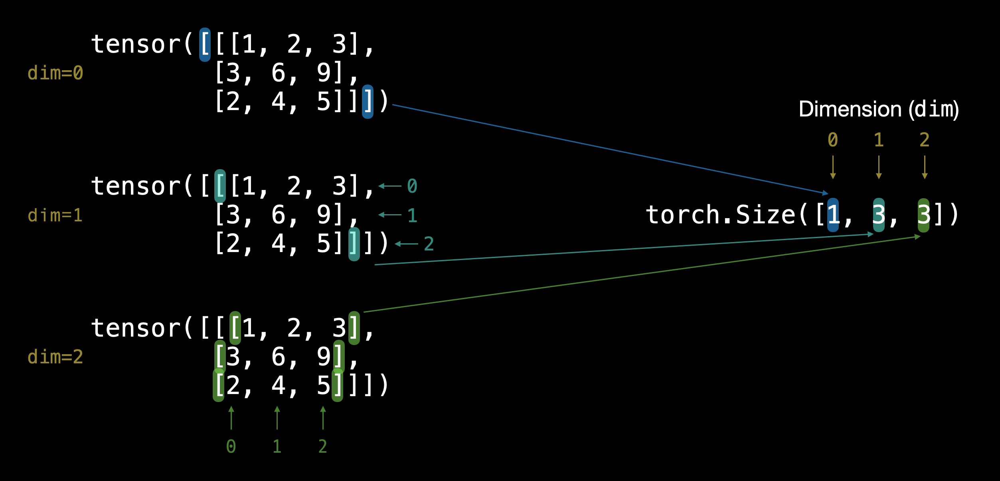
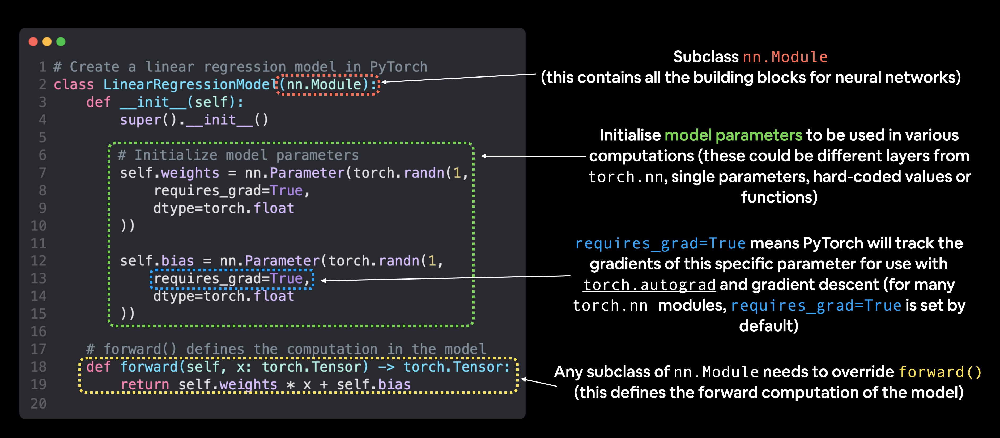
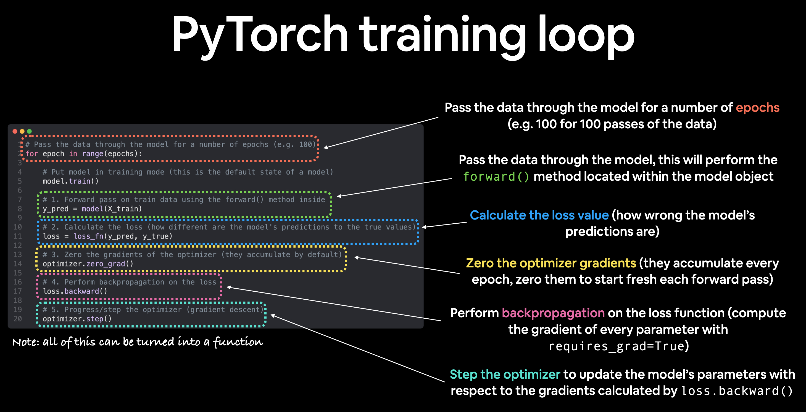

# Table of Contents
# Tensor
## Tensor Attributes
Tensor is a multi-dimensional matrix containing elements of a single data type.  
* ndim: number of dimensions
  ```python
    >>> x = torch.tensor([[1, 2, 3, 4], [5, 6, 7, 8]])
    >>> x.ndim
    2
    ```
* shape: size of each dimension
    ```python
        >>> x.shape
        torch.Size([2, 4])
        ```


* random tensor
  ```python
    >>> torch.rand(2, 3)
    tensor([[0.8147, 0.9058, 0.1270],
            [0.9133, 0.6324, 0.0975]])
    ```
> same for zeros and ones

## Tensor Operations
* Elementwise multiplication
```python
    >>> x = torch.tensor([1, 2, 3, 4])
    >>> y = torch.tensor([2, 2, 2, 2])
    >>> z = x * y
    >>> z
    tensor([2, 4, 6, 8])
```
* Matrix Multiplication
```python
    >>> x = torch.tensor([[1, 2, 3, 4], [5, 6, 7, 8]])
    >>> y = torch.tensor([[2, 2], [3, 3], [4, 4], [5, 5]])
    >>> z = torch.matmul(x, y)
```
> Or we can use @ operator

* Transpose
```python
    >>> x = torch.tensor([[1, 2, 3, 4], [5, 6, 7, 8]])
    >>> x.shape
    torch.Size([2, 4])
    >>> x = x.T
    >>> x.shape
    torch.Size([4, 2])
```
* max, min, sum
```python
print(f"Minimum: {x.min()}")
print(f"Maximum: {x.max()}")
print(f"Sum: {x.sum()}")
```

* mean
  ```python
    >>> x = torch.tensor([[1, 2, 3, 4], [5, 6, 7, 8]], dtype=torch.float32)
    >>> x.mean()
    tensor(4.5000)
    >>> x.mean(dim=0)
    tensor([3., 4., 5., 6.])
    >>> x.mean(dim=1)
    tensor([2.5000, 6.5000])

    # if we don't delcare the dtype when initializing the tensor, we can use the following
    >>> x.mean(dtype=torch.float32)
    ```

* argmax, argmin
  > return the index of the maximum/minimum value
  ```python
    >>> x = torch.tensor([[1, 2, 3, 4], [5, 6, 7, 8]], dtype=torch.float32)
    >>> x.argmax()
    tensor(7)
    >>> x.argmax(dim=0)
    tensor([1, 1, 1, 1])
    ```

* stacking, reshaping etc  
  


| Method | One-line description |
| ----- | ----- |
| [`torch.reshape(input, shape)`](https://pytorch.org/docs/stable/generated/torch.reshape.html#torch.reshape) | Reshapes `input` to `shape` (if compatible), can also use `torch.Tensor.reshape()`. |
| [`Tensor.view(shape)`](https://pytorch.org/docs/stable/generated/torch.Tensor.view.html) | Returns a view of the original tensor in a different `shape` but shares the same data as the original tensor. |
| [`torch.stack(tensors, dim=0)`](https://pytorch.org/docs/1.9.1/generated/torch.stack.html) | Concatenates a sequence of `tensors` along a new dimension (`dim`), all `tensors` must be same size. |
| [`torch.squeeze(input)`](https://pytorch.org/docs/stable/generated/torch.squeeze.html) | Squeezes `input` to remove all the dimenions with value `1`. |
| [`torch.unsqueeze(input, dim)`](https://pytorch.org/docs/1.9.1/generated/torch.unsqueeze.html) | Returns `input` with a dimension value of `1` added at `dim`. | 
| [`torch.permute(input, dims)`](https://pytorch.org/docs/stable/generated/torch.permute.html) | Returns a *view* of the original `input` with its dimensions permuted (rearranged) to `dims`. | 

* indexing
> a:b, b is not included
  ```python
  Suppose x is [[[1, 2, 3],
                [4, 5, 6],
                [7, 8, 9]]]
    x[:, 0] -> tensor([[1, 2, 3]])
    x[:, :, 1] -> tensor([[2, 5, 8]])
    x[:, :, 0:2] -> tensor([[[1, 2],
                            [4, 5],
                            [7, 8]]])
  
  ```

* numpy <-> tensor
  ```python
    import numpy as np
    x = np.array([[1, 2, 3], [4, 5, 6]])
    y = torch.from_numpy(x)
    tensor([[1, 2, 3],
            [4, 5, 6]])
    y.numpy()
    array([[1, 2, 3],
           [4, 5, 6]])
  ```

# Workflow
## 1. Data Preparation
## 2. Build Model
> To check the content of a model use model.parameters()
model.parameters() is a method of a PyTorch model that returns an iterator over all the learnable parameters (weights and biases).

> model.state_dict() is a method of a PyTorch model that returns a dictionary containing the model's entire state, including all the learnable parameters and other information about the model's architecture. 

| PyTorch module | What does it do? |
| ----- | ----- |
| [`torch.nn`](https://pytorch.org/docs/stable/nn.html) | Contains all of the building blocks for computational graphs (essentially a series of computations executed in a particular way). |
| [`torch.nn.Parameter`](https://pytorch.org/docs/stable/generated/torch.nn.parameter.Parameter.html#parameter) | Stores tensors that can be used with `nn.Module`. If `requires_grad=True` gradients (used for updating model parameters via [**gradient descent**](https://ml-cheatsheet.readthedocs.io/en/latest/gradient_descent.html))  are calculated automatically, this is often referred to as "autograd".  | 
| [`torch.nn.Module`](https://pytorch.org/docs/stable/generated/torch.nn.Module.html#torch.nn.Module) | The base class for all neural network modules, all the building blocks for neural networks are subclasses. If you're building a neural network in PyTorch, your models should subclass `nn.Module`. Requires a `forward()` method be implemented. | 
| [`torch.optim`](https://pytorch.org/docs/stable/optim.html) | Contains various optimization algorithms (these tell the model parameters stored in `nn.Parameter` how to best change to improve gradient descent and in turn reduce the loss). | 
| `def forward()` | All `nn.Module` subclasses require a `forward()` method, this defines the computation that will take place on the data passed to the particular `nn.Module` (e.g. the linear regression formula above). |  



## 3. Train Model  

```python
torch.manual_seed(42)
epochs = 100

train_loss_values = []
test_loss_values = []
epoch_count = []

loss_fn = nn.L1Loss() # MAE loss is same as L1Loss
optimizer = torch.optim.SGD(params=model_0.parameters(), lr=0.01)

for epoch in range(epochs):
    # Put model in training mode (this is the default state of a model)
    model_0.train()
    # 1. Forward pass on train data using the forward() method inside 
    y_pred = model_0(X_train)
    # 2. Calculate the loss (how different are our models predictions to the ground truth)
    loss = loss_fn(y_pred, y_train)
    # 3. Zero grad of the optimizer
    optimizer.zero_grad()
    # 4. Loss backwards
    loss.backward()
    # 5. Progress the optimizer
    optimizer.step()

    # Put the model in evaluation mode
    model_0.eval()
    with torch.inference_mode():
      # 1. Forward pass on test data
      test_pred = model_0(X_test)
      # 2. Caculate loss on test data
      test_loss = loss_fn(test_pred, y_test.type(torch.float)) # predictions come in torch.float datatype, so comparisons need to be done with tensors of the same type

      if epoch % 10 == 0:
            epoch_count.append(epoch)
            train_loss_values.append(loss.detach().numpy())
            test_loss_values.append(test_loss.detach().numpy())
            print(f"Epoch: {epoch} | MAE Train Loss: {loss} | MAE Test Loss: {test_loss} ")
```
## 4. Saving and Loading Models

| PyTorch method | What does it do? | 
| ----- | ----- |
| [`torch.save`](https://pytorch.org/docs/stable/torch.html?highlight=save#torch.save) | Saves a serialized object to disk using Python's [`pickle`](https://docs.python.org/3/library/pickle.html) utility. Models, tensors and various other Python objects like dictionaries can be saved using `torch.save`.  | 
| [`torch.load`](https://pytorch.org/docs/stable/torch.html?highlight=torch%20load#torch.load) | Uses `pickle`'s unpickling features to deserialize and load pickled Python object files (like models, tensors or dictionaries) into memory. You can also set which device to load the object to (CPU, GPU etc). |
| [`torch.nn.Module.load_state_dict`](https://pytorch.org/docs/stable/generated/torch.nn.Module.html?highlight=load_state_dict#torch.nn.Module.load_state_dict)| Loads a model's parameter dictionary (`model.state_dict()`) using a saved `state_dict()` object. |
* saving state_dict
```python
from pathlib import Path
# 1. Create models directory 
MODEL_PATH = Path("models")
MODEL_PATH.mkdir(parents=True, exist_ok=True)
# 2. Create model save path 
MODEL_NAME = "01_pytorch_workflow_model_0.pth"
MODEL_SAVE_PATH = MODEL_PATH / MODEL_NAME
# 3. Save the model state dict 
print(f"Saving model to: {MODEL_SAVE_PATH}")
torch.save(obj=model_0.state_dict(), # only saving the state_dict() only saves the models learned parameters
           f=MODEL_SAVE_PATH) 
```
* loading state_dict
```python
loaded_model_0 = LinearRegressionModel()
loaded_model_0.load_state_dict(torch.load(f=MODEL_SAVE_PATH))
```