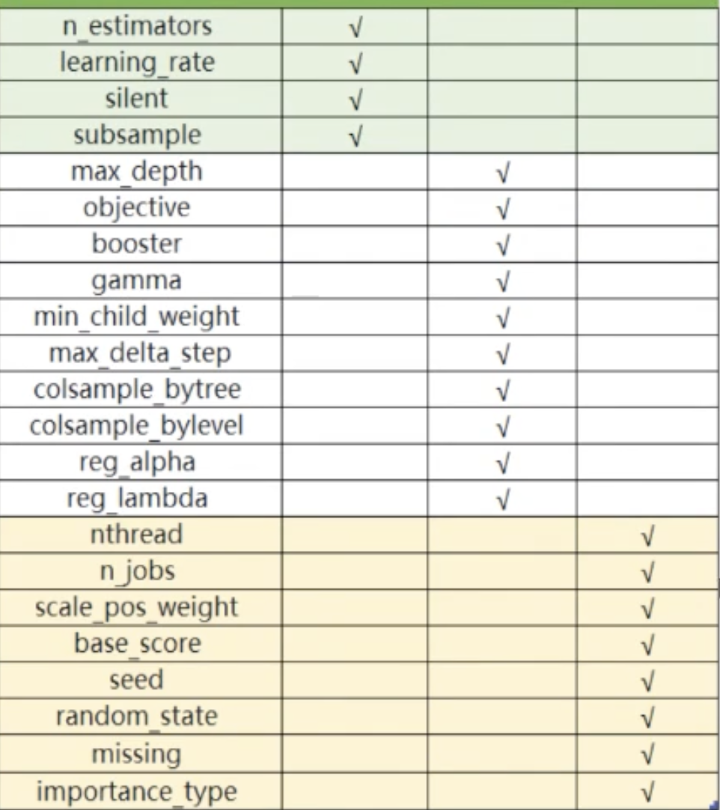

# XGBoost

## Import
import xgboost as xgb

## WorkFlow
Two ways of using XGBoost: Scikit-Learn API and native library API.
```python
xgb.DMatrix() # Read data
params = {} # Set parameters
bst = xgb.train(params, dtrain) # Train
bst.predict(dtest) # Predict
```

## Parameters
  

Parameters can be categorized into three types: ensemble parameters, weak learner parameters, and miscellaneous parameters. (Corresponding to the three columns in the figure above.)
